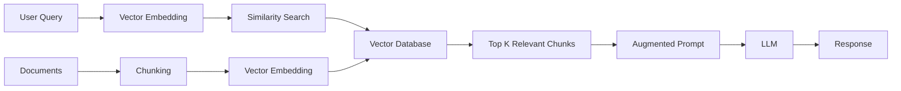

# Agentic AI Evolution

**Difficulty**: Introductory
**Time Investment**: 2-3 hours
**Prerequisites**: Basic understanding of LLMs

---

## Learning Resources (Start Here)

### Primary Video
- **[Stanford Webinar - Agentic AI: A Progression of Language Model Usage](https://www.youtube.com/watch?v=kJLiOGle3Lw)** (90 min)
  - Comprehensive overview of how LMs evolved from simple prompts to autonomous agents
  - Covers RAG, ReAct, and agentic design patterns
  - Includes practical examples and systematic evaluation approaches

---

## Why This Matters

You'll learn new what's possible when you combine reasoning, retrieval, and action. Having an understanding that **LLMs are evolving beyond simple Q&A**. The progression from static prompts → retrieval systems → autonomous agents fundamentally changes:
- How you design integrations with AI services
- What capabilities you can rely on when evaluating tools
- The architectural patterns needed to safely deploy AI in production

---

## Key Concepts

### The Evolution Timeline

1. **Basic Prompts** (2022-early 2023)
   - Static instructions, no external data
   - Limited by training data cutoff
   - "Hallucinations" when asked about proprietary or recent info

2. **RAG - Retrieval Augmented Generation** (2023)
   - LMs gain ability to pull in external context
   - Addresses knowledge limitations
   - Still lacks reasoning about multi-step tasks

3. **Agentic AI** (2024+)
   - Combines reasoning (ReAct) + retrieval (RAG) + tool use
   - Can break down complex tasks autonomously
   - Iterates and self-corrects based on feedback

### The Two Core Patterns

| Pattern | What It Does | Limitation When Used Alone |
|---------|--------------|---------------------------|
| **ReAct** (Reason + Act) | Uses Chain of Thought to break tasks into steps and prompt itself | Lacks external information gathering |
| **RAG** (Retrieval Augmented Generation) | Retrieves relevant context from external sources before generating | Lacks complex reasoning |

**Combining them = Agentic AI**: The ability to reason AND gather information creates autonomous task execution.

---

## How It Works

### ReAct Pattern
```
Task: "Can I get a refund for order #12345?"

Step 1 (Reason): I need to check the refund policy
Step 2 (Act): Call tool → retrieve_policy()
Step 3 (Reason): Policy says 30 days. I need order date.
Step 4 (Act): Call tool → get_order_info(12345)
Step 5 (Reason): Order is 10 days old. Within policy. Need to verify product eligibility.
Step 6 (Act): Call tool → get_product_info()
Step 7 (Generate): "Yes, you're eligible. Here's how to proceed..."
```

The LM prompts itself through a reasoning chain, taking actions when needed.

### RAG Architecture (Simplified)



**Key insight**: Docs are pre-chunked and embedded. At query time, only the most relevant chunks are added to the prompt.

---

## Common Approaches

### Approach 1: Pure Prompting
- **When to use**: Simple, deterministic tasks with clear instructions
- **Trade-off**: No access to external data; limited by context window

### Approach 2: RAG Only
- **When to use**: Q&A over proprietary documents (legal, support, knowledge bases)
- **Trade-off**: Good for retrieval, but can't handle multi-step workflows

### Approach 3: Agentic Workflows (ReAct + RAG + Tools)
- **When to use**: Complex tasks requiring planning, iteration, and external actions
- **Trade-off**: Higher complexity; requires tool integration and safety guardrails

---

## Agentic Design Patterns

From the Stanford lecture, four key patterns emerge:

1. **Planning**: Multi-step planning to achieve goals
2. **Reflexion**: Examines its own work and improves iteratively
3. **Tool Use**: Calls external APIs, scripts, or databases
4. **Multi-Agent Collaboration**: Different agents with specialised roles coordinate

### Example: Reflexion Pattern
```
Prompt 1: "Here is the <code>. Check the code and provide feedback."
Prompt 2: "Here is the <code> and <feedback>. Use the feedback to improve."
```
Repeating this cycle improves output quality significantly.

---

## Try It Yourself

### Experiment 1: Compare Prompt vs. Agentic Approach
**Task**: Ask an LLM to "Summarise the latest news on [topic]"

- **Without RAG**: The model will hallucinate or say "I don't have access to recent data"
- **With RAG**: Integrate a web search tool; the model retrieves real-time data

**What to observe**: How often does the pure prompt approach fail? What's the latency difference with RAG?

**Note:** You might have noticed this yourself already if you've been using products like ChatGPT since they first launched, web search was first launched in ChatGPT in October 2024 for paid users and for all users in Febraury 2025.

### Experiment 2: Test Reflexion
**Task**: Ask Claude Code to write a function, then ask it to review and improve its own code.

```
Prompt 1: "Write a Python function to validate email addresses"
Prompt 2: "Review the above code. What edge cases are missing?"
Prompt 3: "Rewrite the function incorporating your feedback"
```

**What to observe**: Does the second iteration catch issues (e.g., missing regex for special chars)? How many iterations reach "good enough"?

---

## Common Limitations & How Agentic AI Addresses Them

| LLM Limitation | Agentic Solution |
|----------------|------------------|
| **Outdated knowledge** | RAG: Retrieve current data from vector stores or APIs |
| **No domain expertise** | RAG: Provide proprietary docs (contracts, policies, code) |
| **Single-shot answers** | ReAct: Break into steps, iterate |
| **Can't verify accuracy** | Reflexion: Self-critique and regenerate |
| **No external actions** | Tool Use: Call APIs, run scripts, update databases |

---

## Related Topics

- [Prompt Engineering](../02-core-patterns/prompt-engineering.md) - How to write effective prompts for agentic workflows
- [RAG Architecture](../02-core-patterns/rag-architecture.md) - Deep dive into vector stores and chunking strategies
- [Agentic Workflows](../02-core-patterns/agentic-workflows.md) - Implementation patterns for production systems
- [Context Management](../03-development-workflows/context-management.md) - Giving LMs the right context

---

## Further Reading

- [Made With ML - Agentic Systems](https://madewithml.com/) - Comprehensive learning path for ML engineering
- [Anthropic's Claude Agent Guide](https://docs.anthropic.com/claude/docs/agents) - How to build agents with Claude API

---

## Key Takeaway

**LLMs are moving from "assistants" to "agents."** The architectural implications:
- You need **tool integration patterns** (how does the agent call your APIs safely?)
- You need **safety guardrails** (what if the agent makes the wrong decision?)
- You need **evaluation frameworks** (how do you test an agent's behavior systematically?)

Start thinking about AI not as a feature, but as a **component in a distributed system** that reasons, retrieves, and acts.
