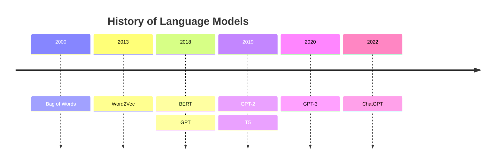
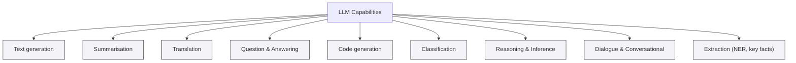
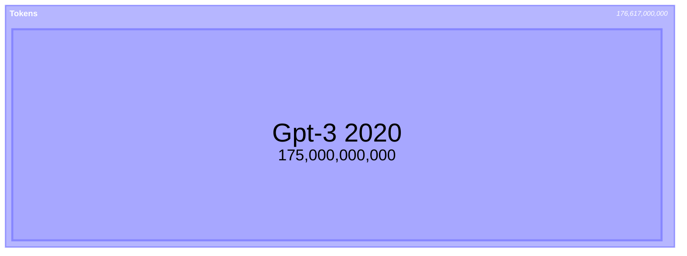

# Agentic AI Evolution

**Difficulty**: Introductory
**Time Investment**: 3-4 hours
**Prerequisites**: Basic understanding of LLMs

---

## Learning resources

### Videos

- **[Eye on Tech Overview](https://youtu.be/zKndCikg3R0?si=QwCdSOAT5LzcKla8)**
  - Describes what an LLM is and how they work
- **[Computerphile Deeper Dive](https://youtu.be/rURRYI66E54?si=I6UA1pvfKBkevhzD)**
  - More in-depth information about what an LLM is and how it works
  - includes more detail on how it works and how to make one

## Why This Matters

Large language models (LLMs) are the backbone technology for modern AI and agentic systems. Knowing how these work is fundamental to understanding their features and limitations.

 As a technical architect, we should be able to select and justify our choice of LLM model and how it solves a given problem.
 
## Key Concepts

### LLMs Are a Tool

Large language models are a technology that enables computers to understand human language. The definition of a large language model is a moving target. Although large language models share a number of similarities, 



Technologically, the 'bag of words' model is a non-transformer model, which means text is not transformed into and out of the model in the way modern approaches do. This is an early attempt to map words into vectors.  

The Word2Vec model took the bag of words approach and attempted to add meaning by embedding semantics into the vectors representing each word. The Word2Vec model does this by examining the probability that words are neighbors in a sentence. 

BERT (Bidirectional Encoder Representations From Transformers) is an early encoder-only model that encodes language. This technology allows us to generate pretrained models that we can use for other purposes. Encoder models like BERT are known as representational models.

GPT (Generative Pre-trained Transformer) is a decoder model that allows us to generate text from learned representations. Since we use these models to generate text, these are also known as generative models.

The term LLM refers to both encoding and decoding, or "generative" and "representational" models. There are also models such as T5 that encompass both generative and representational functions.





### LLMs take a large amount of energy to build and run



Since we started generating large language models, we've used increasingly large datasets to train them. The treemap above shows the number of tokens used in training GPT-1, GPT-2, and GPT-3, demonstrating that later models significantly outscale earlier ones. Although models are available that fit on a standard laptop—particularly through Ollama—the majority of LLMs are cloud-based. Aside from privacy and intellectual property considerations, we should weigh the environmental costs when designing systems that use LLM-based AI. There are also privacy and security considerations with sensitive data. One should never send any data without knowing how it will be used. 

Software development using an LLM presents a particular case. The quality of training data directly affects the quality of generated text. This is especially evident for code generation, where GitHub and Stack Overflow were large repositories used in training. Open source projects vary widely in quality—from excellent examples to a massive body of code generated by students learning to program. Think about this in terms of your own career progression. When you started learning to code, the quality of your code was not as good as it is now, but you were eager to share it on GitHub. By the time you became a senior engineer, your code approached excellence, but it was likely in a private repository for your employer or client. Similarly, every post on Stack Overflow starts with a code snippet that doesn't work and is answered with 4 or 5 code examples, of which one works. Or at least it worked in 2015, before Python had type hints and C# had records—before 94% of the Node.js libraries you used last year had been created, and before clean architecture became mainstream. 


### LLMs Use Probability Functions to Generate Output That "Looks Right"


LLMs generate text one token at a time by assigning a probability to each possible next token. The model computes raw scores (logits) for all tokens and converts them into a probability distribution via `softmax`. Decoding strategies then select tokens from that distribution—the choice of strategy determines whether the output is predictable or creative.

- `Greedy`: pick the single highest-probability token. Safe but can be repetitive.
- `Beam search`: track several high-probability candidate sequences for more coherent results.
- `Sampling` (controlled by `temperature`, `top-k`, `top-p`): introduce randomness to allow variety and creativity.

### Analogy: Choosing an Outfit
- **Context** (weather, occasion, personal style) is like the model's prompt.
- **Probability distribution** is like a wardrobe ranked by suitability.
- **Greedy selection** picks the highest-probability item every time (always the same outfit).
- **Sampling** with higher `temperature` allows less-likely but plausible items to be chosen (trying a scarf or statement jacket).
- **Top-k/top-p** limit choices to a sensible subset (only selecting shoes that match the outfit).

#### Temperature

Temperature is a parameter that controls the results from a model. This property can be adjusted per query and determines how 'creative' the model is. It controls how peaked or flat the next-token probability distribution becomes. Low values (close to 0) make the distribution sharp, so the highest-probability token dominates; higher values flatten the distribution, increasing the chance of less-likely tokens and enabling variety. 

Quick example (simplified): the next-token probabilities might be—"shirt": 0.09, "jacket": 0.25, "scarf": 0.10, "hat": 0.05.
- **Greedy**: selects "shirt"
- **Sampling** with `temperature=1.0`: might pick "jacket" or "scarf", producing a different but acceptable outfit

### Practical Implications
- Use low `temperature` (0–0.3) for factual or deterministic outputs.
- Use higher `temperature` (0.7–1.0) for creative writing or brainstorming.
- Be aware that sampling increases the chance of unexpected or incorrect tokens (hallucinations), so add validation where correctness matters.

**Guidance**: Set `temperature` low (e.g., 0–0.3) for precise, repeatable outputs and higher (e.g., 0.7–1.0) for creative tasks. Values above 1.0 increase unpredictability and the risk of incoherence. For finer control, combine temperature with `top-k`/`top-p` and validation when accuracy matters.

In short: LLMs don't "know" truth—they rank token plausibility. Decoding choices (greedy, beam, sampling) determine whether the model returns the most probable, a coherent, or a creative sequence, much like choosing an outfit that "looks right" versus experimenting with style.


### Models Are Trained on Data at a Point in Time

Models are trained on large snapshots of text and code collected up to a specific cutoff date. This means the model's knowledge—including language syntax, library APIs, and best practices—reflects what existed in its training data at that time. Any language features, standard-library additions, or ecosystem changes released after the model's cutoff are not part of its learned knowledge—the model cannot reliably invent accurate details about features it never encountered.

For code generation, this has practical consequences:
- **Missing new syntax or APIs**: the model may not recognize or produce language features introduced after its training cutoff, or it may propose outdated alternatives.
- **Outdated idioms and patterns**: generated code can follow older conventions or libraries that have since been deprecated or replaced.
- **Plausible but incorrect implementations**: the model often writes code that appears syntactically correct but can fail at runtime, misuse APIs, or ignore edge cases.

### Mitigations and Best Practices for Code Generation
- Explicitly state the target language and version in the prompt (for example, "Generate Go code targeting Go 1.20") so the model has concrete constraints.
- Provide current documentation or small, authoritative code examples in the prompt (prompt engineering or context augmentation) to give the model up-to-date references.
- Use retrieval-augmented generation (RAG) or tool integrations to surface the latest documentation and APIs at runtime, rather than relying solely on the model's static knowledge.
- Validate generated code automatically: run linters, type checkers, unit tests, and execute snippets in a sandboxed environment to catch errors early.
- Prefer small, well-scoped tasks for automated generation (e.g., helper functions, boilerplate) and require human review for critical or complex logic.

This applies to non-code capabilities as well, but the shortcomings are often more evident in code.

In short: treat an LLM as a powerful assistant operating over a historical snapshot of the web and code—useful for drafts and idea generation. However, always pair generated code with explicit versioning, up-to-date references, and automated validation to avoid issues from missing or newer language features.

## Trade-offs: Selecting an LLM

When using an LLM, we typically have two options: running the model from a cloud source or running it locally using a technology like [Ollama](https://ollama.com). The size of the model affects both the speed and responsiveness. There are several trade-offs to consider. 

### Model Size

Large Language Models are, by definition, "large." While size is subjective, it's important to realize that LLM usage is governed by this property.

For example, look at [Qwen3-Coder](https://ollama.com/library/qwen3-coder):

### Training Date

Language models are created at a specific point in time. This means they know things up to that cutoff date and no later. The training date affects outcomes, particularly in rapidly evolving contexts like software development.

For example, newer libraries may not be available to a language model, while older libraries and coding patterns have more training examples. 

### Practical Example

For context: This is written in January 2026 with a C# focus, but all actively developed languages exhibit the same behavior. You may need to look up the equivalent feature for your language.

1. Check your language's [new features](https://learn.microsoft.com/en-us/dotnet/csharp/whats-new/csharp-14#the-field-keyword)
2. Enter an old code example.

```
private string _msg;
public string Message
{
    get => _msg;
    set => _msg = value ?? throw new ArgumentNullException(nameof(value));
}
```

3. Ask an AI model trained before the feature's release to refactor the code using the new feature.

**Outcome**: The model won't refactor the code because it has no awareness of this feature.

## Related topics

Further reading within the AI learning path:

- **Foundations**: [Agentic AI Evolution](learning_paths/ai/01-foundations/agentic-ai-evolution.md), [AI safety & control](learning_paths/ai/01-foundations/ai-safety-control.md), [MLOps principles](learning_paths/ai/01-foundations/mlops-principles.md)
- **Core patterns**: [Agentic workflows](learning_paths/ai/02-core-patterns/agentic-workflows.md), [Prompt engineering](learning_paths/ai/02-core-patterns/prompt-engineering.md), [RAG architecture](learning_paths/ai/02-core-patterns/rag-architecture.md)
- **Development workflows**: [Agent skills framework](learning_paths/ai/03-development-workflows/agent-skills-framework.md), [Context management](learning_paths/ai/03-development-workflows/context-management.md), [Spec-driven development](learning_paths/ai/03-development-workflows/spec-driven-development.md)
- **Governance & automation**: [ADR automation](learning_paths/ai/04-governance-automation/adr-automation.md), [Architectural drift prevention](learning_paths/ai/04-governance-automation/architectural-drift-prevention.md), [Security automation](learning_paths/ai/04-governance-automation/security-automation.md)
- **Resources**: [Glossary](learning_paths/ai/resources/glossary.md), [Tools](learning_paths/ai/resources/tools.md), [Videos](learning_paths/ai/resources/videos.md)

## Further Reading

- **Hands-On Large Language Models**, Jay Alammar, Maarten Grootendorst – A good resource for understanding large language models, their history, and general applications.
- **Building LLM Powered Applications**, Valentina Alto – Useful for understanding what LLMs do, how to use them, and what capabilities they provide.
- **LLM Engineers Handbook**, Paul Iusztin – An in-depth guide to using and evaluating LLMs.
- **Natural Language Processing with Transformers**, Lewis Tunstall, Leandro Von Vaswani, Thomas Wolf – A 2022 book on LLM applications. Particularly relevant for understanding how LLMs were perceived before their explosive growth. Recommended reading for anyone who didn't code professionally before 2023.
- **Attention Is All You Need** (Vaswani et al., 2017) – The original transformer paper explaining self-attention and the architecture that underpins modern LLMs. https://arxiv.org/abs/1706.03762
- **Language Models are Few-Shot Learners** (Brown et al., 2020) – The GPT-3 paper; useful for understanding scale, pretraining, and few-shot behavior. https://arxiv.org/abs/2005.14165
- **The Curious Case of Neural Text Degeneration** (Holtzman et al., 2020) – Introduces nucleus (top-p) sampling and explains why simple greedy decoding can fail. https://arxiv.org/abs/1904.09751
- **The Illustrated Transformer** (Jay Alammar) – A visual, accessible walkthrough of transformer internals. https://jalammar.github.io/illustrated-transformer/
- **Hugging Face – Transformers Documentation** – A practical API reference and model hub for experimentation. https://huggingface.co/docs/transformers
- **OpenAI API and Model Documentation** – Guidance on prompting, sampling parameters (`temperature`, `top_k`, `top_p`), and best practices. https://platform.openai.com/docs
- **On the Dangers of Stochastic Parrots** (Bender et al.) – A discussion of datasets, bias, and ethical considerations when relying on large pre-trained models. https://dl.acm.org/doi/10.1145/3442188.3445922
- **Evaluating Large Language Models Trained on Code (Codex Research)** – Research and reports on code generation capabilities and limitations; useful for understanding failure modes and evaluation metrics. Example: https://arxiv.org/abs/2107.03374

## Practical Tutorials and Validation

- **Prompt Engineering & Retrieval-Augmented Generation (RAG)** – See the `prompt-engineering` and `rag-architecture` guides in this repository for hands-on examples.
- **Testing Generated Code** – Run linters, type checkers, and tests in sandboxed environments; add these steps to CI for systems that accept auto-generated code.