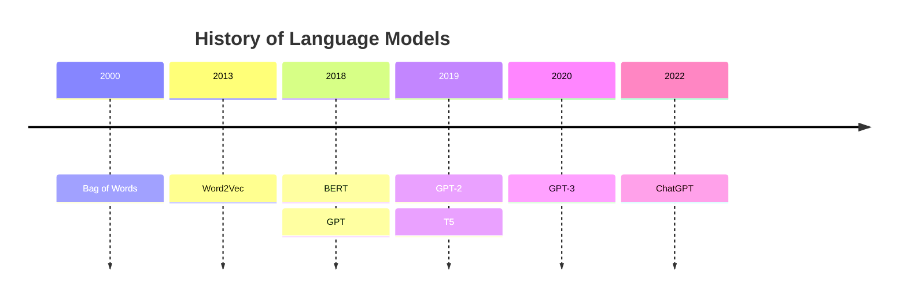
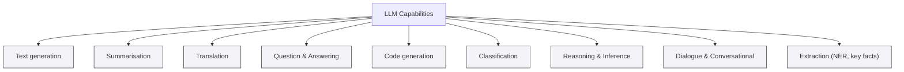

# Agentic AI Evolution

**Difficulty**: Introductory
**Time Investment**: 3-4 hours
**Prerequisites**: Basic understanding of LLMs

---

## Learning resources

### Videos

- **[Eye on Tech Overview](https://youtu.be/zKndCikg3R0?si=QwCdSOAT5LzcKla8)**
  - Describes What an LLM is, and how they work
- **[Computerphile deeper Dive](https://youtu.be/rURRYI66E54?si=I6UA1pvfKBkevhzD)**
  - more in depth of of you of what LLM is and how it works
  - includes more detail on how it works and how to make one

## why this matters


Large language models (LLM) are the backbone technology we have modern AI and agent AI agent systems. Knowing how these work is fundamental to understanding their features and limitations.

 As a technical architect, we should be able to select and justify our choice in LLM models and how they solve a given problem.
 
## Key Concepts

### LLMs's are a tool,   

Large language models are a technology that enables computers to understand human language. The definition of a large language model is a moving target. Although large language models share a number of similarities. 



Technologically the 'bag of words' model is a non-transformer model which means text is not transformed into the model and out of in the more modern way. This is an early attempt to map words into vectors.  

The word2vec model took the bag of words model, and attempted to add the meanings of words by embedding meaning into the vectors representing the word. The word2vec model does this by looking at the probability that words are neighbours in a sentence. 

BERT (Bidirectional Encoder Representations From Transformers) is an early encoder only protocol that encodes language into a model. This technology allows us to generate a pretrained model that we can use for other purposes. encoder models like BERt are known as representational models.

        ## Further Reading

        Below are papers, guides and reference docs that provide deeper background on transformers, decoding strategies, and practical considerations for using LLMs (including code generation):

        - **Attention Is All You Need (Vaswani et al., 2017)** — original transformer paper explaining self-attention and the architecture that underpins modern LLMs. https://arxiv.org/abs/1706.03762
        - **Language Models are Few-Shot Learners (Brown et al., 2020)** — GPT-3 paper, useful for understanding scale, pretraining and few-shot behaviours. https://arxiv.org/abs/2005.14165
        - **The Curious Case of Neural Text Degeneration (Holtzman et al., 2020)** — introduces nucleus (top-p) sampling and explains why simple greedy decoding can fail. https://arxiv.org/abs/1904.09751
        - **The Illustrated Transformer (Jay Alammar)** — visual, accessible walk-through of transformer internals. https://jalammar.github.io/illustrated-transformer/
        - **Hugging Face - Transformers documentation** — practical API reference and model hub for experimentation. https://huggingface.co/docs/transformers
        - **OpenAI API / Model docs** — guidance on prompting, sampling parameters (`temperature`, `top_k`, `top_p`) and best practices. https://platform.openai.com/docs
        - **On the Dangers of Stochastic Parrots (Bender et al.)** — discussion of dataset, bias and ethical considerations when relying on large pre-trained models. https://dl.acm.org/doi/10.1145/3442188.3445922
        - **Evaluating large language models trained on code / Codex research** — research and reports on code generation capabilities and limitations; useful for understanding failure modes and evaluation metrics. Example: https://arxiv.org/abs/2107.03374

        Practical tutorials and validation

        - **Prompt engineering & retrieval-augmented generation (RAG)** — see the `prompt-engineering` and `rag-architecture` guides in this repo for hands-on examples.
        - **Testing generated code** — run linters, type-checkers and tests in sandboxed environments; add these steps to CI for systems that accept auto-generated code.

GPT (Generative Pre-trained Transformer) is a decoder protocol that allows us to generate meaning from a model that is already generated. Since we use these models to generate text, these are also known as generative models.

The term LLM refers to both the encoding and decoding, or "generative" and "representational" models. There are also models such as T5 which encompass both the generative and representational functions of an LLM.





### LLMs take a large amount of energy to build and run

```
treemap-beta
"Tokens"
    "Gpt-1 2018": 117,000,000
    "Gpt-2 2019": 1,500,000,000
    "Gpt-3 2020": 175,000,000,000
```

Since we started generating large language models we've used larger and larger data sets to generate them. The tree above shows the number of tokens used in training GPT 1, 2 and 3. What it shows is that later models dwarf smaller models. Although models are available that will fit on a standard laptop, particularly through ollama, the majority of LLMs will be cloud based. Privacy and intellectual property considerations aside we should consider the environmental costs as a trade-off when designing systems that use LLM based AI. There are also considerations with high value data in terms of privacy and security. One should not send data of any form without knowing what it's going to be used for. 

A particular case should be noted for software development using an LLM. The quality of training data affects the quality of generated text. This is particularly evident when the training data we are looking at is code. Github and Stack Overflow were large repositories used in training LLMs. It should be noted that open source projects vary in quality from a very few examples of very high-quality code, to a massive body of local code generated by students learning to code. Think about this in terms of your own career progression. When you started learning to code the quality of your code was not as fantastic as it is now, but you were keen to put it on GitHub. By the time he become a senior engineer, your code is approaching brilliant, but most likely in a private repository for your employer/client. Similarly, every post in Slack overflow starts with a snippet of code that does not work, and his answered by 4 to 5 examples of code of which one works. Or at least it worked in 2015 before Python had type hints and C Sharp had records. Before 94% of the node libraries that you used in the last year had been dreamed of, and before clean architecture was a thing. 


### LLMs use probability functions to determine output that "look right".


LLMs generate text one token at a time by assigning a probability to each possible next token. The model computes raw scores (logits) for all tokens and turns them into a probability distribution via `softmax`. Decoding strategies then select tokens from that distribution — the choice of strategy determines whether the output is predictable or creative.

- `Greedy`: pick the single highest-probability token. Safe but can be repetitive.
- `Beam search`: track several high-probability candidate sequences for more coherent results.
- `Sampling` (controlled by `temperature`, `top-k`, `top-p`): introduce randomness to allow variety and creativity.

Analogy — choosing an outfit
- Context (weather, occasion, personal style) is like the model's prompt.
- The model's probability distribution is like a wardrobe ranked by suitability.
- Greedy selection is picking the single most appropriate item every time (the same outfit).
- Sampling with a higher `temperature` lets less-likely but still-plausible items be chosen (trying a scarf or a statement jacket).
- `Top-k`/`top-p` limit choices to a sensible subset (only choose from shoes that match the outfit).

Quick example (simplified): the next-token probabilities might be — "shirt": 0.6, "jacket": 0.25, "scarf": 0.1, "hat": 0.05.
- Greedy -> "shirt".
- Sampling with `temperature=1.2` -> might pick "jacket" or "scarf", producing a different but acceptable outfit.


Practical implications
- Use low `temperature` (near 0) for factual or deterministic outputs.
- Use higher `temperature` and `top-p` for creative writing or brainstorming.
- Be aware sampling increases the chance of unexpected or incorrect tokens (hallucinations), so add checks where correctness matters.

#### Temperature 

Temperature is a scalar that re-scales the model's logits before applying `softmax`, controlling how peaked or flat the next-token distribution becomes. Low values (close to 0) make the distribution sharp so the highest-probability token dominates; higher values flatten the distribution, raising the chance of less-likely tokens and increasing variety.

Practically: set `temperature` low (e.g., 0–0.3) for precise, repeatable outputs and higher (e.g., 0.7–1.2) for creative tasks. Values above 1 increase unpredictability and the risk of incoherence, so combine temperature with `top-k`/`top-p` and validation when accuracy matters.

In short: LLMs do not "know" truth — they rank token plausibility. Decoding choices (greedy, beam, sampling) determine whether the model returns the most probable, a coherent, or a creative sequence — much like choosing an outfit that simply "looks right" vs experimenting with style.


### Models are trained on a data set at a point in time.

Models are trained on large snapshots of text and code collected up to a specific cutoff date. That means the model's knowledge — including language syntax, library APIs, and best practices — reflects what existed in its training data at that time. Any language features, standard-library additions, or ecosystem changes released after the model's cutoff are not part of its learned knowledge: the model cannot reliably invent accurate details about features it was never exposed to.

For code generation this has practical consequences:
- Missing new syntax or APIs: the model may not recognise or produce language features introduced after its training cutoff, or it may propose outdated alternatives.
- Outdated idioms and patterns: generated code can follow older conventions or libraries that have since been deprecated or replaced.
- Plausible but incorrect implementations: the model often writes code that looks syntactically plausible but can fail at runtime, misuse APIs, or ignore edge cases.

Mitigations and best practices when using LLMs for code:
- Explicitly state the target language and version in the prompt (for example, "Generate Go code targeting Go 1.20") so the model has concrete constraints to follow.
- Provide current documentation or small, authoritative code examples in the prompt (prompt engineering / context augmentation) to give the model up-to-date references.
- Use retrieval-augmented generation (RAG) or tool integrations to surface the latest documentation and package APIs at runtime rather than relying solely on the model's static knowledge.
- Validate generated code automatically: run linters, type-checkers, unit tests and try executing snippets in a sandboxed environment to detect errors early.
- Prefer small, well-scoped tasks for automated generation (e.g., helper functions, boilerplate) and require human review for critical or complex logic.

This applies also to non-code capabilities, but the shortcomings are often more evident in code.

In short: treat an LLM as a powerful assistant that operates over a historical snapshot of the web and code — useful for drafts and idea generation, but always pair generated code with explicit versioning, up-to-date references, and automated validation to avoid regressions from missing or newer language features.

## Related topics

Further reading within the AI learning path:

- **Foundations**: [Agentic AI Evolution](learning_paths/ai/01-foundations/agentic-ai-evolution.md), [AI safety & control](learning_paths/ai/01-foundations/ai-safety-control.md), [MLOps principles](learning_paths/ai/01-foundations/mlops-principles.md)
- **Core patterns**: [Agentic workflows](learning_paths/ai/02-core-patterns/agentic-workflows.md), [Prompt engineering](learning_paths/ai/02-core-patterns/prompt-engineering.md), [RAG architecture](learning_paths/ai/02-core-patterns/rag-architecture.md)
- **Development workflows**: [Agent skills framework](learning_paths/ai/03-development-workflows/agent-skills-framework.md), [Context management](learning_paths/ai/03-development-workflows/context-management.md), [Spec-driven development](learning_paths/ai/03-development-workflows/spec-driven-development.md)
- **Governance & automation**: [ADR automation](learning_paths/ai/04-governance-automation/adr-automation.md), [Architectural drift prevention](learning_paths/ai/04-governance-automation/architectural-drift-prevention.md), [Security automation](learning_paths/ai/04-governance-automation/security-automation.md)
- **Resources**: [Glossary](learning_paths/ai/resources/glossary.md), [Tools](learning_paths/ai/resources/tools.md), [Videos](learning_paths/ai/resources/videos.md)

## Further Reading

