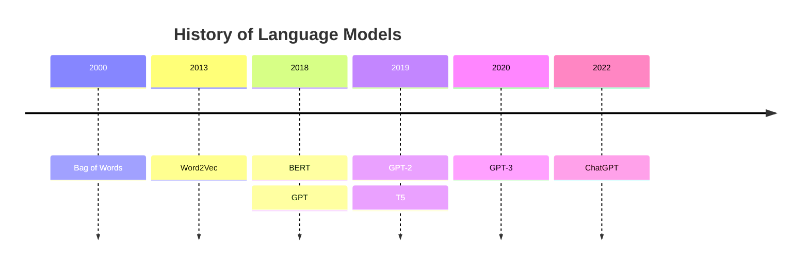
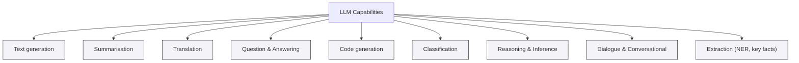
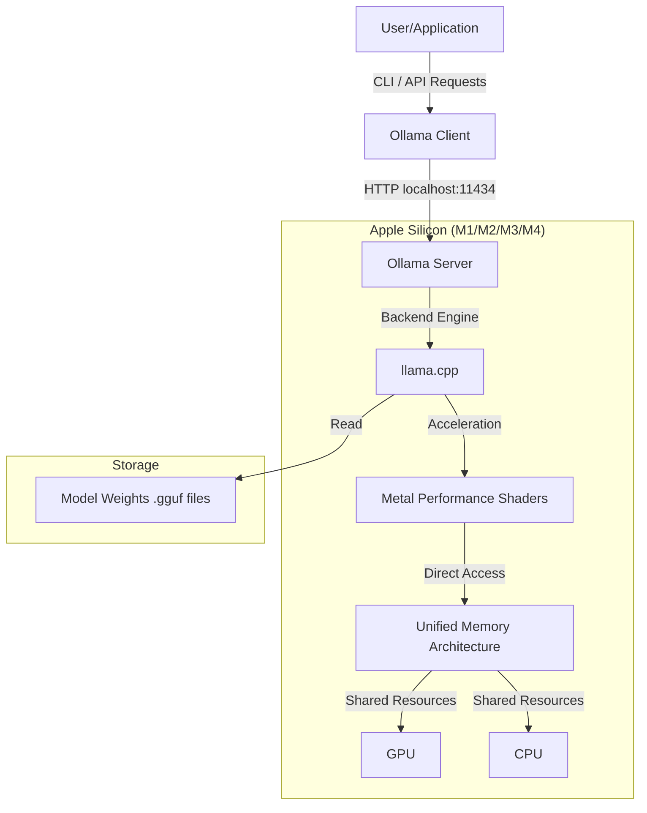

# Agentic AI Evolution

**Difficulty**: Introductory
**Time Investment**: 3-4 hours
**Prerequisites**: Basic understanding of LLMs

---

## Learning resources

### Videos

- **[Eye on Tech Overview](https://youtu.be/zKndCikg3R0?si=QwCdSOAT5LzcKla8)**
  - Describes what an LLM is and how they work
- **[Computerphile Deeper Dive](https://youtu.be/rURRYI66E54?si=I6UA1pvfKBkevhzD)**
  - More in-depth information about what an LLM is and how it works
  - includes more detail on how it works and how to make one

## Why This Matters

Large language models (LLMs) are the backbone technology for modern AI and agentic systems. Knowing how these work is fundamental to understanding their features and limitations.

 As a technical architect, we should be able to select and justify our choice of LLM model and how it solves a given problem.

## Key Concepts

### LLMs Are a Tool

Large language models are a technology that enables computers to understand human language. The definition of a large language model is a moving target. Although large language models share a number of similarities,



Technologically, the 'bag of words' model is a non-transformer model, which means text is not transformed into and out of the model in the way modern approaches do. This is an early attempt to map words into vectors.  

The Word2Vec model took the bag of words approach and attempted to add meaning by embedding semantics into the vectors representing each word. The Word2Vec model does this by examining the probability that words are neighbors in a sentence.

BERT (Bidirectional Encoder Representations From Transformers) is an early encoder-only model that encodes language. This technology allows us to generate pretrained models that we can use for other purposes. Encoder models like BERT are known as representational models.

GPT (Generative Pre-trained Transformer) is a decoder model that allows us to generate text from learned representations. Since we use these models to generate text, these are also known as generative models.

The term LLM refers to both encoding and decoding, or "generative" and "representational" models. There are also models such as T5 that encompass both generative and representational functions.



### LLMs take a large amount of energy to build and run


Since we started generating large language models, we've used increasingly large datasets to train them. The treemap above shows the number of tokens used in training GPT-1, GPT-2, and GPT-3, demonstrating that later models significantly outscale earlier ones. Although models are available that fit on a standard laptop—particularly through Ollama—the majority of LLMs are cloud-based. Aside from privacy and intellectual property considerations, we should weigh the environmental costs when designing systems that use LLM-based AI. There are also privacy and security considerations with sensitive data. One should never send any data without knowing how it will be used.

Software development using an LLM presents a particular case. The quality of training data directly affects the quality of generated text. This is especially evident for code generation, where GitHub and Stack Overflow were large repositories used in training. Open source projects vary widely in quality—from excellent examples to a massive body of code generated by students learning to program. Think about this in terms of your own career progression. When you started learning to code, the quality of your code was not as good as it is now, but you were eager to share it on GitHub. By the time you became a senior engineer, your code approached excellence, but it was likely in a private repository for your employer or client. Similarly, every post on Stack Overflow starts with a code snippet that doesn't work and is answered with 4 or 5 code examples, of which one works. Or at least it worked in 2015, before Python had type hints and C# had records—before 94% of the Node.js libraries you used last year had been created, and before clean architecture became mainstream.

### LLMs Use Probability Functions to Generate Output That "Looks Right"

LLMs generate text one token at a time by assigning a probability to each possible next token. The model computes raw scores (logits) for all tokens and converts them into a probability distribution via `softmax`. Decoding strategies then select tokens from that distribution—the choice of strategy determines whether the output is predictable or creative.

- `Greedy`: pick the single highest-probability token. Safe but can be repetitive.
- `Beam search`: track several high-probability candidate sequences for more coherent results.
- `Sampling` (controlled by `temperature`, `top-k`, `top-p`): introduce randomness to allow variety and creativity.

### Analogy: Choosing an Outfit

- **Context** (weather, occasion, personal style) is like the model's prompt.
- **Probability distribution** is like a wardrobe ranked by suitability.
- **Greedy selection** picks the highest-probability item every time (always the same outfit).
- **Sampling** with higher `temperature` allows less-likely but plausible items to be chosen (trying a scarf or statement jacket).
- **Top-k/top-p** limit choices to a sensible subset (only selecting shoes that match the outfit).

#### Temperature

Temperature is a parameter that controls the results from a model. This property can be adjusted per query and determines how 'creative' the model is. It controls how peaked or flat the next-token probability distribution becomes. Low values (close to 0) make the distribution sharp, so the highest-probability token dominates; higher values flatten the distribution, increasing the chance of less-likely tokens and enabling variety.

Quick example (simplified): the next-token probabilities might be—"shirt": 0.09, "jacket": 0.25, "scarf": 0.10, "hat": 0.05.

- **Greedy**: selects "shirt"
- **Sampling** with `temperature=1.0`: might pick "jacket" or "scarf", producing a different but acceptable outfit

### Practical Implications

- Use low `temperature` (0–0.3) for factual or deterministic outputs.
- Use higher `temperature` (0.7–1.0) for creative writing or brainstorming.
- Be aware that sampling increases the chance of unexpected or incorrect tokens (hallucinations), so add validation where correctness matters.

**Guidance**: Set `temperature` low (e.g., 0–0.3) for precise, repeatable outputs and higher (e.g., 0.7–1.0) for creative tasks. Values above 1.0 increase unpredictability and the risk of incoherence. For finer control, combine temperature with `top-k`/`top-p` and validation when accuracy matters.

In short: LLMs don't "know" truth—they rank token plausibility. Decoding choices (greedy, beam, sampling) determine whether the model returns the most probable, a coherent, or a creative sequence, much like choosing an outfit that "looks right" versus experimenting with style.

### Models Are Trained on Data at a Point in Time

Models are trained on large snapshots of text and code collected up to a specific cutoff date. This means the model's knowledge—including language syntax, library APIs, and best practices—reflects what existed in its training data at that time. Any language features, standard-library additions, or ecosystem changes released after the model's cutoff are not part of its learned knowledge—the model cannot reliably invent accurate details about features it never encountered.

For code generation, this has practical consequences:

- **Missing new syntax or APIs**: the model may not recognize or produce language features introduced after its training cutoff, or it may propose outdated alternatives.
- **Outdated idioms and patterns**: generated code can follow older conventions or libraries that have since been deprecated or replaced.
- **Plausible but incorrect implementations**: the model often writes code that appears syntactically correct but can fail at runtime, misuse APIs, or ignore edge cases.

### Mitigations and Best Practices for Code Generation

- Explicitly state the target language and version in the prompt (for example, "Generate Go code targeting Go 1.20") so the model has concrete constraints.
- Provide current documentation or small, authoritative code examples in the prompt (prompt engineering or context augmentation) to give the model up-to-date references.
- Use retrieval-augmented generation (RAG) or tool integrations to surface the latest documentation and APIs at runtime, rather than relying solely on the model's static knowledge.
- Validate generated code automatically: run linters, type checkers, unit tests, and execute snippets in a sandboxed environment to catch errors early.
- Prefer small, well-scoped tasks for automated generation (e.g., helper functions, boilerplate) and require human review for critical or complex logic.

This applies to non-code capabilities as well, but the shortcomings are often more evident in code.

In short: treat an LLM as a powerful assistant operating over a historical snapshot of the web and code—useful for drafts and idea generation. However, always pair generated code with explicit versioning, up-to-date references, and automated validation to avoid issues from missing or newer language features.

## Trade-offs: Selecting an LLM

When using an LLM, we typically have two options: running the model from a cloud source or running it locally using a technology like [Ollama](https://ollama.com). The size of the model affects both the speed and responsiveness. There are several trade-offs to consider.

As an example, we can look at [Qwen3-Coder](https://ollama.com/library/qwen3-coder/tags):

</img>

The grey numbers refer to the section on this page for meaning.

### [:one:](#model-page) Training Date

Language models are created at a specific point in time. This means they know things up to that cutoff date and no later. The training date affects outcomes, particularly in rapidly evolving contexts like software development.

For example, newer libraries may not be available to a language model, while older libraries and coding patterns have more training examples.

#### Practical Example

For context: This is written in January 2026 with a C# focus, but all actively developed languages exhibit the same behavior. You may need to look up the equivalent feature for your language.

1. Check your language's [new features](https://learn.microsoft.com/en-us/dotnet/csharp/whats-new/csharp-14#the-field-keyword)
2. Enter an old code example.

```c#
private string _msg;
public string Message
{
    get => _msg;
    set => _msg = value ?? throw new ArgumentNullException(nameof(value));
}
```

1. Ask an AI model trained before the feature's release to refactor the code using the new feature.

**Outcome**: The model won't refactor the code because it has no awareness of this feature.

### [:two:](#model-page) Capabilities

There are a number of capabilities that different models offer.

- [Streaming](https://docs.ollama.com/capabilities/streaming)
- [Thinking](https://docs.ollama.com/capabilities/thinking)
- [Structured Outputs](https://docs.ollama.com/capabilities/structured-outputs)
- [Vision](https://docs.ollama.com/capabilities/vision)
- [Embeddings](https://docs.ollama.com/capabilities/embeddings)
- [Tool Calling](https://docs.ollama.com/capabilities/tool-calling)
- [Web Search](https://docs.ollama.com/capabilities/web-search)

These are capabilities that a model is optimised for.

#### Streaming

When a model has streaming capability, it means it can send back its answer one piece at a time (token by token) rather than waiting to finish the entire paragraph before sending it to you.

For a developer, this changes your workflow from a "request-response" mindset to a "data flow" mindset.

Consider the following trade offs:

##### 1. Massive Drop in "Perceived Latency"

In a non-streaming setup, if a model takes 10 seconds to generate a long code block, your user stares at a loading spinner for 10 seconds.

With Streaming: The user sees the first word in ~200ms. Even if the total work still takes 10 seconds, the app feels instant because the user can start reading immediately while the rest "types out."

##### 2. Handling the "Readable Stream"

You can't just use a simple await response.json(). Instead, you have to handle an Asynchronous Iterator.

The Logic: Your code enters a loop that listens for "chunks." Each time a chunk arrives, you append it to your UI or a variable.

The End: You have to look for a specific "done" signal to know when the model is finished speaking.

##### 3. Early Interruption (Token Saving)

Streaming allows your application to be much more efficient:

Scenario: You ask the model to write a 500-line script. By line 10, you realize it’s using the wrong library.

Developer Edge: With streaming, your UI can have a "Stop" button. When clicked, you simply close the connection. The model stops generating immediately, saving you from wasting local compute power or API costs on the remaining 490 lines.

##### 4. Real-Time Logic (Thinking & Tools)

Thinking models "think" before they answer.

Streaming "Thinking": You can actually stream the model's internal reasoning process into a hidden debug console or a "thought bubble" in your UI.

Streaming "Tools": You can see the model "building" a tool call (like a SQL query) in real-time. This allows you to validate or log the intent even before the final command is sent.

#### Thinking

When an AI model has "thinking" capability (often seen in models like DeepSeek-R1 or OpenAI’s o1), it marks a shift from a model that simply predicts the next word to one that reasons through a problem before speaking.

For a developer, this is the difference between a dev who blurts out the first solution that comes to mind versus a dev who whiteboards the architecture before writing a single line of code.

##### 1. Internal Chain-of-Thought (CoT)

Unlike standard models that generate an answer immediately, thinking models use a "hidden" reasoning space.

The Process: The model breaks your request into sub-problems, explores different approaches, catches its own mistakes, and refines the logic—all before you see the final answer.

Developer Impact: You get fewer "logic hallucinations." For example, if you ask it to refactor a complex function with three edge cases, a thinking model will explicitly list those edge cases in its "mind" to ensure they are all covered in the final code.

##### 2. The "Thinking Tokens" vs. "Response Tokens"

When you interact with these models via an API or Ollama, you will notice two distinct phases in the output:

<think> block: This is where the model "talks to itself." It might say, "Wait, if I use a Map here, the lookup is O(1), but the memory overhead might be too high. Let's try an object instead..."

The Output: The final, clean code or answer.

##### 3. "System 2" Thinking for Coding

In psychology, "System 1" is fast/instinctive and "System 2" is slow/logical. Standard LLMs are largely System 1. Thinking models enable System 2:

Debugging: Instead of just saying "try this fix," the model analyzes the stack trace, hypothesizes the root cause, and explains why the fix works.

Architecture: It can weigh trade-offs. If you ask for a database schema, it will "think" about scalability, normalization, and query patterns before presenting the tables.

##### 4. Trade-offs: Latency and Cost

Thinking isn't free. As a developer, you need to account for:

Time to First Token: The "thinking" phase takes time. You might wait several seconds before the actual answer starts appearing.

Token Usage: Even if the final answer is short, the model may have generated 1,000 "thinking tokens" to get there. If you are using a paid API, you are often billed for these internal thoughts.

##### 5. Ethical considerations

Thinking is explainable AI. Where AI can explain its reasoning this leads to an auditable history that allows users to question the results.

#### Structured Outputs

When a model has Structured Outputs capability, it means the model is no longer just "writing a story", it is filling out a form.

For a developer, this is perhaps the most important capability for building production-grade software. It moves the LLM from being a "chatbot" to being a reliable data provider that fits into your existing code.

##### 1. The End of "Parsing Hell"

In the past, if you wanted a list of users in JSON, you had to write complex Regex or use libraries like LangChain to try and find the JSON inside the model's chatty response (e.g., stripping away "Sure! Here is the JSON you asked for...").

With Structured Outputs: The model is physically constrained at the token level. It cannot output a preamble. It will only output the exact data structure you requested.

##### 2. The "Contract" (Schema Adherence)

You provide a JSON Schema (or a Pydantic/Zod model in your code) that defines exactly what you need. The model guarantees:

All required keys are present: It won't "forget" the email field.

Types are correct: If you define age as an integer, it won't return "twenty-five" as a string.

Enums are respected: If a status must be ["active", "inactive"], the model will never hallucinate "pending".

##### 3. Type-Safety in Your IDE

Because the output is guaranteed to match your schema, you can use your language's type system (TypeScript interfaces, Python Dataclasses, etc.) to handle the result immediately.

The Benefit: Your IDE will give you autocomplete for the model's response. You can write response.data.user_id without worrying that user_id might be missing or misspelled as userId.

##### 4. Why it matters for Local Models (Ollama)

On smaller local models (like the 30b models in your screenshot), the "brain" isn't as large as a massive cloud model. Without structured outputs, these smaller models often make "syntax typos" in their JSON.

Capability: Structured output uses a technique called Grammar-Constrained Decoding. It essentially "muffles" the model so it is physically impossible for it to pick a character that would break the JSON format. This makes even smaller models incredibly effective for data extraction tasks.

Another advantage here is that conversational filler is removed. There is no need for the model to tell you that you're getting a json model, when you have told it exactly what you desire.

#### Vision

In the context of LLMs, Vision capability (also known as Multimodality) means the model has a "sight" module integrated directly into its "brain." It can process pixels and text simultaneously.

For a developer, this allows your application to "understand" the world outside of code editors and terminal logs.

##### 1. From UI Design to Boilerplate

One of the most immediate uses for a vision-capable model is Design-to-Code.

The Workflow: You can upload a screenshot of a high-fidelity Figma mockup or even a hand-drawn sketch.

The Result: The model identifies the layout, components (buttons, inputs, cards), and branding, then generates the corresponding HTML, CSS (Tailwind/Bootstrap), or Angular/Vue code to recreate it.

##### 2. Intelligent Frontend Debugging

Traditional "text-only" LLMs struggle with visual bugs (e.g., "The button is overlapping the header").

Visual Context: You can provide a screenshot of a broken UI along with the source code.

Analysis: The model can "see" that a z-index issue or a flex-box misalignment is occurring and point to the exact line in your CSS that is causing the overlap.

##### 3. Automated Documentation & OCR

Vision models excel at Optical Character Recognition (OCR) and beyond.

Parsing Charts/Graphs: If you give the model a PNG of a performance chart, it can extract the data points and turn them into a Markdown table or a JSON array.

Physical World Data: You can build apps that "read" printed serial numbers, ID cards, or handwritten notes and automatically populate a database, bypassing the need for manual data entry.

If doing this then ensure that vlidation has humans in the loop. Poor quality images exist.

##### 4. Accessibility as a Service

As a developer, you can use vision models to make your software more accessible.

Dynamic Alt-Text: The model can look at user-uploaded images and generate highly descriptive, context-aware alt tags for screen readers.

Video Understanding: If the model supports video, it can summarize what is happening in a recording, which is invaluable for logging user sessions or analyzing security footage.

Why the "Vision" Tag Matters in Your Screenshot
If you look back at the models in your library, a model with a Vision tag (often labeled as vl for "Vision-Language") is built differently:

Multimodal Embedding: It doesn't just convert pixels to text; it understands the spatial relationship of objects (e.g., it knows the difference between "a cat on a mat" and "a mat on a cat").

Performance Cost: Vision tasks are computationally heavier. You will notice that "thinking" through an image usually takes more time and memory than thinking through a simple text prompt.

#### Embeddings

When a model has Embeddings capability, it isn't "talking" to you. Instead, it is acting as a translator that turns human language into a map of numbers.

For a developer, this is the foundation for building "smart" features that require a computer to understand relationships between concepts without using exact keyword matches.

##### 1. The "Meaning Map" (Vectors)

An embedding model takes a string of text (a word, a sentence, or a whole function) and outputs a Vector.

The Magic: This vector represent "coordinates" in a high-dimensional space.

Proximity = Similarity: In this space, the coordinate for "Python" will be physically close to "Java," but very far away from "Banana."

Developer Use: You can use simple math (like Cosine Similarity) to calculate how "related" two pieces of text are, even if they share zero common words.

##### 2. The Core of RAG (Retrieval-Augmented Generation)

If you want to build a chatbot that answers questions about your company’s private documentation, you need embeddings.

The "Search" Step: You convert all your documents into embeddings and store them in a Vector Database.

The "Retrieval" Step: When a user asks a question, you turn that question into an embedding and ask the database: "Find me the top 3 document snippets that are closest to this question's coordinates."

The "Generation" Step: You feed those snippets to a standard LLM to write the final answer.

##### 3. Smart Search (Semantic Search)

Traditional search (like SQL LIKE or basic Elasticsearch) is rigid. If a user searches for "troubleshoot login," it might miss a document titled "Authentication Debugging."

With Embeddings: The model understands that "troubleshoot" and "debugging" are semantically similar. Your search results will include the most relevant content, even if the keywords don't match.

##### 4. Classification and Clustering

Because embeddings turn text into math, you can use them for non-generative tasks:

Auto-Tagging: Grouping 10,000 support tickets into categories automatically based on where they land on the "map."

Anomaly Detection: Identifying a log entry that is a "mathematical outlier" compared to your typical system logs, which could indicate a security breach or a unique bug.

#### Tool Calling

When an LLM has Tool Calling (or Function Calling) capability, it means the model can act as an orchestrator for your code. It is the bridge between "talking" and "doing."

For a developer, this transforms the LLM from a static library into an active participant in your application's logic.

##### 1. The Model as a "Decision Maker"

Unlike standard text generation, a tool-calling model doesn't just guess the next word. It evaluates the user's intent against a list of "tools" (functions) you have described to it.

The Logic: If a user asks, "What's the status of order 123?", a standard model will hallucinate an answer as is will have no reference to your current database. A tool-calling model will say, "I don't know that, but I see a get_order_status function. I should call that with order_id=123."

Developer Impact: You don't have to write complex if/else logic to determine when to call an API. The model does the "routing" for you.

##### 2. The "Handshake" Protocol

It’s important to understand that the model does not actually run your code. Instead, it generates a structured request for your application to run it.

- **The Suggestion**: The model outputs a specific JSON object containing the Function Name and the Arguments.
- **The Execution**: Your backend code sees this "request," executes the actual database query or API call, and gets the result.
- **The Loop**: You send that result back to the model.
- **The Final Answer**: The model reads the real data and gives the user a natural language response: "Order #123 is currently out for delivery."

##### 3. Precision Arguments

Tool-calling models are fine-tuned to extract data from a sentence and format it exactly how your function needs it.

Scenario: A user says, "Remind me to call Sarah tomorrow at 3pm."

The Tool Call: The model can automatically convert "tomorrow" into a standardized date string (e.g., 2026-02-07) and "3pm" into 15:00, passing them into your Tasks/Reminders() function.

Benefit: It handles the messy "human-to-date" translation that is notoriously difficult to code manually.

##### 4. From Chatbots to Agents

This is the "secret sauce" behind AI Agents. By giving a model tools like read_file, write_file, and run_terminal_command, you create a loop where the model can:

- Try to solve a bug.
- Call a tool to run a test.
- See the test failed.
- Call a tool to edit the code.
- Repeat until the test passes.

#### Web Search

When a model has Web Search capability, it means the model can step outside its "training bubble" to browse the live internet for information.

For a developer, this is the solution to the "Knowledge Cutoff" problem. Most models are frozen in time (as you saw in the screenshot, these models were updated "4 months ago"), but web search allows them to stay current.

##### 1. Real-Time Documentation & APIs

As a developer, you know that frameworks move fast. If you ask a standard model for help with a library that had a major release yesterday, it will give you outdated, "deprecated" code.

With Web Search: The model can search for the official documentation of the latest version, read the new syntax, and provide code that actually runs. It essentially "learns" the new API on the fly before answering you.

##### 2. Fact-Checking and Grounding

LLMs are famous for "hallucinating"—confidently stating things that aren't true.

The Process: A web-search model is trained to recognize when it doesn't know a specific fact (like a specific error code or a recent CVE security vulnerability).

The Benefit: It triggers a search, finds a reliable source (like a GitHub Issue or Stack Overflow thread), and uses that data to "ground" its response. It will often provide Citations so you can click the link and verify the fix yourself.

##### 3. Deep Research & Debugging

Sometimes a bug is so specific that it isn't in any textbook.

Agentic Search: Higher-end models (like the reasoning models we discussed) can perform "Agentic Search." This means they don't just do one search; they might search for an error, realize they need to check a specific dependency's version history, and perform a second search to connect the dots.

Developer Edge: This is like having an assistant who does the "Google-fu" for you, summarizing five different blog posts and forum threads into one coherent troubleshooting guide.

##### 4. Competitive Intelligence & Market Data

If you are building a product, you can use web search to keep your code context-aware of the world:

Example: "Search for the top 5 most popular React component libraries in 2026 and compare their accessibility scores."

Developer Use: It helps you make informed architectural decisions based on current industry trends rather than just what the model knew when it was finished being trained.

This can also be used with intranets where search is implemented.

### [:two:](#model-page) Model Tiers

30b / 480b tags Trefer to Parameter Count (30 Billion vs. 480 Billion).

30b: Smaller, faster, and can often run on a single high-end consumer GPU. Great for standard coding tasks.

480b: A "frontier-class" model. It is much smarter and better at complex reasoning, but it requires massive hardware (data-center grade) to run locally.

### [:two:](#model-page) Cloud

This tag indicates the model can be offloaded to Ollama’s hosted infrastructure, allowing you to use the massive 480b model even if your local laptop doesn't have 300GB of VRAM.

### [:three:](#model-page) The RAM (VRAM) Requirement

The most critical implication is that Model Size required memory.

**The Rule:** To run a model smoothly, its size must fit entirely within the chip that is running it, *Along with everything else that the chip is doing*.

The chip that is running it is typically GPU, See Apple M series Ollama Architecture for Apple notebooks. Typically consider that a model should be at most 80% of the free RAM available with Ollama uninstalled.

Apple Ollama Architecture



### [:four:](#model-page) Context

Context (Column 4) refers to the Context Window, which is measured in Tokens (e.g., 256K).

For a developer, the context window is the model’s short-term working memory. It is the total amount of information the model can "hold in its head" at one single time during a conversation.

#### 1. Capabilities

What fits in "256K"? 256,000 tokens is roughly 190,000 words—about the length of two full-sized novels.Whole-Repo Awareness: You don't have to copy-paste one function at a time. You can often feed the model several hundred source files simultaneously, allowing it to understand how a change in your auth.service.ts might impact a component ten folders away.Long-Form Analysis: You can upload massive logs (e.g., an hour of server traffic) or 100-page PDF specifications and ask the model to "find the needle in the haystack."Coherent Agents: For "Agentic" tasks, a large context allows the model to remember its previous five attempts at a problem, including the errors it saw in the terminal, so it doesn't repeat the same mistake.

#### 2. Trade-offs

The "Latency Tax"Context isn't a free lunch. As a developer, you need to account for the Quadratic Scaling of the Transformer architecture ($O(n^2)$):The Slowdown: Most LLMs get slower as the context fills up. Processing 200,000 tokens takes significantly more "pre-fill" time than processing 2,000 tokens. Your users might experience a 10–30 second delay before the first word even appears.RAM Consumption: Large contexts eat up VRAM. Even if a 19GB model fits on your GPU, using the full 256K context might require an additional 10–20GB of memory just to store the "KV Cache" (the model's internal notes on the text it just read).

#### 3. The "Lost in the Middle" Problem

Just because a model can see 256,000 tokens doesn't mean it pays equal attention to all of them.

**Primacy & Recency Bias**: Models are great at remembering the very beginning (Primacy) and the very end (Recency) of your prompt.The "Context Rot": Information buried in the middle of a massive prompt is frequently ignored or "hallucinated."

**Dev Strategy**: If you have a critical instruction (e.g., "Use the older version of the API"), put it at the very end of the prompt, after the massive block of code or logs.

#### 4. Context vs. RAG (The Economic Choice)

A common mistake is "Context Stuffing" - putting everything into the window because they can. If you have 50MB of documentation, it is often better to use Retrieval-Augmented Generation (RAG) to find the 3 most relevant pages and send those to the model, rather than the whole 50MB.

**Efficiency**: RAG is faster and cheaper (or lighter on local compute) than pushing the 256K limit for more than a single query.

### [:five:](#model-page) Input

In the Ollama interface, the Input column (marker 5) defines what kind of "raw data" the model’s brain is wired to understand. While it might seem simple, this choice fundamentally shifts your hardware requirements and your application's architecture.Here are the possible values you will see and their trade-offs:

#### 1. Text

This is the standard value for most LLMs. The model only accepts strings of characters (tokens).

##### Capabilities

 Excellent for logic, writing code, summarizing logs, and chat.

##### Trade-offs  

- **High Efficiency**: These models are generally the fastest and require the least amount of memory.
- **Limitation**: It is "blind." If you need it to explain a diagram or a screenshot, you must first use a separate OCR (Optical Character Recognition) tool to turn that image into text, which often loses the layout context (like knowing a button is next to a specific label).
  
#### 2. Multimodal (or Vision)

As touched on earlier, a model with this input capability can take Text + Images simultaneously. In some advanced versions, this might eventually include Audio or Video.

##### Capabilities

Can "see" UI mockups, read handwritten notes, or analyze architectural diagrams. It understands spatial relationships (e.g., "The error is in the top-right corner of the dashboard").

##### Trade-off

- **Increased Token Cost**: When you feed an image into a model, Ollama converts that image into hundreds or thousands of image tokens. This can eat up your context window quickly. One high-res image might take up as much "memory space" as 1,000 words of text.
- **Increased Latency**: Processing pixels is harder than processing text. Expect a multimodal model to take longer to generate its first word because it has to "scan" the image before it can start thinking.Higher
- **VRAM Usage**: Vision models usually have an extra "Vision Encoder" module that stays loaded in your GPU memory, leaving less room for the actual text-generation part of the brain.

#### 3 The "Hidden" Value - Embedding

While not usually listed in this specific "Input" column, some models are purely Embedding models. Their "Input" is text, but their "Output" is numbers (vectors). You would choose these when you don't need a chatty response, but rather a way to build a search engine.

## Related topics

Further reading within the AI learning path:

- **Foundations**: [Agentic AI Evolution](learning_paths/ai/01-foundations/agentic-ai-evolution.md), [AI safety & control](learning_paths/ai/01-foundations/ai-safety-control.md), [MLOps principles](learning_paths/ai/01-foundations/mlops-principles.md)
- **Core patterns**: [Agentic workflows](learning_paths/ai/02-core-patterns/agentic-workflows.md), [Prompt engineering](learning_paths/ai/02-core-patterns/prompt-engineering.md), [RAG architecture](learning_paths/ai/02-core-patterns/rag-architecture.md)
- **Development workflows**: [Agent skills framework](learning_paths/ai/03-development-workflows/agent-skills-framework.md), [Context management](learning_paths/ai/03-development-workflows/context-management.md), [Spec-driven development](learning_paths/ai/03-development-workflows/spec-driven-development.md)
- **Governance & automation**: [ADR automation](learning_paths/ai/04-governance-automation/adr-automation.md), [Architectural drift prevention](learning_paths/ai/04-governance-automation/architectural-drift-prevention.md), [Security automation](learning_paths/ai/04-governance-automation/security-automation.md)
- **Resources**: [Glossary](learning_paths/ai/resources/glossary.md), [Tools](learning_paths/ai/resources/tools.md), [Videos](learning_paths/ai/resources/videos.md)

## Further Reading

- **Hands-On Large Language Models**, Jay Alammar, Maarten Grootendorst – A good resource for understanding large language models, their history, and general applications.
- **Building LLM Powered Applications**, Valentina Alto – Useful for understanding what LLMs do, how to use them, and what capabilities they provide.
- **LLM Engineers Handbook**, Paul Iusztin – An in-depth guide to using and evaluating LLMs.
- **Natural Language Processing with Transformers**, Lewis Tunstall, Leandro Von Vaswani, Thomas Wolf – A 2022 book on LLM applications. Particularly relevant for understanding how LLMs were perceived before their explosive growth. Recommended reading for anyone who didn't code professionally before 2023.
- **Attention Is All You Need** (Vaswani et al., 2017) – The original transformer paper explaining self-attention and the architecture that underpins modern LLMs. <https://arxiv.org/abs/1706.03762>
- **Language Models are Few-Shot Learners** (Brown et al., 2020) – The GPT-3 paper; useful for understanding scale, pretraining, and few-shot behavior. <https://arxiv.org/abs/2005.14165>
- **The Curious Case of Neural Text Degeneration** (Holtzman et al., 2020) – Introduces nucleus (top-p) sampling and explains why simple greedy decoding can fail. <https://arxiv.org/abs/1904.09751>
- **The Illustrated Transformer** (Jay Alammar) – A visual, accessible walkthrough of transformer internals. <https://jalammar.github.io/illustrated-transformer/>
- **Hugging Face – Transformers Documentation** – A practical API reference and model hub for experimentation. <https://huggingface.co/docs/transformers>
- **OpenAI API and Model Documentation** – Guidance on prompting, sampling parameters (`temperature`, `top_k`, `top_p`), and best practices. <https://platform.openai.com/docs>
- **On the Dangers of Stochastic Parrots** (Bender et al.) – A discussion of datasets, bias, and ethical considerations when relying on large pre-trained models. <https://dl.acm.org/doi/10.1145/3442188.3445922>
- **Evaluating Large Language Models Trained on Code (Codex Research)** – Research and reports on code generation capabilities and limitations; useful for understanding failure modes and evaluation metrics. Example: <https://arxiv.org/abs/2107.03374>

## Practical Tutorials and Validation

- **Prompt Engineering & Retrieval-Augmented Generation (RAG)** – See the `prompt-engineering` and `rag-architecture` guides in this repository for hands-on examples.
- **Testing Generated Code** – Run linters, type checkers, and tests in sandboxed environments; add these steps to CI for systems that accept auto-generated code.
