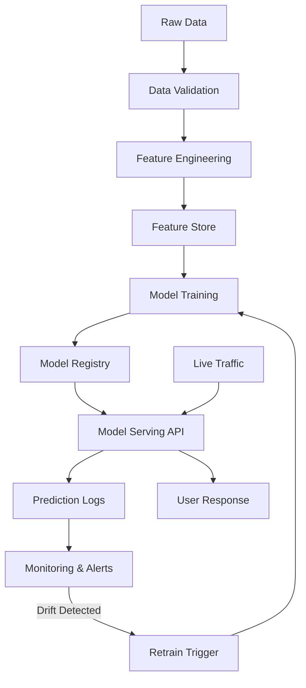

# MLOps Principles & ML System Design

**Difficulty**: Introductory
**Time Investment**: 2-3 hours
**Prerequisites**: Basic understanding of DevOps and CI/CD

---

## Learning Resources (Start Here)

### Primary Video
- **[Principles of Good Machine Learning Systems Design - Chip Huyen, Stanford MLSys Seminar](https://www.youtube.com/watch?v=c_AUuTuPA5k)** (90 min)
  - Covers the engineering reality of ML in production
  - Explains infrastructure trade-offs (research vs. production)
  - Provides a framework for evaluating ML platforms

### Deep Dive Learning Path
- **[Made With ML](https://madewithml.com/)** - Comprehensive hands-on course covering:
  - MLOps foundations
  - Model training, evaluation, and deployment
  - Production monitoring and debugging
  - *Bookmark this if you need to build ML systems*

---

## Why This Matters

You might be asked:
- "Should we build or buy our ML platform?"
- "Can we integrate this ML model into our production system?"
- "What's the TCO of running ML workloads?"

**The critical insight**: ML systems are **10% machine learning and 90% good engineering practices**. The skills you already have (infrastructure, DevOps, monitoring) are more valuable than knowing PyTorch.

Understanding MLOps principles helps you:
- Evaluate vendor platforms (AWS SageMaker, Azure ML, GCP Vertex AI)
- Design integration points for ML models
- Avoid common pitfalls (model drift, data quality issues, scaling bottlenecks)

---

## Key Concepts

### The 10/90 Rule

```
┌─────────────────────────────────┐
│  ML Engineering Effort          │
├─────────────────────────────────┤
│  10% → Model Training & Tuning  │
│  90% → Infrastructure & Ops     │
└─────────────────────────────────┘
```

**What the 90% includes**:
- Data pipelines (ingestion, validation, versioning)
- Feature engineering and storage
- Model serving infrastructure (APIs, latency, scaling)
- Monitoring & observability (drift detection, performance degradation)
- CI/CD for models (retraining, A/B testing, rollback)
- Security (model access control, data privacy)

**Implication**: A team with strong DevOps practices can adopt ML faster than a team with ML expertise but weak engineering discipline.

---

## Research vs. Production Infrastructure

| Dimension | Research / Training | Production / Serving |
|-----------|-------------------|---------------------|
| **Scaling** | Vertical (bigger GPUs) | Horizontal (more instances) |
| **Optimization** | Accuracy | Latency & throughput |
| **Hardware** | GPU-heavy (A100, H100) | CPU-friendly (optimised for inference) |
| **Cost Model** | Burst usage (train once, discard) | Always-on (serving 24/7) |
| **Tooling** | Jupyter, TensorBoard | Kubernetes, API gateways |

**Architect's Takeaway**: Don't design production systems based on research requirements. Training infrastructure ≠ serving infrastructure.

---

## Principles of Good ML Systems Design

From Chip Huyen's framework, a good ML system:

### 1. Solves a Real Problem
- **Anti-pattern**: "Let's use ML because it's cool"
- **Good practice**: Start with the business problem. If a rules engine works, use that instead.
- **ROI Check**: ML requires high investment (data, infrastructure, talent). Is the problem worth it?

### 2. Is Tested
- **Unit tests**: Individual components (data validation, feature transforms)
- **Integration tests**: End-to-end pipelines
- **Model tests**: Performance on holdout sets, edge cases, adversarial inputs

### 3. Is Accessible to Users
- **Latency matters**: If a recommendation takes 5 seconds, users will leave
- **API design**: REST/gRPC interfaces that hide ML complexity
- **Explainability**: Can you show why the model made a decision? (Critical for regulated industries)

### 4. Is Ethical
- **Bias detection**: Test for fairness across demographics
- **Data privacy**: GDPR, CCPA compliance
- **Transparency**: Users should know they're interacting with ML

### 5. Has Modular, Integrated Components
```
┌──────────────┐    ┌──────────────┐    ┌──────────────┐
│ Data Pipeline│ -> │ Feature Store│ -> │ Model Serving│
└──────────────┘    └──────────────┘    └──────────────┘
       ↓                    ↓                    ↓
  (versioned)          (cached)            (monitored)
```
Each component should be independently deployable and testable.

### 6. Is As Simple As Possible
- **Start with simple models** (logistic regression, decision trees)
- **Optimise simple models** (better features, more data)
- **Only add complexity if needed** (deep learning, ensembles)

**Why**: Complex models are harder to debug, explain, and maintain.

### 7. Is Transparent
- **Model registry**: Track which model version is in production
- **Feature lineage**: Know where each feature comes from
- **Decision logs**: Audit trail for predictions

### 8. Allows for Continuous Integration
- **Automated retraining**: Models degrade over time (data drift)
- **A/B testing**: Compare new models against baseline in production
- **Rollback capability**: If new model underperforms, revert instantly

### 9. Is Versioned
- **Data versioning**: Which dataset was used for training?
- **Model versioning**: Which hyperparameters, which code commit?
- **Dependency versioning**: Which TensorFlow/PyTorch version?

### 10. Is Documented
- **Model cards**: What is this model for? What are its limitations?
- **Runbooks**: How to retrain, deploy, monitor?
- **Incident response**: What to do when accuracy drops?

---

## How It Works: ML System Architecture



**Key Insight**: ML systems are **feedback loops**. Unlike traditional software, ML models degrade over time as data patterns shift. You need continuous monitoring and retraining.

---

## Common Approaches (AI Generated)

### Approach 1: Managed ML Platforms (AWS SageMaker, Azure ML, GCP Vertex AI)
**When to use**: You want to focus on models, not infrastructure

**Pros**:
- Built-in feature stores, model registries, monitoring
- Auto-scaling and managed endpoints
- Integrated with cloud services (S3, BigQuery, etc.)

**Cons**:
- Vendor lock-in
- Higher cost at scale
- Less flexibility for custom workflows

**Cost**: ££ (pay-per-use can spike, harder to predict monthly costs)

---

### Approach 2: Open-Source MLOps Stack (MLflow, Kubeflow, Airflow)
**When to use**: You have strong DevOps capability and need customization

**Pros**:
- Full control over infrastructure
- No vendor lock-in
- Lower cost at scale (if you have expertise)

**Cons**:
- High operational burden
- Requires ML + DevOps expertise
- Longer time to production

**Cost**: £ (compute) + £££ (engineering time to build/maintain)
---

### Approach 3: Hybrid (Managed Training + Custom Serving)
**When to use**: Training is infrequent, but serving requirements are unique

**Example**: Train models on SageMaker, export to ONNX, serve on custom Kubernetes cluster

**Pros**:
- Use managed services for heavy lifting (training)
- Optimise serving layer for cost/latency

**Cons**:
- More complex integration
- Need to manage model export/import

**Cost**: ££ (training) + £-££ (serving infrastructure) + ££ (integration complexity)

---

## Try It Yourself (AI Generated)

### Experiment 1: ML Model Degradation
**Setup**: Use a simple classification model (e.g., spam detection)

**Task**:
1. Train model on 2023 data
2. Test on 2024 data
3. Observe accuracy drop

**What to observe**: How quickly does performance degrade? What causes drift (new slang, new attack patterns)?

**Lesson**: Models need continuous retraining, not just initial deployment.

### Experiment 2: Cost Analysis
**Setup**: Compare training costs across platforms

**Task**:
1. Estimate cost to train a model on SageMaker
2. Estimate cost on GCP Vertex AI
3. Estimate cost on self-managed EC2/GCE instances

**What to observe**: Where's the cost difference? (Data transfer, GPU pricing, managed service fees)

**Lesson**: TCO includes operational overhead, not just compute cost.

---

## ML Adoption Strategy

From Chip Huyen's talk, the recommended progression:

```
1. Simple Models (Start Here)
   - Logistic regression, decision trees
   - Easy to debug and explain
   - Fast to deploy

2. Optimised Simple Models
   - Better feature engineering
   - More training data
   - Hyperparameter tuning

3. Complex Models (Only If Needed)
   - Deep learning, ensembles
   - When simple models hit a ceiling
   - Higher operational cost
```

**Anti-pattern**: Starting with a complex model (e.g., transformer) when a simple rule-based system would work.

---

## Common Pitfalls

### Pitfall 1: Ignoring Data Quality
**Problem**: "Garbage in, garbage out" is 10x worse in ML
**Solution**: Invest in data validation, lineage tracking, and automated checks

### Pitfall 2: No Monitoring
**Problem**: Model accuracy degrades silently in production
**Solution**: Track prediction distribution, feature drift, and business metrics

### Pitfall 3: Overengineering
**Problem**: Deploying Kubernetes + Kubeflow for a model that runs once a day
**Solution**: Start simple (cron job + SQLite), scale when needed

### Pitfall 4: Treating ML Like Traditional Software
**Problem**: "We deployed it, we're done"
**Solution**: ML requires continuous integration (retraining, A/B testing, monitoring)

---

## Related Topics

- [Agentic AI Evolution](./agentic-ai-evolution.md) - How LMs fit into the ML ecosystem
- [RAG Architecture](../02-core-patterns/rag-architecture.md) - A practical ML pattern for knowledge retrieval
- [Context Management](../03-development-workflows/context-management.md) - Improving LM performance through better inputs

---

## Key Takeaway

**ML is 90% engineering.** If your team has strong DevOps practices, you can adopt ML without hiring a team of PhDs.

**When evaluating ML initiatives, ask**:
1. Do we have clean, versioned data?
2. Can we monitor and retrain models automatically?
3. Is the ROI worth the operational overhead?
4. Should we build, buy, or partner?

**The opportunity**: Many organisations overcomplicate ML. If you apply good engineering discipline, you can deliver ML systems faster and cheaper than teams that focus only on model accuracy.

**Next steps**: Bookmark [Made With ML](https://madewithml.com/) for hands-on learning if you need to build production ML systems.
