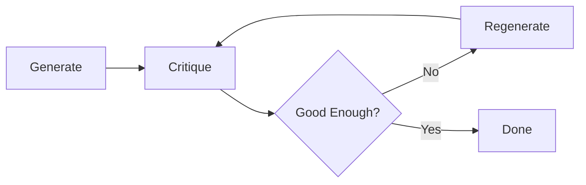
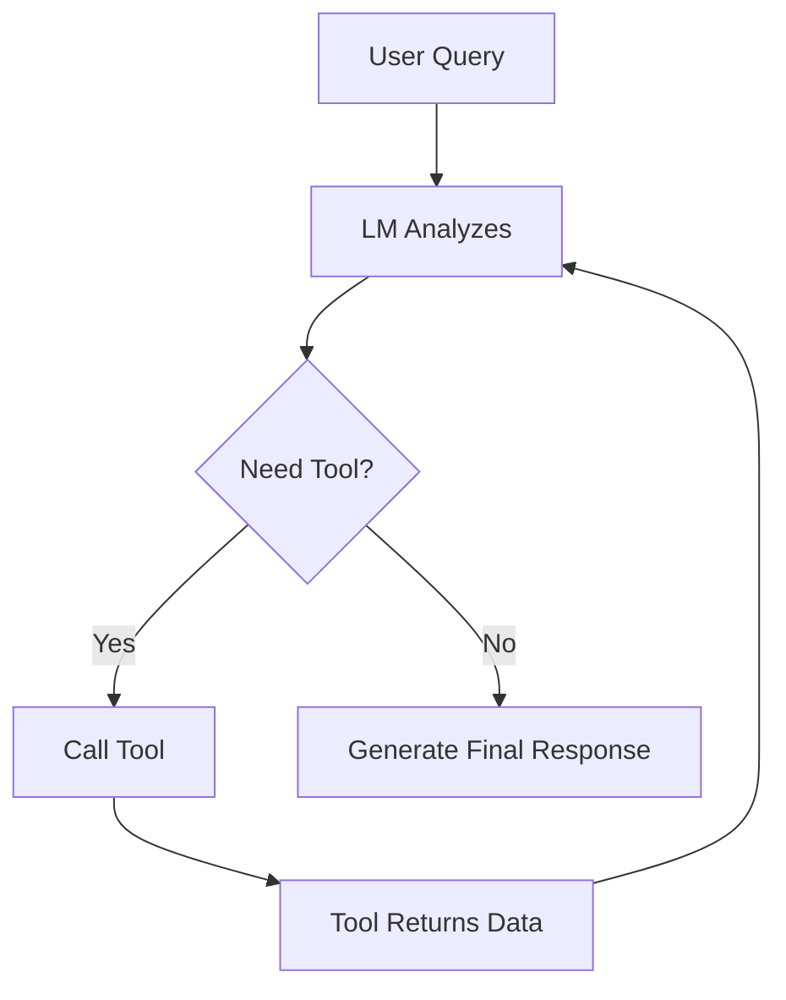

# Agentic Workflows

**Difficulty**: Intermediate
**Time Investment**: 2-3 hours
**Prerequisites**: Understanding of prompts, RAG, and basic LM limitations

---

## Learning Resources (Start Here)

### Primary Video
- **[Stanford Webinar - Agentic AI: A Progression of Language Model Usage](https://www.youtube.com/watch?v=kJLiOGle3Lw)** (90 min)
  - Agentic workflow patterns section (50 min mark onwards)
  - Covers ReAct, reflexion, tool use, multi-agent collaboration

---

## Why This Matters

Traditional LM usage is **single-shot**: You send a prompt, get a response, done.

**Agentic workflows** introduce **iteration and autonomy**:
- LMs break down complex tasks into steps
- LMs call external tools (APIs, databases, code execution)
- LMs self-critique and improve their outputs
- Multiple specialised LMs collaborate

As a Technical Architect, you'll encounter agentic patterns when:
- Evaluating tools like Cursor, Claude Code, or Devin
- Designing systems where AI needs to perform multi-step tasks
- Building automation that requires decision-making, not just text generation

Understanding these patterns helps you assess **what's possible** and **what guardrails are needed**.

---

## Key Concepts

### The Four Agentic Design Patterns

From the Stanford lecture:

| Pattern | What It Does | Example Use Case |
|---------|--------------|------------------|
| **Planning** | Multi-step planning to achieve goals | "Build a web app" → breaks into design, code, test, deploy |
| **Reflexion** | Examines own work and iterates | Code review: generate → critique → regenerate |
| **Tool Use** | Calls external APIs, scripts, databases | Customer support: query CRM, retrieve order, process refund |
| **Multi-Agent** | Specialised agents collaborate | Research: one agent searches, one summarises, one validates |

**Key insight**: Combining these patterns creates systems far more capable than single-shot prompting.

---

## Pattern 1: Planning

### How It Works

The LM breaks a complex goal into a sequence of sub-tasks.

**Example Task**: "Prepare a financial analysis report"

**Planning Output**:
```
Plan:
1. Gather quarterly revenue data from database
2. Calculate YoY growth percentages
3. Generate visualization charts
4. Write executive summary
5. Format as PDF
```

The agent then executes each step sequentially, using the output of one step as input to the next.

### Common Approaches

**Approach A: Fixed Plan**
- LM generates plan upfront
- Executes steps in order
- ✅ Simple, predictable
- ❌ Can't adapt if a step fails

**Approach B: Dynamic Re-Planning**
- LM generates initial plan
- After each step, re-evaluates and adjusts plan
- ✅ Adapts to failures (e.g., if data unavailable, skip to alternative source)
- ❌ Higher complexity, more LM calls

### When to Use

- **Good for**: Multi-step workflows with clear dependencies (data pipelines, report generation)
- **Not good for**: Simple, single-action tasks

---

## Pattern 2: Reflexion (Self-Critique)

### How It Works

The LM generates output, reviews it, then regenerates based on its own feedback.

**Example - Code Quality**:
```
Prompt 1: "Write a Python function to validate email addresses"
Output 1: [basic regex function]

Prompt 2: "Review the above code. What edge cases are missing?"
Output 2: "Missing: special chars (+, .), subdomains, internationalised domains"

Prompt 3: "Rewrite the function incorporating your feedback"
Output 3: [improved function with edge case handling]
```

### The Iteration Loop



**Key question**: When to stop iterating?
- Fixed iterations (e.g., 3 cycles)
- Quality threshold (e.g., "no major issues found")
- Time/cost limit

### Performance Impact

From Stanford research: Reflexion improves output quality **significantly** on tasks like coding, writing, and reasoning.

**Example Benchmark**:
- Single-shot: 60% accuracy
- After 1 reflexion cycle: 78% accuracy
- After 2 cycles: 85% accuracy

**Diminishing returns**: After 3-4 cycles, improvements plateau.

### When to Use

- **Good for**: Tasks where quality matters more than speed (code, legal documents, technical writing)
- **Not good for**: High-volume, low-stakes tasks (too slow/expensive)

---

## Pattern 3: Tool Use

### How It Works

The LM can call external functions/APIs to gather information or perform actions.

**Example - Customer Support Agent**:
```
User: "Can I get a refund for order #12345?"

Agent reasoning:
1. I need the refund policy → Call tool: get_policy()
2. I need order details → Call tool: get_order(12345)
3. I need product info → Call tool: get_product_details(order.product_id)
4. Generate response based on retrieved data
```

### The Tool Calling Flow



**Key insight**: The LM decides **when** and **which** tool to call. You provide the tools; the LM orchestrates them.

### Tool Definition Example

```json
{
  "name": "get_order",
  "description": "Retrieves order details by order ID",
  "parameters": {
    "order_id": {
      "type": "string",
      "description": "The unique order identifier"
    }
  }
}
```

The LM reads this schema and knows how to call the tool correctly.

### Common Tools

| Tool Type | Example | Use Case |
|-----------|---------|----------|
| **Search** | Web search, vector DB | Research, fact-checking |
| **Code Execution** | Python interpreter | Math, data analysis |
| **APIs** | CRM, payment gateway | Business workflows |
| **File System** | Read/write files | Document processing |

### When to Use

- **Good for**: Tasks requiring real-time data or external actions
- **Not good for**: Simple Q&A that the LM can answer directly

---

## Pattern 4: Multi-Agent Collaboration

### How It Works

Instead of one general-purpose agent, create **specialised agents** that collaborate.

**Example - Research Task**:
```
Goal: "Research AI safety regulations in the EU"

Agent 1 (Searcher):
- Role: Find relevant articles and papers
- Tools: Web search, academic databases

Agent 2 (Summariser):
- Role: Summarise findings
- Tools: Text processing

Agent 3 (Validator):
- Role: Fact-check claims
- Tools: Cross-reference multiple sources

Agent 4 (Writer):
- Role: Compile final report
- Tools: Document formatter
```

### Collaboration Patterns

**Pattern A: Sequential (Pipeline)**
```
Searcher → Summariser → Validator → Writer
```
Each agent passes output to the next.

**Pattern B: Debate**
```
Agent A proposes solution
Agent B critiques
Agent A revises
Agent C makes final decision
```
Agents challenge each other to improve output quality.

**Pattern C: Voting**
```
3 agents generate solutions independently
Vote on best solution
Execute winning approach
```
Reduces error rate (majority vote filters outliers).

### When to Use

- **Good for**: Complex tasks where specialization improves quality (research, code review, security analysis)
- **Not good for**: Simple tasks (overhead of coordination isn't worth it)

---

## Combining Patterns (Real-World Example)

**Scenario**: "Build a dashboard for sales analytics"

**Agent Workflow**:
```
1. Planning Agent:
   - Break task into: design schema, write SQL, build frontend, test

2. Tool Use (SQL Agent):
   - Call tool: execute_sql()
   - Retrieve sales data

3. Reflexion (Code Agent):
   - Generate React component
   - Review for accessibility issues
   - Regenerate with fixes

4. Multi-Agent (Testing):
   - Unit test agent
   - Integration test agent
   - Security test agent

5. Final output: Deployed dashboard
```

**Key insight**: Real agentic systems combine all four patterns.

---

## Scaling Considerations (AI-Generated)

As agentic workflows move from prototypes to production, scaling challenges emerge. Here's how complexity and requirements change with team size.

### Team Size: 1-10 Developers

**Approach**: Single agent, 3-5 tools, fixed planning

**What works**:
- One agent handles all tasks (code generation, testing, documentation)
- Small, curated tool library (5-7 tools max)
- Fixed planning patterns (no dynamic replanning needed)
- Shared context in `.cursorrules` or project docs

**Scaling limits**:
- Tool library gets cluttered (too many tools = agent confusion)
- No coordination needed yet (everyone uses same agent configuration)
- Cost is manageable (single team's token usage)

**When to evolve**: When tool count exceeds 10, or multiple sub-teams form

---

### Team Size: 10-50 Developers

**Approach**: Multi-agent collaboration, specialised tool libraries, light governance

**What changes**:
- **Specialised agents** emerge (frontend agent, backend agent, data agent)
- **Tool library grows** to 10-20 tools (categorised by domain)
- **Coordination patterns** needed (frontend agent calls backend agent for API design)
- **Light governance**: Shared ADRs, tech radar for approved tools

**New challenges**:
- **Tool discoverability**: How do developers know which tools exist?
- **Agent routing**: Which agent should handle this task?
- **Conflicting patterns**: Frontend agent uses React patterns, backend uses Java conventions

**Solutions**:
- **Tool registry**: Centralised catalog of available tools with descriptions
- **Agent routing layer**: Simple rules ("frontend/** files → use frontend agent")
- **Cross-agent context**: Shared Golden Path docs that all agents reference

**When to evolve**: When agent coordination failures become frequent, or cost/token usage spikes

---

### Team Size: 50-200 Developers

**Approach**: Agent platform, formal governance, centralised monitoring

**What this looks like**:
- **Agents as a platform**: Dedicated team maintains agent infrastructure
- **Tool governance**: Approval process for new tools, deprecation lifecycle
- **Centralised monitoring**: Token usage by team, agent success rates, cost tracking
- **Policy enforcement**: ADR compliance, security scans, drift detection

**Critical infrastructure**:
- **Agent orchestration**: Route tasks to appropriate specialised agents
- **Tool versioning**: Teams can pin to specific tool versions
- **Observability**: Dashboards showing agent performance, errors, token costs
- **Feedback loops**: Capture when agents fail, improve prompts/tools

**Governance patterns**:
- **Tool approval process**: Security review, cost analysis before adding tools
- **Agent skill library**: Reusable skills (e.g., threat-modeler, adr-governor)
- **Cost allocation**: Track token usage per team for chargeback

**Common failure modes**:
- **Tool sprawl**: 50+ tools → agent paralysis ("which tool should I use?")
- **Stale tools**: Tools break silently, no one notices until production incident
- **Shadow agents**: Teams build custom agents outside platform → fragmentation

**Solutions**:
- **Tool sunset policy**: Deprecate unused tools after 90 days
- **Automated tool testing**: CI/CD for agent tools
- **Platform mandate**: Strongly encourage (or require) platform usage

**When to evolve**: When coordinating 200+ developers, or multiple business units involved

---

### Team Size: 200+ Developers (Enterprise Scale)

**Approach**: Federated agent platforms, multi-tenant infrastructure, advanced governance

**What changes**:
- **Federation**: Business units run their own agent platforms, with shared standards
- **Multi-tenancy**: Isolate teams (separate contexts, token budgets, tool libraries)
- **Advanced governance**: Compliance tracking, audit trails, security attestation
- **Cross-platform interop**: Agents from different platforms can coordinate (standardised APIs)

**Enterprise considerations**:
- **Compliance**: Agent outputs must meet regulatory requirements (SOC 2, ISO 27001)
- **Audit trails**: Who prompted the agent? What context was provided? What was generated?
- **Cost control**: Token budgets per team, automatic throttling
- **Security**: Prevent agents from accessing sensitive data inappropriately

**Platform maturity requirements**:
- **SLA commitments**: 99.9% uptime for agent infrastructure
- **Disaster recovery**: Fallback if primary agent platform fails
- **Change management**: How to roll out new agents/tools without disrupting 200+ developers

**This is rare**: Most organisations don't reach this scale. If you're here, you're treating agents like critical infrastructure (similar to CI/CD, observability platforms).

---

### Scaling Anti-Patterns (AI-Generated)

**Anti-pattern 1: Premature Platform**
- Building complex orchestration for 5 developers
- **Solution**: Start simple, scale when pain is real

**Anti-pattern 2: No Tool Governance**
- Everyone adds tools without approval → chaos at 50+ developers
- **Solution**: Lightweight approval process early (even a Slack review)

**Anti-pattern 3: Single Agent for Everything**
- One agent tries to handle frontend, backend, data, infrastructure
- **Solution**: Specialise agents around 20-30 developers

**Anti-pattern 4: No Cost Tracking**
- Token costs invisible until £10K+ monthly bill arrives
- **Solution**: Basic cost tracking from day 1 (even a spreadsheet)

---

## Try It Yourself (AI Generated)

### Experiment 1: Test Reflexion
**Setup**: Use Claude Code or Cursor

**Task**:
```
Prompt 1: "Write a function to calculate Fibonacci numbers"
Prompt 2: "Review your code for performance issues"
Prompt 3: "Rewrite using memoization"
```

**Observe**:
- Does the agent catch inefficiencies (e.g., exponential time complexity)?
- How much does the code improve after reflexion?

---

### Experiment 2: Tool Use with APIs
**Setup**: Use an LM with function calling (Claude, GPT-4, Gemini)

**Task**: Build a simple weather bot
```
Tools:
- get_weather(city) → returns temp, conditions
- get_forecast(city, days) → returns multi-day forecast

Test query: "What's the weather in London, and should I bring an umbrella tomorrow?"
```

**Observe**:
- Does the agent call the right tools?
- Does it chain tools correctly (current weather + forecast)?

---

### Experiment 3: Multi-Agent Debate
**Setup**: Use 2-3 LM instances

**Task**: "Should we migrate from monolith to microservices?"

```
Agent A (Pro-Microservices):
- Generate argument for microservices

Agent B (Pro-Monolith):
- Generate counterargument

Agent C (Architect):
- Evaluate both arguments
- Make final recommendation with trade-offs
```

**Observe**: Does the debate surface nuanced trade-offs that a single agent would miss?

---

## Common Pitfalls

### Pitfall 1: Over-Planning
**Problem**: Agent generates a 20-step plan that takes forever
**Solution**: Constrain plan depth (e.g., "max 5 steps")

### Pitfall 2: Infinite Reflexion Loops
**Problem**: Agent keeps finding issues, never finishes
**Solution**: Set max iterations (e.g., 3 cycles) or quality threshold

### Pitfall 3: Tool Calling Errors
**Problem**: LM calls tools with wrong parameters
**Solution**: Validate tool calls before execution; retry on error

### Pitfall 4: Multi-Agent Coordination Overhead
**Problem**: Agents spend more time coordinating than working
**Solution**: Only use multi-agent when specialization clearly improves outcomes

---

## Advanced Considerations

### Cost Management

Agentic workflows can be **expensive** (many LM calls, long contexts).

**Optimization strategies**:
- Use cheaper models for simple steps (e.g., Haiku for search, Sonnet for reasoning)
- Cache intermediate results
- Set token limits per step

### Latency

Agentic workflows are **slower** than single-shot prompts.

**When latency matters**:
- Use parallel tool calls (where possible)
- Set timeout limits
- Consider async workflows (user doesn't wait)

### Safety & Control

Agents can take **unexpected actions**.

**Guardrails**:
- Require human approval for high-risk actions (e.g., deleting data, financial transactions)
- Sandbox execution (agents can't access production systems directly)
- Audit logs (track all tool calls)

See [AI Safety & Control](../01-foundations/ai-safety-control.md) for more.

---

## Related Topics

- [Agentic AI Evolution](../01-foundations/agentic-ai-evolution.md) - How we got here
- [AI Safety & Control](../01-foundations/ai-safety-control.md) - Guardrails for agentic systems
- [Vibe Engineering](../03-development-workflows/vibe-engineering.md) - How developers use agentic workflows in practice

---

## Key Takeaway

**Agentic workflows unlock complex automation.** But they require:
1. **Careful tool design** (what can the agent do?)
2. **Safety guardrails** (what should it NOT do?)
3. **Cost/latency budgets** (how much iteration is acceptable?)

**When evaluating agentic tools** (Cursor, Claude Code, etc.), ask:
- Which patterns do they support? (Planning, reflexion, tool use, multi-agent?)
- What guardrails exist? (Can you constrain agent behavior?)
- How do you debug when things go wrong? (Logs, traces, human-in-the-loop?)

Start simple (single agent, few tools, fixed plan) and add complexity only when you see clear benefits.
