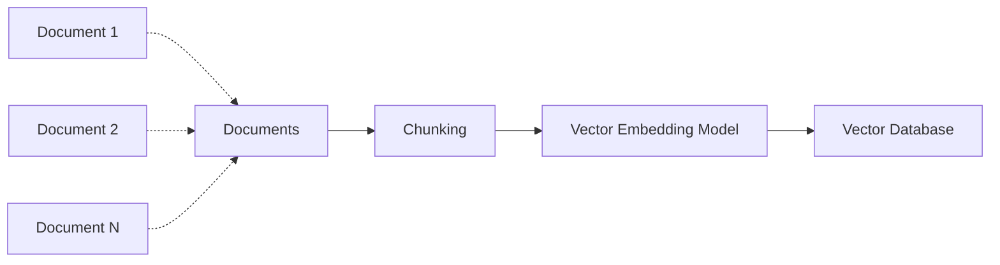
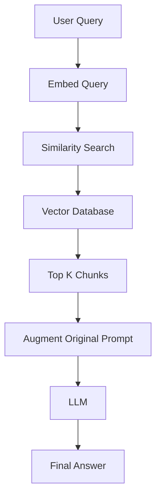

# RAG (Retrieval Augmented Generation) Architecture

**Difficulty**: Intermediate
**Time Investment**: 2-3 hours
**Prerequisites**: Basic understanding of vector embeddings, databases

---

## Learning Resources (Start Here)

### Primary Video
- **[Stanford Webinar - Agentic AI: A Progression of Language Model Usage](https://www.youtube.com/watch?v=kJLiOGle3Lw)** (90 min)
  - RAG section starts around 40 minutes
  - Covers chunking, embedding, retrieval strategies

### Supplementary
- **[Pinecone - What is RAG?](https://www.pinecone.io/learn/retrieval-augmented-generation/)** - Practical implementation guide
- **[OpenAI Cookbook - RAG Examples](https://cookbook.openai.com/examples/question_answering_using_embeddings)** - Code examples

---

## Why This Matters

LLMs have three fundamental limitations:
1. **Knowledge cutoff**: They don't know anything after their training date
2. **No proprietary data**: They can't access your company's docs, code, or databases
3. **Hallucinations**: They make up plausible-sounding but false answers

**RAG addresses all three** by giving the LM access to external, up-to-date, domain-specific knowledge at query time.

Understanding RAG architecture helps you understand how to evaluate vendors and tool but also how to design custom solutions when needed.

---

## Key Concepts

### The Core Problem RAG Solves

**Scenario**: User asks, "What's our vacation policy for remote employees?"

**Without RAG**:
- LM has no access to company policy docs
- It hallucinates a generic answer
- High risk of misinformation

**With RAG**:
- System retrieves relevant sections from policy docs
- Augments the prompt with retrieved text
- LM generates answer grounded in real data

**Formula**:
```
Final Response = LLM(Original Query + Retrieved Context)
```

---

## How It Works: The RAG Pipeline (AI Generated)

### Phase 1: Data Ingestion (One-Time Setup)



**Step 1: Chunking**
Break large documents into smaller, semantically meaningful pieces.

**Why chunking?**
- LMs have finite context windows (e.g., 200k tokens for Claude)
- Smaller chunks = more precise retrieval
- Chunk size is a trade-off (see "Common Approaches" below)

**Example**:
```
Original Document (5000 words)
↓
Chunk 1: Introduction (500 words)
Chunk 2: Architecture Overview (600 words)
Chunk 3: Security Considerations (700 words)
...
```

**Step 2: Embedding**
Convert each chunk into a numerical vector (e.g., 1536-dimensional array).

**Key insight**: Documents with similar semantic meaning have vectors that are numerically "close" in high-dimensional space.

**Example**:
```
Text: "The API endpoint returns JSON"
Vector: [0.12, -0.45, 0.78, ..., 0.23]  (1536 numbers)

Text: "JSON responses from REST API"
Vector: [0.14, -0.43, 0.76, ..., 0.21]  (similar numbers!)
```

**Popular Embedding Models (Always check for newer models)**:
- OpenAI `text-embedding-3-large` (best quality, higher cost)
- Cohere `embed-v3` (good balance)
- Open-source: `sentence-transformers` (free, runs locally)

**Step 3: Indexing**
Store vectors in a specialised database optimised for similarity search.

---

### Phase 2: Query Processing (Real-Time)



**Step 1: Embed the Query**
Use the **same embedding model** to convert the user's question into a vector.

**Example**:
```
Query: "How do I deploy the API?"
Vector: [0.13, -0.44, 0.77, ..., 0.22]
```

**Step 2: Similarity Search**
Find the top K chunks whose vectors are closest to the query vector.

**Common algorithm**: Cosine similarity or Euclidean distance

**Example**:
```
Query vector: [0.13, -0.44, ...]
Top matches:
1. "Deployment Guide" (similarity: 0.92)
2. "API Configuration" (similarity: 0.87)
3. "CI/CD Pipeline" (similarity: 0.81)
```

**Step 3: Augment the Prompt**
Inject retrieved chunks into the LM prompt.

**Example**:
```
System: You are a helpful assistant. Use the following context to answer questions.

Context:
[Chunk 1: Deployment Guide text...]
[Chunk 2: API Configuration text...]

User: How do I deploy the API?
```

**Step 4: Generate Response**
The LM now has relevant context and can answer accurately without hallucinating.

---

## Common Approaches (AI Generated)

### Chunking Strategies

| Strategy | Chunk Size | When to Use | Trade-offs |
|----------|-----------|-------------|-----------|
| **Fixed-size** | 500-1000 tokens | Simple docs (articles, blogs) | May split mid-sentence; fast to implement |
| **Semantic** | Variable (by paragraph/section) | Structured docs (manuals, wikis) | Preserves meaning; harder to implement |
| **Sliding window** | Overlapping chunks (e.g., 1000 tokens, 200 overlap) | Dense technical docs | Avoids context loss; higher storage cost |

**Architect's Decision**:
- Start with **fixed-size** (easier to debug)
- Upgrade to **semantic** if retrieval quality is poor

---

### Vector Database Options

| Database | Type | When to Use | Trade-offs |
|----------|------|-------------|-----------|
| **Pinecone** | Managed, cloud-native | Production, scale quickly | ✅ Easy, ❌ Vendor lock-in, cost |
| **Weaviate** | Open-source, self-hosted | Need control, hybrid search | ✅ Flexible, ❌ Operational overhead |
| **pgvector** | Postgres extension | Already using Postgres | ✅ Simple stack, ❌ Less optimised for scale |
| **Chroma** | In-memory, local | Prototyping, small datasets | ✅ Fast setup, ❌ Not production-ready |

**Architect's Decision**:
- **Prototype**: Start with Chroma (free, local)
- **Production (small scale)**: pgvector (leverage existing Postgres)
- **Production (large scale)**: Pinecone or Weaviate

---

### Retrieval Strategies

**Approach 1: Naive Retrieval (Top-K)**
- Retrieve the K most similar chunks
- Simple, fast
- May miss context if chunks are too small

**Approach 2: Hybrid Search (Vector + Keyword)**
- Combine semantic search (vectors) with traditional keyword search (BM25)
- Better for queries with specific terms (e.g., product names, IDs)
- Requires more complex indexing

**Approach 3: Reranking**
- Retrieve top 50 chunks with fast search
- Use a more powerful model to re-rank top 50 → top 5
- Higher accuracy, higher latency

**Architect's Decision**:
- Start with **Top-K** (simplest)
- Add **Hybrid** if users search for specific terms
- Add **Reranking** if accuracy is critical (e.g., legal, medical)

---

## Cost Considerations (AI Generated)

RAG infrastructure costs vary significantly by scale and approach. Understanding the cost model helps justify investment and choose appropriate solutions.

### Infrastructure Cost Tiers

**£ (Prototype/Small Scale)**
- **Setup**: Chroma or FAISS in-memory, <10K documents
- **Embedding**: Open-source models or small embedding APIs
- **Good for**: MVP, proof-of-concept, departmental tools
- **Limitations**: No persistence, single-server, limited scale

**££ (Production/Medium Scale)**
- **Setup**: Managed vector DB (Pinecone, Weaviate Cloud), 100K-1M documents
- **Embedding**: Commercial embedding APIs
- **Good for**: Enterprise applications, multi-team usage
- **Considerations**: Vendor lock-in, monthly commitments

**£££ (Enterprise/Large Scale)**
- **Setup**: Self-hosted clusters or managed enterprise tier, 10M+ documents
- **Embedding**: Batch processing, potentially self-hosted models
- **Good for**: High-volume applications, regulatory environments
- **Trade-offs**: Highest control, highest operational complexity

---

### Hidden Costs to Budget For

**1. Embedding API Calls**
- Initial indexing of large corpora can be expensive
- Re-indexing on schema changes requires full re-embedding
- **Mitigation**: Use smaller embedding models, batch requests, consider open-source alternatives

**2. Vector Storage & Compute**
- **Storage**: Higher embedding dimensions = larger vectors = more storage
  - 768-dim: Lower cost, lower accuracy
  - 1536-dim: Medium cost, good accuracy
  - 3072-dim: Higher cost, best accuracy
- **Compute**: Larger dimensions = slower similarity search
- **Trade-off**: Accuracy vs. cost/speed

**3. Retrieval Latency**
- Achieving <200ms P95 latency may require caching layers, CDN, or higher-tier database
- Re-ranking adds latency but improves accuracy

---

### Cost Trade-Offs in Vector Database Selection

| Database | Setup Cost | Ongoing Cost | Operational Overhead | Lock-in Risk |
|----------|-----------|--------------|---------------------|--------------|
| **Chroma** | £ | £ | Low (local dev) | None |
| **Pinecone** | ££ | ££ | Lowest (managed) | High |
| **Weaviate** | ££ | £-£££ | Medium-High | Medium |
| **pgvector** | £ | £ | Medium | Low |

**Decision framework:**
- **Budget tier £**: Chroma (local) or pgvector (if already using Postgres)
- **Budget tier ££**: Pinecone (ease) or pgvector (control)
- **Budget tier £££**: pgvector on managed Postgres (regulated) or Weaviate cluster (flexibility)

---

### ROI Considerations

**When does RAG pay for itself?**

RAG systems typically justify investment when:
- Manual document search consumes significant team time (>5 hours/week)
- Documentation is large enough that keyword search fails (>1000 documents)
- Accuracy of information retrieval directly impacts business outcomes (support quality, compliance)

**Key metrics to track:**
- **Time saved per query**: Manual (5-15 min) → RAG (<2 min)
- **Search success rate**: % of queries that return relevant results
- **Cost per query**: Infrastructure cost / total queries (target: fraction of a cent)

**Other benefits:**
- Reduced errors from outdated information
- Faster onboarding (self-service documentation)
- Consistent answers across teams

---

## Try It Yourself (AI Generated)

### Experiment 1: Build a Mini RAG System

**Setup** (using Python + OpenAI):
```python
# 1. Install dependencies
# pip install openai chromadb

# 2. Load documents
docs = ["Your company handbook", "API documentation", ...]

# 3. Chunk documents
chunks = [doc.split("\n\n") for doc in docs]  # Simple paragraph splitting

# 4. Embed and store in Chroma
import chromadb
client = chromadb.Client()
collection = client.create_collection("my_docs")
collection.add(documents=chunks, ids=[...])

# 5. Query
query = "What's the vacation policy?"
results = collection.query(query_texts=[query], n_results=3)

# 6. Augment prompt
context = "\n".join(results['documents'])
prompt = f"Context:\n{context}\n\nQuestion: {query}"

# 7. Send to LLM
# (use OpenAI API or similar)
```

**Observe**:
- How accurate is retrieval?
- What happens if chunk size is too small/large?
- Does the LM still hallucinate?

---

### Experiment 2: Test Chunk Size Impact

**Setup**: Take a 10-page technical doc

**Task**:
1. Chunk into 100-word chunks
2. Chunk into 500-word chunks
3. Chunk into 1000-word chunks

**Query**: "How do I configure authentication?"

**Observe**:
- Which chunk size retrieves the most relevant section?
- Does larger chunk size hurt precision (too much irrelevant info)?
- Does smaller chunk size miss context (split mid-thought)?

---

## Common Pitfalls (AI Generated)

### Pitfall 1: Mismatched Embedding Models
**Problem**: Using `model-a` to embed documents, `model-b` to embed queries
**Result**: Similarity search fails (vectors aren't comparable)
**Solution**: Always use the same embedding model for indexing and querying

### Pitfall 2: No Metadata Filtering
**Problem**: Retrieving chunks from old/deprecated docs
**Solution**: Add metadata (e.g., `version`, `last_updated`) and filter before similarity search

**Example**:
```python
collection.query(
    query_texts=["How to deploy?"],
    where={"version": "2.0"},  # Only search current version
    n_results=5
)
```

### Pitfall 3: Ignoring Retrieval Quality
**Problem**: Assuming retrieval always works
**Solution**: Log retrieved chunks; manually review to ensure relevance

**Metric to track**: Precision@K (% of retrieved chunks that are actually relevant)

### Pitfall 4: Over-Reliance on RAG
**Problem**: Using RAG when the LM already knows the answer
**Solution**: Use RAG for domain-specific, proprietary, or recent data. For general knowledge, skip retrieval.

---

## Advanced Techniques (AI Generated)

### Technique 1: Hypothetical Document Embeddings (HyDE)
**Problem**: User queries are short; documents are long. Vectors may not match well.

**Solution**:
1. Ask LM to generate a hypothetical answer to the query
2. Embed the hypothetical answer
3. Use that vector to search (better match with documents)

**Example**:
```
Query: "How to deploy?"
Hypothetical Answer: "To deploy the API, first configure the environment variables..."
Embed hypothetical answer → search → retrieve actual deployment guide
```

### Technique 2: Multi-Query Retrieval
**Problem**: A single query may not capture all relevant docs

**Solution**: Generate multiple variations of the query, retrieve for each, combine results

**Example**:
```
Original: "How to deploy the API?"
Variations:
- "API deployment steps"
- "Production deployment guide"
- "Deploy REST API"
```

### Technique 3: Parent-Child Chunking
**Problem**: Small chunks lack context; large chunks hurt precision

**Solution**: Store small chunks for retrieval, but return the full parent document to the LM

**Example**:
```
Retrieve: "Step 3: Configure database connection"
Return to LM: Entire "Deployment Guide" (includes context from steps 1-10)
```

---

## Related Topics

- [Agentic AI Evolution](../01-foundations/agentic-ai-evolution.md) - RAG is a key component of agentic systems
- [Prompt Engineering](./prompt-engineering.md) - How to structure prompts when using RAG
- [Context Management](../03-development-workflows/context-management.md) - Optimizing context provided to LMs

---

## Key Takeaway (AI Generated)

**RAG is the bridge between LMs and your data.** When designing RAG systems, focus on:

1. **Chunking strategy**: Start simple (fixed-size), optimise later
2. **Vector DB choice**: Prototype with Chroma, production with Pinecone/pgvector
3. **Retrieval quality**: Log and review retrieved chunks; track precision
4. **Cost vs. Accuracy**: Embedding, storage, and retrieval all have costs—balance against requirements

**When to use RAG**:
- ✅ Q&A over proprietary docs
- ✅ Code assistants for your codebase
- ✅ Customer support (access to tickets, knowledge base)

**When NOT to use RAG**:
- ❌ General knowledge questions (LM already knows)
- ❌ Real-time data that changes faster than you can re-index (use API calls instead)

Start with a prototype (Chroma + OpenAI embeddings), test with real user queries, then scale.
