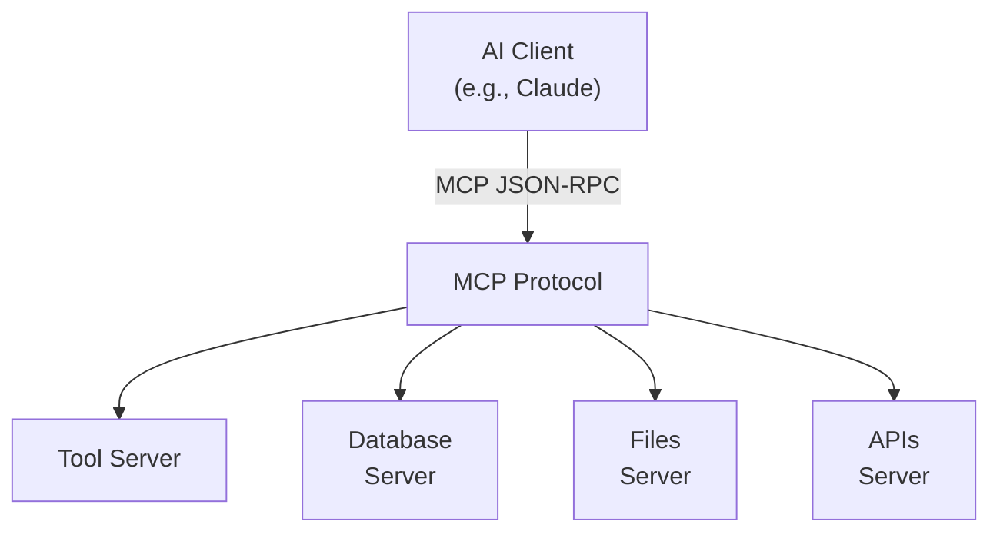
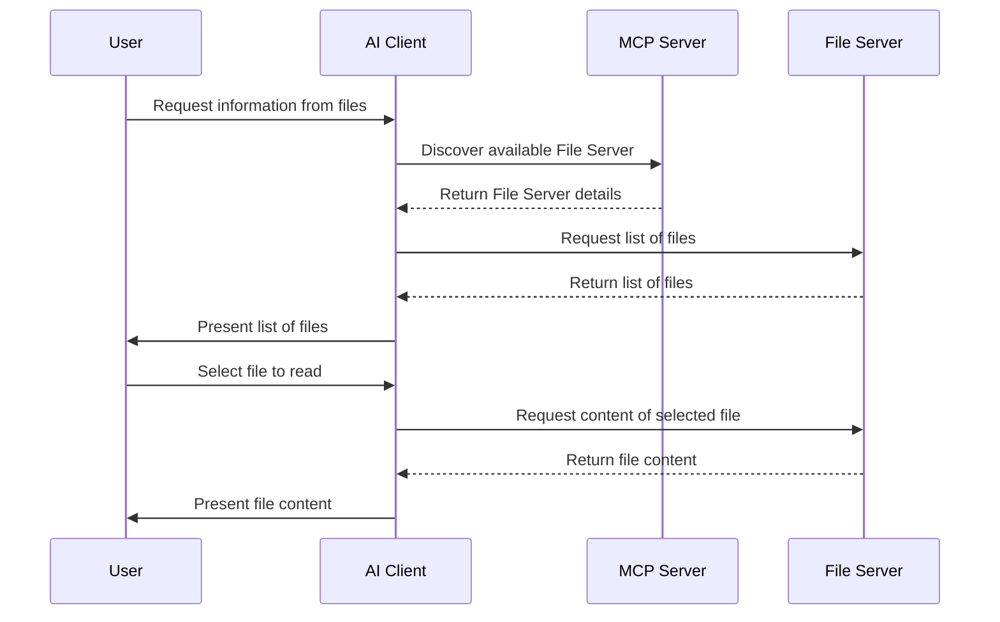
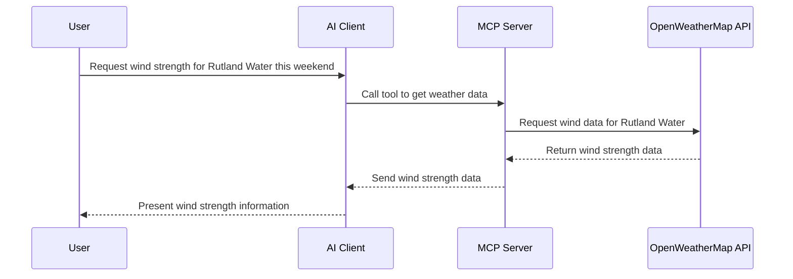

# Model Context Protocol (MCP)

**Difficulty**: Intermediate
**Time Investment**: 5-8 hours
**Prerequisites**: Basic understanding of APIs, client-server architecture, and LLM integration

---

## Learning Resources (Start Here)

### Official Documentation
- **[Anthropic Model Context Protocol Documentation](https://modelcontextprotocol.io/)** — Official specification and reference
- **[MCP GitHub Repository](https://github.com/anthropics/model-context-protocol)** — Source code, examples, and SDKs

### Videos & Tutorials
- **[Anthropic MCP Overview](https://www.anthropic.com/research/model-context-protocol)** — Introduction and architecture overview
- **[Building MCP Servers](https://modelcontextprotocol.io/tutorials)** — Step-by-step tutorials for common use cases

---

## Why This Matters

As AI agents become more sophisticated, they need access to diverse tools, data sources, and services to operate effectively. Without a standard protocol, each AI application must build custom integrations to every tool it needs — a fragmented, error-prone approach.

**Model Context Protocol (MCP) solves this** by providing a standardized, language-agnostic way for AI models to:
- Discover and call external tools
- Access local and remote resources
- Maintain secure, auditable integrations
- Share context with other agents and services

Understanding MCP helps you architect scalable, composable AI systems that can safely extend beyond the model's training data and built-in capabilities.

---

## What is Model Context Protocol?

### Definition

Model Context Protocol is an **open standard protocol** that defines how AI clients communicate with servers (tools, data sources, resources) to:
1. **Request context** — Retrieve data, documents, or information relevant to the current task
2. **Call tools** — Execute functions or services on behalf of the AI
3. **Manage resources** — Handle authentication, permissions, and state

### Key Design Principles

- **Standardized**: Language-agnostic JSON-RPC based protocol
- **Composable**: Multiple servers can be combined to create rich capability sets
- **Secure**: Built-in authentication, permission scoping, and audit trails
- **Simple**: Minimal specification for server developers to implement

### Architecture Overview





Each server implements MCP to provide a standardized interface for the client to interact with resources.

---

## Core Concepts

### Resources

**Resources** are named, addressable data or endpoints that the server can provide to the client.

**Examples**:
- A document: `file:///home/user/project/architecture.md`
- A database query: `postgres://inventory/products`
- An API endpoint: `https://api.example.com/weather`

Resources are described with:
- **URI**: Unique identifier
- **Name**: Human-readable description
- **MIME type**: Content type (text, JSON, binary, etc.)
- **Annotations**: Metadata for discovery

```json
{
  "uri": "file:///docs/architecture.md",
  "name": "Architecture Documentation",
  "mimeType": "text/markdown",
  "description": "System architecture and design decisions"
}
```

### Tools

**Tools** are callable functions or services that the server provides. The client can request the server to execute a tool with specific arguments.

**Examples**:
- Execute a SQL query
- Deploy an application
- Fetch data from an API
- Transform or validate data
- Run a linter or test suite

```json
{
  "name": "query_database",
  "description": "Execute a SQL query against the inventory database",
  "inputSchema": {
    "type": "object",
    "properties": {
      "query": {
        "type": "string",
        "description": "SQL query to execute"
      }
    },
    "required": ["query"]
  }
}
```

### Prompts

**Prompts** are pre-built, reusable instruction templates that help standardise how the client interacts with the server.

**Examples**:
- "Analyze code for security issues"
- "Generate a commit message based on file changes"
- "Summarise meeting notes"

Prompts can include dynamic arguments that the client fills in at runtime.

example
```json
{
    "name": "summarize_notes",
    "description": "Summarize meeting notes with customizable tone",
    "inputSchema": {
        "type": "object",
        "properties": {
            "notes": {
                "type": "string",
                "description": "Raw meeting notes to summarize"
            },
            "tone": {
                "type": "string",
                "enum": ["formal", "casual", "executive"],
                "description": "Desired tone for the summary"
            },
            "max_length": {
                "type": "integer",
                "description": "Maximum words in summary (optional)"
            }
        },
        "required": ["notes"]
    }
}
```

### Transport & Sessions

MCP supports multiple transport mechanisms:
- **Standard I/O**: Server runs as a subprocess, communicates via stdin/stdout
- **HTTP with SSE**: Server over HTTP, with Server-Sent Events for server-to-client messages
- **WebSockets**: Bidirectional communication over network sockets


#### Tradeoffs by Transport

| Transport | Latency | Scalability | Setup Complexity | Best For |
|-----------|---------|-------------|------------------|----------|
| **Stdio** | Lowest | Single client per process | Simplest | Local development, single-client tools |
| **HTTP + SSE** | Medium | High (stateless) | Medium | Web-based clients, multiple concurrent users |
| **WebSockets** | Medium | High (with load balancing) | Higher | Real-time interactions, bidirectional updates |

Choose based on your deployment model: local CLI tools favor Stdio, web services favor HTTP/SSE, and real-time collaborative systems favor WebSockets.


Each transport maintains a **session** between client and server, allowing for stateful interactions and resource discovery.

---

## How to Use MCP

### As a Client (Consuming Tools & Resources)

#### 1. Discover Available Servers

First, configure which MCP servers your application will connect to. This is typically done in a configuration file or environment.

```json
{
  "mcpServers": {
    "filesystem": {
      "command": "mcp-server-filesystem",
      "args": ["--root", "/home/user/projects"],
      "env": {}
    },
    "database": {
      "command": "mcp-server-postgres",
      "args": ["--connection", "postgresql://localhost/mydb"],
      "env": {}
    },
    "github": {
      "command": "npx",
      "args": ["@mcpx/github"],
      "env": {
        "GITHUB_TOKEN": "${GITHUB_TOKEN}"
      }
    }
  }
}
```

#### 2. Initialize Connection

Your AI client establishes a connection to each configured server:

```python
import asyncio
from mcp import ClientSession, StdioServerParameters
from mcp.client.stdio import stdio_client

async def connect_to_servers():
    # Connect to filesystem server
    fs_params = StdioServerParameters(
        command="mcp-server-filesystem",
        args=["--root", "/home/user"]
    )
    
    async with stdio_client(fs_params) as (read_stream, write_stream):
        async with ClientSession(read_stream, write_stream) as session:
            # Initialize connection
            await session.initialize()
            
            # List available resources
            resources = await session.list_resources()
            for resource in resources.resources:
                print(f"Resource: {resource.uri}")
            
            # List available tools
            tools = await session.list_tools()
            for tool in tools.tools:
                print(f"Tool: {tool.name}")
```

#### 3. Call Tools

When your AI agent needs to perform an action, request the server to execute a tool:

```python
async def execute_tool(session, tool_name, arguments):
    result = await session.call_tool(tool_name, arguments)
    return result.content[0].text
```

#### 4. Access Resources

Retrieve content from resources to augment the AI's context:

```python
async def read_resource(session, uri):
    # Read a resource by URI
    result = await session.read_resource(uri)
    return result.contents[0].text
```

### Integration with AI Agents

In practice, MCP is integrated into agentic workflows:

1. **User request** → "Deploy the latest changes to production"
2. **Agent thinks** → "I need to check the deployment status first"
3. **Agent calls tool** → `call_tool("github.get_latest_commit", {"repo": "myapp"})`
4. **Server executes** → Returns latest commit details
5. **Agent calls tool** → `call_tool("deploy.trigger", {"version": "abc123"})`
6. **Server executes** → Deployment starts
7. **Agent reports** → "Deployment triggered for commit abc123"

---

## How to Develop for MCP

### Building an MCP Server

MCP servers are relatively simple to build. You implement the MCP specification and expose resources and tools.

#### Prerequisites

- Language support: Python, TypeScript/JavaScript, Go, Rust, or any language with JSON-RPC support
- Understanding of async programming (most MCP interactions are asynchronous)
- Basic API design knowledge

#### Step 1: Set Up Project Structure

```
my-mcp-server/
├── src/
│   ├── server.py           # Main server implementation
│   ├── resources.py        # Resource definitions
│   └── tools.py            # Tool implementations
├── requirements.txt
├── setup.py
└── README.md
```

#### Step 2: Implement Using SDK

Use the official SDK for your language:

**Python Example**:

```python
import json
from mcp.server import Server
from mcp.types import (
    Resource, Tool, TextContent, ToolResult
)

# Initialize server
server = Server("my-mcp-server")

# Define a resource
@server.list_resources()
async def list_resources():
    return [
        Resource(
            uri="file:///data/config.json",
            name="Configuration File",
            mimeType="application/json"
        )
    ]

@server.read_resource()
async def read_resource(uri: str):
    if uri == "file:///data/config.json":
        with open("/data/config.json") as f:
            return TextContent(
                mimeType="application/json",
                text=f.read()
            )

# Define a tool
@server.list_tools()
async def list_tools():
    return [
        Tool(
            name="analyze_logs",
            description="Analyze application logs for errors",
            inputSchema={
                "type": "object",
                "properties": {
                    "log_file": {
                        "type": "string",
                        "description": "Path to log file"
                    },
                    "error_level": {
                        "type": "string",
                        "enum": ["WARNING", "ERROR", "CRITICAL"]
                    }
                },
                "required": ["log_file"]
            }
        )
    ]

@server.call_tool()
async def call_tool(name: str, arguments: dict):
    if name == "analyze_logs":
        log_file = arguments["log_file"]
        error_level = arguments.get("error_level", "ERROR")
        
        # Parse logs
        errors = parse_logs(log_file, error_level)
        
        return ToolResult(
            content=[TextContent(
                mimeType="text/plain",
                text=f"Found {len(errors)} {error_level} entries"
            )],
            isError=False
        )

# Run server
if __name__ == "__main__":
    import asyncio
    from mcp.server.stdio import stdio_server
    
    asyncio.run(stdio_server(server))
```

**TypeScript Example**:

```typescript
import { Server } from "@modelcontextprotocol/sdk/server/index.js";
import { StdioServerTransport } from "@modelcontextprotocol/sdk/server/stdio.js";
import {
  CallToolRequestSchema,
  ListResourcesRequestSchema,
  ListToolsRequestSchema,
  ReadResourceRequestSchema,
} from "@modelcontextprotocol/sdk/types.js";

const server = new Server({
  name: "my-mcp-server",
  version: "1.0.0",
});

// Handle resource listing
server.setRequestHandler(ListResourcesRequestSchema, async () => {
  return {
    resources: [
      {
        uri: "file:///data/config.json",
        name: "Configuration File",
        mimeType: "application/json",
      },
    ],
  };
});

// Handle resource reading
server.setRequestHandler(ReadResourceRequestSchema, async (request) => {
  const uri = request.params.uri;
  if (uri === "file:///data/config.json") {
    return {
      contents: [
        {
          uri,
          mimeType: "application/json",
          text: JSON.stringify({ /* config */ }),
        },
      ],
    };
  }
  throw new Error(`Unknown resource: ${uri}`);
});

// Handle tool listing
server.setRequestHandler(ListToolsRequestSchema, async () => {
  return {
    tools: [
      {
        name: "analyze_logs",
        description: "Analyze application logs for errors",
        inputSchema: {
          type: "object",
          properties: {
            log_file: {
              type: "string",
              description: "Path to log file",
            },
          },
          required: ["log_file"],
        },
      },
    ],
  };
});

// Handle tool calls
server.setRequestHandler(CallToolRequestSchema, async (request) => {
  const { name, arguments: args } = request.params;
  
  if (name === "analyze_logs") {
    const logFile = (args as { log_file: string }).log_file;
    const errors = await parseLogs(logFile);
    
    return {
      content: [
        {
          type: "text",
          text: `Found ${errors.length} errors`,
        },
      ],
    };
  }
  
  throw new Error(`Unknown tool: ${name}`);
});

// Run server
const transport = new StdioServerTransport();
await server.connect(transport);
```

#### Step 3: Define Resources and Tools

Resources should represent stable, addressable data. Tools should be actions the server can perform.

**Best Practices**:
- **Clear naming**: Use descriptive names (`database.query` not `db_q`)
- **Consistent parameters**: Document required vs. optional arguments
- **Error handling**: Return meaningful error messages
- **Security**: Validate all inputs, implement access controls
- **Efficiency**: Cache resources when appropriate, optimize tool execution

#### Step 4: Handle Authentication & Permissions

For servers accessing sensitive data:

```python
@server.call_tool()
async def call_tool(name: str, arguments: dict):
    # Check authorization
    if not has_permission(name):
        return ToolResult(
            content=[TextContent(
                mimeType="text/plain",
                text="Permission denied"
            )],
            isError=True
        )
    
    # Execute tool
    return perform_action(name, arguments)
```

#### Step 5: Package & Deploy

Package your server for distribution:

```bash
# Python
pip install -e .
# Or publish to PyPI
python setup.py upload

# TypeScript/JavaScript
npm publish
```

Clients configure it like:

```json
{
  "mcpServers": {
    "myserver": {
      "command": "python",
      "args": ["-m", "my_mcp_server"],
      "env": {
        "API_KEY": "${MY_SERVER_API_KEY}"
      }
    }
  }
}
```

---

## Practical Examples

### Example 1: Git Repository Server

A server exposing Git operations:

```python
@server.list_tools()
async def list_tools():
    return [
        Tool(
            name="get_latest_commit",
            description="Get latest commit information",
            inputSchema={
                "type": "object",
                "properties": {
                    "repo_path": {"type": "string"}
                },
                "required": ["repo_path"]
            }
        ),
        Tool(
            name="get_branch_list",
            description="List all branches",
            inputSchema={
                "type": "object",
                "properties": {
                    "repo_path": {"type": "string"}
                },
                "required": ["repo_path"]
            }
        ),
    ]

@server.call_tool()
async def call_tool(name: str, arguments: dict):
    if name == "get_latest_commit":
        repo_path = arguments["repo_path"]
        repo = Repo(repo_path)
        commit = repo.head.commit
        return ToolResult(
            content=[TextContent(
                mimeType="application/json",
                text=json.dumps({
                    "sha": commit.hexsha,
                    "message": commit.message,
                    "author": commit.author.name,
                    "date": commit.committed_datetime.isoformat()
                })
            )],
            isError=False
        )
```

### Example 2: Database Query Server

A server for executing parameterized SQL queries:

```python
@server.list_tools()
async def list_tools():
    return [
        Tool(
            name="execute_query",
            description="Execute a parameterized SQL query",
            inputSchema={
                "type": "object",
                "properties": {
                    "query": {"type": "string"},
                    "parameters": {"type": "object"}
                },
                "required": ["query"]
            }
        )
    ]

@server.call_tool()
async def call_tool(name: str, arguments: dict):
    if name == "execute_query":
        query = arguments["query"]
        params = arguments.get("parameters", {})
        
        # Safety: validate query doesn't contain dangerous commands
        if any(cmd in query.upper() for cmd in ["DROP", "DELETE", "TRUNCATE"]):
            return ToolResult(
                content=[TextContent(
                    mimeType="text/plain",
                    text="Dangerous query blocked"
                )],
                isError=True
            )
        
        # Execute safely
        result = execute_sql(query, params)
        return ToolResult(
            content=[TextContent(
                mimeType="application/json",
                text=json.dumps(result)
            )],
            isError=False
        )
```

### Example 3: File System Server

A server exposing safe file access:

```python
@server.list_resources()
async def list_resources():
    resources = []
    root = "/home/user/projects"
    
    for file in os.listdir(root):
        path = os.path.join(root, file)
        if os.path.isfile(path):
            resources.append(Resource(
                uri=f"file://{path}",
                name=file,
                mimeType=get_mime_type(file)
            ))
    
    return resources

@server.read_resource()
async def read_resource(uri: str):
    # Parse file:// URI
    file_path = uri.replace("file://", "")
    
    # Prevent directory traversal attacks
    if not file_path.startswith("/home/user/projects"):
        raise ValueError("Access denied")
    
    with open(file_path, "r") as f:
        return TextContent(
            mimeType=get_mime_type(file_path),
            text=f.read()
        )
```

---

## Tradeoffs & Considerations

When deciding whether to implement MCP in your architecture, weigh these factors against your specific requirements for tool integration, system complexity, and operational constraints.

### Advantages
- **Standardization**: No custom integration code for each tool
- **Composability**: Easily add new servers without client changes
- **Security**: Built-in authentication and permission scoping
- **Language agnostic**: Servers can be written in any language
- **Discoverability**: Clients can discover available tools and resources dynamically

### Challenges
- **Operational complexity**: Managing multiple servers and their configurations
- **Latency**: Network calls between client and server add latency
- **Error handling**: Distributed system error scenarios are more complex
- **Versioning**: Updates to server APIs must be managed carefully
- **Debugging**: Troubleshooting issues across client-server boundaries

### When to Use MCP

**Good fit**:
- Systems integrating multiple external tools or APIs
- Need for standardized, discoverable interfaces
- Want to decouple AI logic from tool implementations
- Building platforms where users or third parties add tools

**Not ideal**:
- Simple, single-tool integrations (too much overhead)
- Real-time, low-latency requirements
- Deeply stateful interactions


## Suggested Projects

Build your MCP expertise through hands-on practice. These projects progress from foundational to advanced concepts.

### Beginner Projects

**1. Simple File Server**
Create an MCP server that exposes a directory of files as resources and implements a tool to search for text within files.
- **Skills**: Basic resource management, tool implementation, file I/O
- **Time**: 2-3 hours
- **Starter code**: Use the [Python SDK example](https://github.com/anthropics/model-context-protocol/tree/main/examples/python) or the [TypeScript SDK example](https://github.com/anthropics/model-context-protocol/tree/main/examples/typescript).




**2. Weather Data Server**
Build an MCP server that wraps a public weather API (e.g., OpenWeatherMap) and exposes weather resources for different locations.
- **Skills**: HTTP integration, data transformation, resource discovery
- **Time**: 3-4 hours
- **Extension**: Add caching to improve performance 


### Intermediate Projects

**3. Database Query Server**
Implement a safe SQL query server that allows clients to execute read-only queries against a SQLite or PostgreSQL database with parameterized inputs.
- **Skills**: Database connections, input validation, error handling, security
- **Time**: 4-6 hours
- **Challenge**: Add query result pagination and rate limiting

**4. Git Operations Server**
Create an MCP server exposing Git repository operations (commit history, branch information, diffs) as both resources and tools.
- **Skills**: Process execution, structured data formatting, tool composition
- **Time**: 4-6 hours
- **Extension**: Add code review or diff analysis tools

**5. Documentation Server**
Build a server that indexes Markdown documentation and provides tools for searching and summarizing content.ß
- **Skills**: Text processing, search algorithms, resource relationships
- **Time**: 5-7 hours
- **Enhancement**: Add semantic search using embeddings

### Advanced Projects

**6. Multi-Server System**
Integrate 3-4 different MCP servers (filesystem, database, API wrapper) into a single AI agent orchestration system.
- **Skills**: Client-side server management, session handling, error recovery
- **Time**: 8-10 hours
- **Challenge**: Handle failures gracefully when one server is unavailable

**7. Custom Tool Aggregator**
Create an MCP server that itself acts as a client to other MCP servers, aggregating and transforming their capabilities into a unified interface.
- **Skills**: Nested client-server patterns, protocol composition, abstraction design
- **Time**: 10-12 hours
- **Real-world use**: Useful for simplifying multi-tool AI agent interfaces

**8. Stateful Workflow Server**
Build an MCP server that manages workflow execution state (e.g., CI/CD pipelines, approval workflows) with tools for triggering, monitoring, and querying progress.
- **Skills**: State management, async orchestration, progress tracking
- **Time**: 12-15 hours
- **Production consideration**: Implement persistence across server restarts

### Learning Milestones

| Project | Key Learning | Complexity |
|---------|--------------|-----------|
| File Server | Resource basics, simple tools | ⭐ |
| Weather API | HTTP integration, external APIs | ⭐⭐ |
| Database Server | Security, parameterization, validation | ⭐⭐⭐ |
| Git Server | Process execution, data transformation | ⭐⭐⭐ |
| Documentation Server | Text processing, search | ⭐⭐⭐ |
| Multi-Server System | Client patterns, coordination | ⭐⭐⭐⭐ |
| Tool Aggregator | Protocol composition, abstraction | ⭐⭐⭐⭐ |
| Workflow Server | State management, persistence | ⭐⭐⭐⭐⭐ |

### Evaluation Checklist

As you complete each project, ensure you've covered:
- [ ] Proper error handling and meaningful error messages
- [ ] Input validation to prevent misuse
- [ ] Security controls appropriate to the use case
- [ ] Clear documentation of resources and tools
- [ ] Tests demonstrating the server's functionality
- [ ] Example client code showing how to use the server
- [ ] Performance considerations for your use case

---

## Related Topics

Further reading within the AI learning path:

- **Foundations**: [AI Safety & Control](learning_paths/ai/01-foundations/ai-safety-control.md), [MLOps Principles](learning_paths/ai/01-foundations/mlops-principles.md)
- **Core patterns**: [Agentic Workflows](learning_paths/ai/02-core-patterns/agentic-workflows.md), [Prompt Engineering](learning_paths/ai/02-core-patterns/prompt-engineering.md), [RAG Architecture](learning_paths/ai/02-core-patterns/rag-architecture.md)
- **Development workflows**: [Agent Skills Framework](learning_paths/ai/03-development-workflows/agent-skills-framework.md), [Context Management](learning_paths/ai/03-development-workflows/context-management.md)
- **Governance & automation**: [Security Automation](learning_paths/ai/04-governance-automation/security-automation.md), [Integration Contracts](learning_paths/ai/04-governance-automation/integration-contracts.md)

---

## Further Reading

- **[Model Context Protocol Specification](https://modelcontextprotocol.io/docs)** — Complete technical specification
- **[MCP Implementation Guide](https://modelcontextprotocol.io/tutorials/building-servers)** — Step-by-step server development
- **[Example Servers](https://github.com/anthropics/model-context-protocol/tree/main/examples)** — Reference implementations in multiple languages
- **[Anthropic Blog - Model Context Protocol](https://www.anthropic.com/research/model-context-protocol)** — Architecture and design philosophy
- **[JSON-RPC 2.0 Specification](https://www.jsonrpc.org/specification)** — Underlying protocol specification
- **[Building Production AI Systems](https://www.anthropic.com/research)** — Best practices for reliable AI integrations

### Hands-On Resources

- **[MCP Server Development Tutorials](https://modelcontextprotocol.io/tutorials)** — Interactive guides for building servers
- **[Testing MCP Servers](https://modelcontextprotocol.io/docs/testing)** — Tools and patterns for validation
- **[Claude with MCP](https://claude.ai)** — Try using Claude with MCP-connected tools
