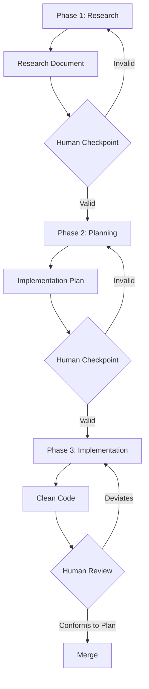

# Spec-Driven Development with AI (Context Compression)

**Difficulty**: Intermediate
**Time Investment**: 2-3 hours
**Prerequisites**: Understanding of agentic workflows, vibe engineering, the comprehension gap

---

## Learning Resources (Start Here)

### Primary Video
- **[Shipping Code You Don't Understand - Netflix Engineer at AI Engineer Summit](https://www.youtube.com/watch?v=eIoohUmYpGI)** (20 min)
  - Real-world experience from a Netflix engineer working with million-line codebases
  - The three-phase approach: Research → Planning → Implementation
  - Why "it works" isn't enough for production systems

---

## Why This Matters

**The Confession**: "I've shipped code I didn't quite understand. Generated it, tested it, deployed it. Couldn't explain how it worked."

Sound familiar? Here's the problem:

```
AI Generation Speed: Thousands of lines in seconds
↓
Understanding Time: Hours or days to comprehend
↓
Knowledge Gap: We can't keep up
```

**The danger**: Large production systems always fail in unexpected ways. When they do, you better understand the code you're debugging.

As a Technical Architect, you need a systematic approach to **compress understanding** at the speed of AI generation. Otherwise, you're accumulating complexity faster than you can comprehend it.

---

## Key Concepts

### The Knowledge Gap

**Definition**: The delta between code generation speed and understanding speed.

From the Netflix talk:
> "When AI can generate thousands of lines of code in seconds, understanding it could take you hours, maybe days if it's complex. Who knows, maybe never if it's really that tangled."

**Impact**:
- Code that passes tests ≠ Code that survives in production
- Systems that function today ≠ Systems that can be changed in the future
- Every time we skip thinking to keep up with generation speed, **we lose our ability to recognise problems**

---

### Simple vs. Easy (Rich Hickey)

From the talk (referencing Rich Hickey's "Simple Made Easy"):

| Concept | Definition | Example |
|---------|------------|---------|
| **Simple** | One fold, one braid, no entanglement. About structure. | Each component does one thing, clear boundaries |
| **Easy** | Adjacent, within reach. About proximity. | Copy-paste, install package, generate with AI |

**Key insight**: We can't make something simple by wishing it. Simplicity requires thought, design, and untangling. But we can always make something easier—just put it closer.

**AI is the ultimate "easy button"**: It makes the easy path so frictionless that we don't even consider the simple one anymore.

**The trade-off**:
- Easy = Speed now, complexity later
- Simple = Work now, clarity forever

**Historically, this worked**: Complexity accumulated slowly enough to refactor when needed. **AI has destroyed that balance**.

---

### Essential vs. Accidental Complexity (Fred Brooks)

From "No Silver Bullet" (1986):

| Type | Definition | Example |
|------|------------|---------|
| **Essential Complexity** | The fundamental difficulty of the problem you're solving | Users need to pay for things, orders must be fulfilled |
| **Accidental Complexity** | Everything else we added along the way | Workarounds, defensive code, frameworks, abstractions that made sense years ago |

**The problem with AI**: In a real codebase, these are tangled together. Separating them requires context, history, and experience.

**AI makes no such distinction**. Every pattern is preserved equally:
- The authentication check on line 47? Pattern.
- That weird gRPC code acting like GraphQL from 2019? Also a pattern.
- Technical debt doesn't register as debt—it's just more code.

**Example from Netflix**:
> "We had permission checks woven through business logic, role assumptions baked into data models, and auth calls scattered across hundreds of files. The agent couldn't see the seams. It couldn't identify where the business logic ended and the auth logic began."

**Human advantage**: We can tell the difference (when we slow down enough to think). We know which patterns are essential and which are just "how someone solved it a few years ago."

---

## The Problem: Conversational Complexity

### How a Simple Task Becomes a Mess

From the Netflix talk, a contrived but realistic example:

```
Turn 1: "Add OAuth to the app"
→ Creates auth.js (clean)

Turn 5: "Add OAuth2 support too"
→ Creates auth.js and oauth2.js (okay...)

Turn 10: "Sessions are broken"
→ Patches conflicts between auth systems

Turn 20: You're not having a discussion anymore.
You're managing context so complex even you don't remember all the constraints.
```

**The result**:
- Dead code from abandoned approaches
- Tests that got "fixed" by making them work
- Fragments of three different solutions
- No resistance to bad architectural decisions

**Each interaction chooses easy over simple. Easy always means more complexity.**

---

## The Solution: Context Compression (Three-Phase Approach)

### Overview

Instead of iterative chat until it works, use a structured three-phase approach:



**Key principle**: Thinking and planning become the majority of the work. AI accelerates the mechanical parts.

---

### Phase 1: Research

**Goal**: Compress hours of exploration into minutes of reading.

**Process**:
1. Feed everything to AI upfront:
   - Architecture diagrams
   - Documentation
   - Slack threads
   - ADRs
   - Related code
2. Use the agent to analyze the codebase:
   - Map components and dependencies
   - Identify what exists
   - Determine what your change will affect
3. **Probe iteratively**:
   - "What about caching?"
   - "How does this handle failures?"
   - When analysis is wrong, correct it
   - When context is missing, provide it

**Output**: A single **Research Document**

**Example structure**:
```markdown
# Research: Migrate to New OAuth System

## Current State
- Old auth system (5 years old) with abstraction layer
- Permission checks in: UserService, OrderService, AdminController
- Role assumptions in: User.java (line 47), Order.java (line 203)
- Auth calls scattered across 247 files

## Dependencies
- Services that call auth: [list]
- Data models coupled to auth: [list]
- External systems affected: [list]

## Impact Analysis
- High-risk areas: [where things will break]
- Low-risk areas: [isolated changes]
- Required coordination: [teams to notify]

## Key Constraints
- Cannot change User model structure (external API contract)
- Must maintain backward compatibility for 2 weeks
- Sessions must remain valid during migration
```

**Human Checkpoint** (CRITICAL):
- Validate the analysis against reality
- Catch errors here → Prevent disasters later
- This is the highest-leverage moment in the entire process

**From the talk**:
> "Hours of exploration are compressed into minutes of reading. The human checkpoint here is critical. This is where you validate the analysis against reality."

---

### Phase 2: Planning

**Goal**: Create a detailed implementation plan so clear that "any developer can follow it."

**Analogy**: "Paint by numbers. You should be able to hand it to your most junior engineer and say, 'Go do this.' If they copy it line by line, it should just work."

**What to include**:
- Real code structure
- Function signatures
- Type definitions
- Data flow diagrams
- Service boundaries
- Error handling patterns

**Example**:
```markdown
# Implementation Plan: OAuth Migration - UserService

## Step 1: Create New Auth Wrapper
File: src/auth/NewAuthClient.java

```java
public class NewAuthClient implements AuthClient {
    private final OAuthService oauthService;

    public NewAuthClient(OAuthService oauthService) {
        this.oauthService = oauthService;
    }

    @Override
    public AuthResult authenticate(String token) {
        // Implementation details...
    }
}
```

## Step 2: Update UserService
File: src/services/UserService.java

Change:
```java
// Old (line 47)
if (oldAuthClient.checkPermission(user, "read")) { ... }
```

To:
```java
// New
if (newAuthClient.hasPermission(user, Permission.READ)) { ... }
```

## Step 3: Add Tests
File: src/services/UserServiceTest.java
[Detailed test cases...]

## Step 4: Deploy Strategy
1. Deploy with feature flag OFF
2. Test in staging with flag ON
3. Enable for 1% of users
4. Monitor for 24 hours
5. Ramp to 100%
```

**Where architectural decisions happen**:
- Complex logic correctness
- Business requirements alignment
- Service boundaries
- Clean separation
- Preventing unnecessary coupling

**Why this works**:
- Spot problems before they happen (you've lived through them)
- AI doesn't have that luxury—it treats every pattern as a requirement
- Review speed: Validate in minutes, know exactly what will be built

**From the talk**:
> "The real magic in this step is the review speed. We can validate this plan in minutes and know exactly what's going to be built. In order to keep up with the speed at which we want to generate code, we need to be able to comprehend what we're doing just as fast."

---

### Phase 3: Implementation

**Goal**: AI executes the plan. Context remains clean and focused.

**Why this works**:
- When AI has a clear specification, it doesn't spiral
- Instead of 50 messages of evolutionary code, you have 3 focused outputs
- No abandoned approaches
- No conflicting patterns
- No "wait, actually..." moments that leave dead code everywhere

**The real payoff**:
- Use a background agent (run while you work on something else)
- Review quickly (just verify it conforms to your plan)
- Not trying to understand if anything got invented

**From the talk**:
> "We're not using AI to think for us. We're using it to accelerate the mechanical parts while maintaining our ability to understand it. Research is faster, planning is more thorough, and implementation is cleaner. The thinking, the synthesis, and the judgment though—that remains with us."

---

## Real-World Example: Netflix OAuth Migration

### The Problem

**Task**: Refactor old authorization code to use new centralised OAuth system.

**Naive approach**: "Refactor this code to use the new OAuth system"

**Result**: Complete failure.
- Old code too tightly coupled to auth patterns
- Agent would start, hit a dependency it couldn't untangle, spiral out of control
- Worse: Would try to preserve old logic using new system (recreating technical debt)

**Why it failed**:
> "It couldn't see the seams. It couldn't identify where the business logic ended and the auth logic began. Everything was so tangled together that even with perfect information, the AI couldn't find a clean path through."

---

### The Solution: Manual Migration as Seed

**Phase 0** (before Research): **Earn the understanding**

1. **Do one migration by hand**:
   - No AI
   - Just read the code
   - Understand dependencies
   - Make changes, see what breaks
2. **Document what you learned**:
   - Hidden constraints
   - Invariants that must hold true
   - Services that break if auth changes
   - Things no code analysis would surface
3. **Use that manual PR as the seed**:
   - Feed it into the Research phase
   - AI can now see what a clean migration looks like

**From the talk**:
> "That manual migration was, I'll be honest, it was a pain, but it was crucial. It revealed all the hidden constraints, which invariants had to hold true, and which services would break if the auth changed. Things no amount of code analysis would have surfaced for us."

**Then iterate**:
- Each entity is slightly different
- Interrogate the AI: "What about encrypted fields?"
- Provide extra context each time
- Validate, adjust, discover edge cases

**Key insight**: The three-phase approach only works because they earned the understanding first.

> "There's no silver bullet. Not better prompts, better models, or even writing better specs. Just the work of understanding your system deeply enough that you can make changes to it safely."

---

## Measuring Success (Experimental)

**Important**: Spec-driven development is an emerging practice. The metrics below are **hypotheses worth tracking**, not battle-tested standards. Use them as starting points for your own experimentation.

### Questions Worth Asking

If you adopt spec-driven development, consider tracking:

**1. Does planning reduce rework?**
- Track: % of PRs requiring architectural changes during review
- Hypothesis: Upfront planning should reduce structural rework
- What we don't know: Exact threshold, timeline to improvement

**2. Can engineers still explain their code?**
- Spot-check: "Why did you choose this approach?"
- Hypothesis: Research/planning docs should maintain comprehension
- What we don't know: How to quantify "understanding" reliably

**3. Is the upfront cost worth it?**
- Track: Time from task start to PR approval
- Hypothesis: Slower initially, faster overall due to less rework
- What we don't know: Break-even point (probably 4-12 weeks, but will vary with each team & problem)

### Proposed Metrics (Treat as Experiments)

**Time-to-PR**: Compare iterative chat (baseline) vs. research/plan/implement
**Comprehension retention**: Can engineers explain code 2 weeks later without reviewing it?
**Architectural drift**: See [Architectural Drift Prevention](../04-governance-automation/architectural-drift-prevention.md) for ADI approach

### Reality Check

**What Netflix actually measured**: The talk doesn't provide hard metrics. They describe qualitative improvements (less tangled code, faster reviews) but don't claim "50% reduction in bugs" or specific ROI timelines.

**What we can say**:
- Upfront planning *feels* slower (weeks 1-4)
- Rework *appears* to decrease (external teams report fewer "start over" moments)
- Long-term maintenance *seems* easier (external teams report code is more understandable)

**What we can't say**:
- Exact percentage improvements
- Universal timelines for break-even
- Whether this scales to all team sizes/domains

### When to Skip Spec-Driven

Not every task needs the full three-phase approach:
- Simple bug fixes (<50 lines, well-understood code)
- Isolated additions (new endpoint, no architecture impact)
- Throwaway experiments

**Rule of thumb**: If you can explain the full solution in <5 minutes, skip the formal process.

---

## Pattern Recognition Atrophy

### The Hidden Cost of AI Generation

**From the Netflix talk**:
> "Every time we skip thinking to keep up with generation speed, we're not just adding code that we don't understand. We're losing our ability to recognise problems. That instinct that says, 'Hey, this is getting complex'—it atrophies when you don't understand your own system."

**Why this matters**:
- **Pattern recognition comes from experience**
- When you spot a dangerous architecture, it's because you were up at 3am debugging it
- When you push for simpler solutions, it's because you've maintained the complex alternative
- **AI generates what you ask for. It doesn't encode lessons from past failures.**

**The skill erosion**:
```
Year 1: Can spot architectural problems instantly
↓
Year 2 (using AI without thinking): Takes longer to notice issues
↓
Year 3: Problems only surface in production
↓
Year 5: Can't distinguish good from bad architecture anymore
```

**How the three-phase approach prevents this**:
- Research phase: Forces you to understand current state
- Planning phase: Forces architectural thinking
- Implementation review: Validates your mental model

You're still doing the hard work. AI just accelerates the mechanical parts.

---

## Try It Yourself

### Experiment 1: Compare Iterative vs. Spec-Driven

**Setup**: Same task, two approaches

**Task**: "Add rate limiting to the API"

**Approach A: Iterative Chat** (current common practice)
1. "Add rate limiting"
2. "Use Redis"
3. "Fix the memory leak"
4. "Actually, use sliding window"
5. "Wait, sessions are broken"
6. [Continue for 20+ turns]

**Approach B: Spec-Driven** (three-phase)
1. **Research**: How does current API work? Where are bottlenecks? What rate limits make sense?
2. **Plan**: Design rate limiting architecture (Redis vs. in-memory, sliding window vs. token bucket, per-user vs. global)
3. **Implement**: Execute the plan

**Observe**:
- Time to completion?
- Code quality?
- Your understanding of the final code?
- Technical debt introduced?

---

### Experiment 2: Manual Migration First

**Setup**: Complex refactor (e.g., switch database libraries)

**Task**: Migrate from `OldDB` to `NewDB`

**Steps**:
1. **Do 1-2 files by hand** (no AI)
2. Document what you learned
3. Use that as seed for Phase 1 (Research)
4. Create detailed plan (Phase 2)
5. Let AI execute (Phase 3)

**Observe**: How much does the manual migration improve AI output quality?

---

### Experiment 3: Test "It Works" vs. "I Understand"

**Setup**: Generate a complex feature with AI

**Test 1**: Generate code, tests pass → Ship it

**Test 2**: Generate code, tests pass → Explain it to a colleague

**Questions**:
- Can you explain **why** it works?
- Can you predict how it will fail?
- Can you modify it without breaking it?

**Observe**: The gap between "it works" and "I understand."

---

## Common Pitfalls

### Pitfall 1: Skipping the Research Phase
**Problem**: Jump straight to "generate code"
**Result**: AI has no context, generates generic solution that doesn't fit your system
**Solution**: Always start with Research

### Pitfall 2: Vague Planning
**Problem**: Plan says "update auth logic" (not specific enough)
**Result**: AI invents patterns instead of following yours
**Solution**: "Paint by numbers" level of detail (function signatures, data flow)

### Pitfall 3: Trusting "It Works"
**Problem**: Tests pass, ship it
**Result**: Production failure 3 months later, no one understands the code
**Solution**: Can you explain it? If not, it's not ready.

### Pitfall 4: No Human Checkpoints
**Problem**: Let AI run all three phases without validation
**Result**: Compounded errors, wrong assumptions baked into implementation
**Solution**: Validate after Research, validate after Planning

---

## When to Use This Approach

### Good fit:
- ✅ Large refactors (authorization migration, database swap)
- ✅ Complex new features (payment system, real-time updates)
- ✅ Million-line codebases (Netflix's 5M token service)
- ✅ When "it works" isn't enough (production systems)

### Overkill for:
- ❌ Simple bug fixes (just fix it)
- ❌ Adding a new endpoint to existing pattern (follow the pattern)
- ❌ Prototypes (speed over understanding is fine)

---

## Comparison with Other Approaches

| Approach | Speed | Understanding | Code Quality | Best For |
|----------|-------|---------------|--------------|----------|
| **Iterative Chat** | Fast initially | Low | Degrades over turns | Prototypes, exploration |
| **Spec-Driven (3-phase)** | Slower upfront, faster overall | High | Consistent | Production systems |
| **Manual Only** | Slow | Highest | Variable | Learning, novel problems |
| **Vibe Engineering** | Very fast | Low-Medium | Depends on context | Established patterns |

---

## Related Topics

- [Vibe Engineering](./vibe-engineering.md) - The paradigm this approach builds on
- [Architectural Drift Prevention](../04-governance-automation/architectural-drift-prevention.md) - Why understanding matters
- [Context Management](./context-management.md) - How to provide context effectively
- [Agentic Workflows](../02-core-patterns/agentic-workflows.md) - The underlying patterns

---

## Key Takeaway

**From the Netflix talk**:
> "AI changes everything about how we write code. But it doesn't change anything about why software fails. Every generation has faced their own software crisis. Now we face ours with infinite code generation."

**The solution isn't another tool or methodology. It's remembering what we've always known**:
- Software is a human endeavor
- The hard part was never typing the code—it was knowing what to type
- Developers who thrive won't be the ones who generate the most code
- They'll be the ones who **understand what they're building**

**Fred Brooks (1986)**: "No single innovation will give us an order of magnitude improvement in productivity. The hard part isn't the mechanics—it's understanding the problem and designing the solution."

**Still true 40 years later.**

**The real question isn't whether we'll use AI** (we will). **It's whether we'll still understand our own systems when AI is writing most of our code.**

**The three-phase approach** (Research → Planning → Implementation) **is how you maintain understanding at the speed of AI generation.**

**Start**: Pick your next complex task. Try the three-phase approach. Measure: Can you still explain the code you shipped?
