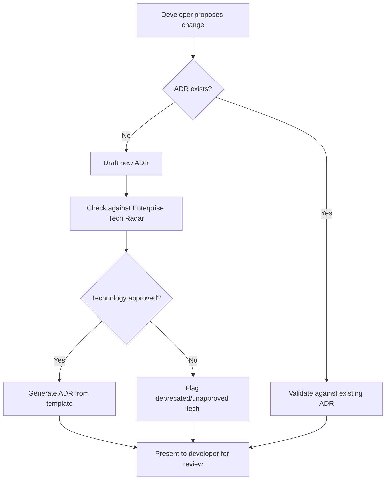

# ADR Automation with Agent Skills

**Difficulty**: Advanced
**Time Investment**: 2-3 hours
**Prerequisites**: Understanding of ADRs, agent skills framework, governance challenges

---

## Learning Resources (Start Here)

### Primary Concepts
- **[Agent Skills Framework](../03-development-workflows/agent-skills-framework.md)** - Foundation for building governance skills
- **[ADR Templates - Michael Nygard](https://github.com/joelparkerhenderson/architecture-decision-record)** - Standard ADR format

### Supplementary
- **[Thoughtworks Tech Radar](https://www.thoughtworks.com/radar)** - Example of technology governance at scale

---

## Why This Matters

**The Problem**: Architectural Decision Records (ADRs) are critical for long-term maintainability, but they're often:
- Forgotten entirely (developers jump straight to coding)
- Inconsistent (different formats, missing context)
- Misaligned with enterprise standards (using deprecated tech)
- Written **after** the code is committed (documentation debt)

**The Cost**:
- New team members can't understand why decisions were made
- Same debates happen repeatedly (no institutional memory)
- Technical debt accumulates (no one documented the trade-offs)
- Architects become bottlenecks (manual review of every decision)

**The Solution**: Agent skills can act as **architecture guardrails**, automatically:
- Detecting when an ADR is needed
- Drafting ADRs using approved templates
- Validating against enterprise standards (tech radar, golden paths)
- Preventing misaligned decisions before code is written

---

## Key Concepts

### What Are ADRs?

**Architecture Decision Record (ADR)**: A document that captures an important architectural decision along with its context and consequences.

**Standard Format (Nygard)**:
```markdown
# ADR-XXX: [Decision Title]

## Status
Accepted | Proposed | Deprecated | Superseded by ADR-YYY

## Context
What is the issue we're trying to solve?
What constraints exist? (team size, budget, timeline)
What alternatives did we consider?

## Decision
What did we decide to do?
Be specific: "We will use PostgreSQL for the primary database"

## Consequences
Positive outcomes (what we gain)
Negative outcomes (what we lose, technical debt we accept)
Risks and mitigations
```

**Example**:
```markdown
# ADR-003: Use Zustand for Client State Management

## Status
Accepted

## Context
Our Next.js application needs client-side state management for:
- User session data
- UI state (modals, filters)
- Real-time notifications

Alternatives considered:
- Redux (too complex for our small team of 3)
- Context API (performance issues with frequent updates)
- Zustand (simpler API, good performance)

## Decision
We will use Zustand for all client-side state management.

## Consequences
✅ Simpler API (less boilerplate than Redux)
✅ Good performance (optimised re-renders)
❌ Smaller community than Redux (fewer examples)
❌ Need to educate team (new library)
```

---

## The `adr-governor` Skill

### What It Does

**Triggers when**:
- User proposes a new technology ("Let's use Redis")
- User proposes an architectural change ("We should switch to microservices")
- Code changes suggest a significant decision (new database, new framework)

**Workflow**:


### Skill Structure

```
/adr-governor/
├── SKILL.md                 # Instructions for when/how to use
├── templates/
│   └── adr-template.md      # Nygard format template
├── references/
│   ├── tech-radar.json      # Approved/deprecated technologies
└── scripts/
    ├── validate_adr.py      # Check ADR against standards
    └── generate_adr.sh      # Create new ADR from template
```

---

## How It Works: Practical Example

### Scenario: Developer Wants to Use Redis

**Without `adr-governor`**:
```
Developer: "Let's use Redis for caching"
→ Implements Redis
→ Pushes code
→ Architect reviews PR: "Why Redis instead of our standard Memcached?"
→ Debate happens in PR comments
→ Code rework or exception approval
→ No ADR written (context lost)
```

**With `adr-governor`**:
```
Developer: "Let's use Redis for caching"
→ Skill triggers: "I detect a new technology proposal"
→ Skill checks tech-radar.json:
   {
     "redis": {
       "status": "assess",
       "note": "We standardise on Memcached. Redis requires approval."
     }
   }
→ Skill responds:
   "Redis is in 'assess' status. Our standard is Memcached.
    To proceed with Redis, we need to document why it's necessary.
    I'll draft an ADR for you."
→ Skill generates ADR:
   # ADR-012: Use Redis Instead of Memcached for Caching

   ## Context
   [Prompts developer to fill in: Why is Memcached insufficient?]

   ## Decision
   We will use Redis for [specific use case]

   ## Consequences
   ✅ [Benefits Redis provides]
   ❌ Diverges from standard (increases operational complexity)

→ Developer fills in context
→ Skill validates: "This looks good. File a PR with this ADR."
→ Architect reviews ADR (not PR comments)
→ Decision documented for future reference
```

---

## Try It Yourself

[Exmaple version of the Skill](https://github.com/madetech/madetech-madeinsight/blob/main/.claude/skills/adr-governor/skill.md)

### Experiment 1: Test Without ADR Skill

**Setup**: Use Claude Code or Cursor **without** the adr-governor skill

**Task**: "Initialise a new project using Express and MongoDB"

**Observe**:
- Does the agent ask about ADRs? (No)
- Does it validate your technology choices? (No)
- Does it warn about deprecated tech? (No)

**Lesson**: Without guardrails, agents will happily implement suboptimal choices.

---

### Experiment 2: Test With ADR Skill

**Setup**: Add the adr-governor skill (use example above)

**Task**: "Initialise a new project using Express and MongoDB"

**Observe**: The skill **prevents** bad decisions before code is written.

**Note:** As descrbed in the [Agent Skills Framework](./agent-skills-framework.md) Agent Skills have limitations, you made need to prompt Claude to use this skill for now...

---

### Experiment 3: Auto-Generate ADR

**Setup**: With adr-governor skill enabled

**Task**: "We need to add real-time features to the app"

**Expected agent behavior**:
1. Detect architectural decision (real-time = new pattern)
2. Ask clarifying questions:
   - "What's the expected scale? (100 users? 10,000?)"
   - "What's the latency requirement?"
   - "Is this critical functionality or nice-to-have?"
3. Propose options:
   - WebSockets (for low latency, high concurrency)
   - Server-Sent Events (for one-way updates, simpler)
   - Polling (for simplicity, lower scale)
4. Draft ADR based on your answers

**Observe**: The skill **guides** the decision-making process, not just documents it.

---

## Common Pitfalls

### Pitfall 1: Tech Radar Becomes Stale
**Problem**: Radar says "use React 16" but you're on React 18
**Solution**: Treat tech radar like code—review quarterly, update proactively

### Pitfall 2: Too Strict (Blocks Everything)
**Problem**: Skill flags every minor library choice
**Solution**: Only govern **significant** decisions (databases, frameworks, major libraries)

### Pitfall 3: No Escape Hatch
**Problem**: Developer has a valid reason to deviate, but skill blocks them
**Solution**: Allow "exception ADRs" that document why standard was bypassed

### Pitfall 4: ADRs Written After Implementation
**Problem**: Developer codes first, writes ADR later (loses decision context)
**Solution**: Skill should trigger **before** code is written (ideally in planning phase)

---

## Related Topics

- [Agent Skills Framework](../03-development-workflows/agent-skills-framework.md) - How to build governance skills
- [Security Automation](./security-automation.md) - Similar governance pattern for security
- [Integration Contracts](./integration-contracts.md) - Governance for API schemas

---

## Key Takeaway

ADR automation may **help to mitigate** the "governance at scale" problem, but it may contribute velocity without comprehension, your mileage may vary.

**Without automation**:
- Architects manually review every decision (bottleneck)
- ADRs are afterthoughts (written after code)
- Inconsistent quality (depends on who writes it)

**With automation (adr-governor skill)**:
- Decisions validated in real-time (before code)
- ADRs auto-generated from templates (consistent format)
- Enterprise standards enforced automatically (no manual gatekeeping)
- Risk of introducing another 'Easy Button' shortcut which could lead to velocity without comprehension

**Start**:
1. Create a simple tech radar (10-20 technologies)
2. Introduce the adr-governor skill
3. Test on one team working on an Alpha/Private Beta project for a couple of sprints
4. Measure: How many "bad" decisions were caught early?

**The goal**: Agents reduce the friction and toil of the ADR process to improve technical decision audit trails.
