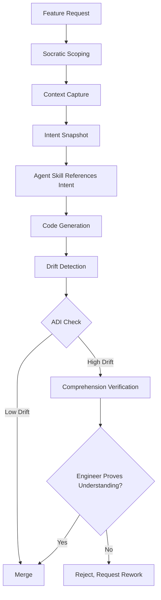

# Architectural Drift Prevention

**Difficulty**: Advanced
**Time Investment**: 3-4 hours
**Prerequisites**: Understanding of ADRs, agent skills, code review processes

---

## Why This Matters

**The Comprehension Gap**: AI coding agents (Cursor, Copilot, Claude Code) enable unprecedented velocity, but they create a systemic risk:

**Engineers merge complex AI-generated code they don't fully understand.**

This leads to three critical problems:

1. **The "Easy Button" Trap**: Teams accept AI-generated code without critical analysis, accumulating technical debt
2. **Architectural Drift**: AI agents optimise for local completion, not global architectural patterns (the "Golden Path")
3. **Knowledge Atrophy**: As AI handles the "how," engineers lose the "why," making debugging and pivoting impossible

**For public sector and regulated industries**, this is especially critical—software is maintained for decades, and the "audit trail of intent" is mandatory.

---

## Key Concepts

### The Comprehension Gap

**Definition**: The delta between code velocity (how fast AI generates code) and human comprehension (how well engineers understand it).

```
┌─────────────────────────────────────┐
│  AI Code Generation Velocity        │  ← Exponentially increasing
├─────────────────────────────────────┤
│                                     │
│    ← COMPREHENSION GAP →            │  ← Growing over time
│                                     │
├─────────────────────────────────────┤
│  Human Comprehension Capacity       │  ← Relatively constant
└─────────────────────────────────────┘
```

**Symptoms**:
- PRs with 500+ lines of AI code, approved in 5 minutes
- Engineers can't explain why the code works
- Bugs discovered months later because no one understood the edge cases
- Architectural patterns violated because AI doesn't "know" the Golden Path

---

### The Golden Path

**Definition**: The enterprise-blessed, standardised approach to common problems.

**Examples**:
- "All S3 access goes through `S3Wrapper`, never raw `boto3`"
- "All database queries use the `DBConnection` pool, not direct connections"
- "All authentication uses `AuthMiddleware`, not custom JWT parsing"

**Why AI violates it**: LLMs are trained on generic code from the internet, not your organisation's specific patterns.

---

## The Architectural Drift Index (ADI)

### What It Measures

**ADI quantifies** how much a code change deviates from the planned architecture (the "Golden Path").

**Formula**:
```
ADI = (Σ Vi × Si) / T

Where:
Vi = Individual architectural violation
Si = Severity weight (0.0 to 1.0)
T = Total architectural touchpoints in the PR
```

**Result**: A percentage representing drift (0% = perfect alignment, 100% = complete divergence).

---

### Example Calculation

**Scenario**: PR adds an S3 file upload feature

**Planned Architecture (from ADR)**:
- Use `S3Wrapper` for all S3 operations
- Trigger audit event on successful upload
- Use global error handler

**AI-Generated Code Violations**:

| Violation (Vi) | Description | Severity (Si) |
|----------------|-------------|---------------|
| V1: Direct Import | Used raw `boto3` instead of `S3Wrapper` | 0.8 (High Risk) |
| V2: Missing Log | No audit event on upload | 1.0 (Critical) |
| V3: Local Pattern | Custom error handler instead of global | 0.2 (Low Risk) |

**Total Architectural Touchpoints (T)**: 10 (number of relevant rules/patterns)

**Calculation**:
```
Weighted Sum = (1 × 0.8) + (1 × 1.0) + (1 × 0.2) = 2.0
ADI = 2.0 / 10 = 0.20 (20%)
```

---

### ADI Thresholds & Actions

| ADI Range | Status | Action |
|-----------|--------|--------|
| **0.00 - 0.05** | 🟢 Green (Low Drift) | Auto-approve or light review |
| **0.06 - 0.15** | 🟡 Yellow (Moderate Drift) | Trigger Socratic Review (ask "why?") |
| **> 0.15** | 🔴 Red (Critical Drift) | Block merge, require manual architect review |

**Example**: ADI = 0.20 → 🔴 Red → PR blocked until violations are addressed.

---

### Calibrating Severity Weights for Your Organisation (Hypothesis)

The severity weights (Si) in the ADI formula are **starting points, not universal truths**. Calibrate them to your organisation's priorities and risk tolerance.

**Example calibration rationale:**

| Violation Type | Severity (Si) | Justification |
|----------------|---------------|---------------|
| Security violations (missing auth, exposed secrets) | 1.0 (Critical) | One breach can cost £M+ in incident response, regulatory fines |
| Performance degradation (N+1 queries, memory leaks) | 0.7-0.8 (High) | Impacts user experience, harder to fix later, compounds over time |
| Golden Path deviations (wrong library, pattern) | 0.5-0.6 (Medium) | Increases maintenance burden, fragments knowledge |
| Code style violations (naming, formatting) | 0.1-0.2 (Low) | Low business impact, easy to fix, mostly aesthetic |

**How to calibrate:**
1. **Review past incidents** - What violations caused the most pain? Assign higher weights.
2. **Estimate remediation cost** - How expensive is it to fix this type of violation later? Higher cost = higher weight.
3. **Adjust quarterly** - Review actual drift patterns and recalibrate weights based on real outcomes.
4. **Document rationale** - Keep a `severity-weights.md` file explaining why each weight was chosen.

**Important**: This is a **heuristic, not a science**. The value is in **consistent measurement**, not perfect weights. A team using 0.8 for security vs. another using 1.0 is less important than both teams measuring consistently.

**Start simple**: Use three tiers (Critical=1.0, High=0.7, Low=0.2) and refine over time.

---

### When NOT to Use ADI

While ADI helps maintain architectural consistency, it's not appropriate for all teams and situations:

**Skip ADI if:**
- **Team <10 developers**: Overhead exceeds benefit. Use lightweight code reviews instead.
- **<20 ADRs documented**: ADI requires a baseline. Build your Golden Path first.
- **Experimental/prototype phase**: Premature governance stifles learning. Wait until patterns stabilise.
- **Emergency hotfixes**: Blocking production fixes for drift compliance is counterproductive.

**ADI works best when:**
- ✅ You have documented architectural standards (ADRs, Golden Path)
- ✅ Team velocity is high enough that manual review can't keep up
- ✅ You're maintaining a system for years (public sector, regulated industries)
- ✅ Multiple teams contribute to the same codebase (needs consistent patterns)

**Alternative for smaller teams**: Use "Comprehension Verification" (the check-mate) without formal ADI calculation. Simply ask: "Can you explain why this code works?" before merge.

---

## The AI Accelerated MVA (Minimum Viable Architecture) Process (Hypothesis)

### What It Is

**MVA**: A lightweight, context-first scoping process that captures architectural intent **before** code is written.

**Purpose**: Ensure the "System of Record" for design intent is human-authored, not AI-inferred.

---

### The MVA Workflow



---

### Phase 1: Socratic Scoping

Instead of accepting requirements at face value, use **Socratic questioning** to extract architectural context.

**Example Dialogue**:
[A conversation between a Scoratic AI Architect Agent and a user](https://github.com/madetech/madetech-madeinsight/blob/main/skills-test-logs/architecture-context-first/socratic-rewrite.md)

This log taken from an interaction with Claude Code with the architecture-context-first skill demonstrates how effective this method is at maximising the work not done for the first iteration. A project that could have taken many months to deliver as it was bogged down in hard requirements gets stripped back to the essentials, allowing earlier delivery to validate critical user and business needs before investing more time in unvalidated features.

---

### Phase 2: Intent Snapshot

**What it is**: An AI generated "Source of Truth" file that captures key architectural decisions for a project.

**Example** (`intent-snapshot.md`):
```markdown
# Feature: API Caching Layer

## Context
- Problem: API response time averaging 800ms (target: <200ms)
- Root cause: Repeated DB queries for rarely-changing data
- Business impact: User churn on mobile (slow UX)

## Architectural Decisions
- **Technology**: Redis (already in stack, team familiar)
- **Cache Strategy**: Cache-aside (lazy loading)
- **TTL**: 5 minutes (acceptable staleness per product team)
- **Fallback**: On cache miss, fetch from DB (no error to user)
- **Eviction**: LRU (Least Recently Used)

## Golden Path Alignment
✅ Uses `RedisWrapper` (not raw `redis-py`)
✅ Triggers `CacheMetrics` event on hit/miss
✅ Uses global `ErrorHandler` for Redis failures

## Success Criteria
- P95 latency < 200ms
- Cache hit rate > 70%
- Zero user-facing errors from cache failures

## Constraints
- Must work offline (mobile app requirement)
- No PII in cache (GDPR compliance)
```

**How it's used**: Agents empowered with Skills reference this file to generate code **more** aligned with intent.

---

## Comprehension Verification (The "Check-Mate" - Hypothesis)

### The Problem

Traditional code review asks: "Does this code work?"

**Better question**: "Does the engineer understand why it works?"

---

### The Verification Gate

**Pattern**: Before merge, the engineer must answer a **high-level logic question** about their code.

**Not this** (syntax check):
```
Reviewer: "You're missing a null check on line 47"
```

**This** (comprehension check):
```
Reviewer: "If the auth service returns a 403 here, how does your retry logic prevent an infinite loop?"
```

**Gate logic**:
- **Strong answer** (demonstrates understanding) → Merge approved
- **Weak answer** ("I think it retries 3 times?") → Merge blocked
- **No answer** ("The AI generated it") → Reject, request rework

---

### Comprehension Metrics

## Policy-as-Code with OPA (Hypothesis)

### What It Is

**OPA (Open Policy Agent)**: A policy engine that enforces rules in code, not just documentation.

**Use case**: Prevent AI from introducing non-compliant patterns.

---

### Example OPA Policy

**Rule**: "All S3 access must use `S3Wrapper`"

**OPA Policy** (`s3-policy.rego`):
```rego
package main

deny[msg] {
    # Check if code imports boto3 directly
    input.imports[_] == "boto3"

    # Check if S3Wrapper is NOT imported
    not input.imports[_] == "S3Wrapper"

    msg := "Direct boto3 import detected. Use S3Wrapper instead."
}

deny[msg] {
    # Check for raw boto3.client('s3') calls
    contains(input.code, "boto3.client('s3')")

    msg := "Raw S3 client detected. Use S3Wrapper.get_client() instead."
}
```

**How it works**:
1. PR submitted
2. CI/CD parses AST (Abstract Syntax Tree)
3. AST sent to OPA
4. OPA evaluates policies
5. If violation → PR blocked

---

### Visual Dependency Mapping (Hypothesis)

**Problem**: Hard to see how a change impacts system structure.

**Solution**: Generate a real-time graph comparing MVA intent vs. actual implementation.

**Example**:
```
Planned (from MVA):
[API] → [S3Wrapper] → [S3]

Actual (from code analysis):
[API] → [boto3] → [S3]  ← VIOLATION
```

**Tool**: Use tools like `madge`, `dependency-cruiser`, or custom AST parsers.

---

## Building a Drift Prevention Skill (Hypothesis)

### Skill: `drift-detector`

**Structure**:
```
/drift-detector/
├── SKILL.md
├── references/
│   ├── golden-path.json        # Approved patterns
│   └── severity-weights.json   # Si values for violations
└── scripts/
    ├── calculate_adi.py        # Compute ADI from AST
    ├── parse_intent.py         # Extract MVA from intent-snapshot.md
    └── visualise_drift.py      # Generate dependency graph
```

---

### Example Workflow

**Step 1**: Engineer requests feature
```
Engineer: "Add user export to CSV feature"
```

**Step 2**: Skill triggers Socratic scoping
```
Skill: "Before we code, let's capture context:
1. What data fields should be exported?
2. Are there privacy concerns (GDPR)?
3. What's the expected file size?
4. Who will consume this CSV (internal/external)?
5. How does this align with our export strategy?"
```

**Step 3**: Intent snapshot created
```
intent-snapshot.md generated with answers
```

**Step 4**: AI generates code
```
Engineer: "Generate CSV export code"
AI: [generates 200 lines]
```

**Step 5**: Skill calculates ADI
```
Skill: Running drift detection...
- V1: Used raw `csv` library instead of `CSVExporter` (Si=0.6)
- V2: No PII redaction (Si=1.0)
- V3: No file size limit (Si=0.8)
ADI = 0.24 (24%) → 🔴 Critical Drift
```

**Step 6**: Comprehension check triggered
```
Skill: "Before merging, please answer:
If a user's data contains 1M rows, how does your code prevent memory overflow?"

Engineer: "Uh, it loads all rows into memory... that's a problem."

Skill: "Correct. The Golden Path uses streaming CSVExporter. Please refactor."
```

---

## Try It Yourself (AI Generated)

### Experiment 1: Calculate ADI for Your Last PR

**Task**: Review your most recent PR

**Steps**:
1. List architectural "touchpoints" (# of Golden Path rules that apply)
2. Identify violations (where code diverges)
3. Assign severity weights (0.0 - 1.0)
4. Calculate ADI

**Observe**: Would your PR have been blocked? What's the threshold?

---

### Experiment 2: Socratic Scoping Practice

**Task**: Take a vague feature request

**Example**: "Add notifications to the app"

**Practice Socratic questions**:
- What triggers a notification?
- What channels (email, SMS, push)?
- What's the expected volume?
- How does this fit existing notification infrastructure?
- What happens if notification service is down?

**Observe**: How much clearer is the requirement after 5-10 questions?

---

### Experiment 3: Build an OPA Policy

**Task**: Write a simple policy for your codebase

**Example**: "All API endpoints must have rate limiting"

**OPA Policy**:
```rego
package main

deny[msg] {
    input.route_definition
    not input.route_definition.rate_limit
    msg := "API endpoint missing rate_limit configuration"
}
```

**Test**: Run against your codebase, see violations

---

## Common Pitfalls (AI Generated)

### Pitfall 1: Over-Indexing on Velocity
**Problem**: Prioritizing speed over comprehension
**Solution**: Set ADI thresholds and enforce them (block merges)

### Pitfall 2: No Intent Capture
**Problem**: Skipping MVA, jumping straight to code
**Solution**: Make Socratic scoping mandatory for new features

### Pitfall 3: Weak Comprehension Checks
**Problem**: Asking yes/no questions instead of "explain why"
**Solution**: Train reviewers on Socratic questioning techniques

### Pitfall 4: Golden Path Isn't Codified
**Problem**: Patterns exist in tribal knowledge, not code
**Solution**: Document in `golden-path.json`, enforce via OPA

---

## Competitive Landscape (AI Generated)

### Tools in This Space

| Tool | Focus | Strengths | Gaps |
|------|-------|-----------|------|
| **vFunction** | Architectural drift detection | Visualises true architecture, monitors drift | Observability-focused (tells you drift happened, doesn't prevent) |
| **CodeRabbit** | AI peer review | Deep, context-aware reviews | Recommender, not enforcer (no verification gate) |
| **Qodo (Codium)** | AI test generation + review | Good at generating tests | Focuses on coverage, not comprehension |
| **Traycer** | Intent-based review | Detects "veering off intent" | Still prioritises velocity over understanding |
| **UST CodeCrafter** | Enterprise SDLC | Forces ADR capture, policy-as-code | Service-heavy, platform lock-in |

---

## Related Topics

- [Spec-Driven Development](../03-development-workflows/spec-driven-development.md) - Three-phase approach to maintain comprehension
- [ADR Automation](./adr-automation.md) - Intent capture through ADRs
- [Agent Skills Framework](../03-development-workflows/agent-skills-framework.md) - Building drift detection skills
- [Vibe Engineering](../03-development-workflows/vibe-engineering.md) - The velocity/comprehension trade-off
- [AI Safety & Control](../01-foundations/ai-safety-control.md) - Preventing AI from making wrong decisions

---

## Key Takeaway

**AI velocity without comprehension = technical debt at scale.**

Hypothetical pattern to prevent this:
1. **Start**: Capture intent via MVA/Socratic scoping
2. **Measure**: Calculate ADI for PRs
3. **Enforce**: Set thresholds, block high-drift PRs
4. **Verify**: Add comprehension checks to code review
5. **Automate**: Build OPA policies for Golden Path enforcement

**Hypothetical Success Metrics**:
- **ADI < 0.10** for 90% of PRs
- **CKR > 90%** (code traceable to intent)
- **Zero** unvetted libraries introduced by AI
- **Comprehension velocity**: Engineers can explain logic without studying the code (should take them less than 5 minutes to explain a 'block' of code)

**The goal**: Ensure AI amplifies human capability without creating unmaintainable "black box" systems.

**Remember**: In public sector and regulated industries, the "audit trail of intent" is not optional, it's mandatory. We need patterns and approaches make that audit trail explicit and enforceable without becoming a bottleneck on forward progress.
