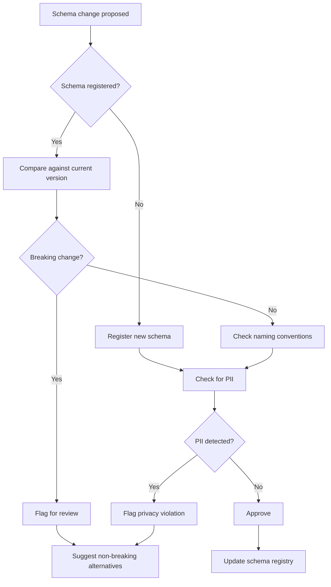

# Integration Contract Validation with Agent Skills (Hypothesis - AI Generated)

**Difficulty**: Advanced
**Time Investment**: 2-3 hours
**Prerequisites**: Understanding of APIs, schemas, semantic versioning, agent skills

---

## Learning Resources (Start Here)

### Primary Concepts
- **[Agent Skills Framework](../03-development-workflows/agent-skills-framework.md)** - Foundation for building governance skills
- **[OpenAPI Specification](https://swagger.io/specification/)** - Standard for REST API contracts
- **[JSON Schema](https://json-schema.org/)** - Schema definition for JSON data
- **[Apache Avro](https://avro.apache.org/)** - Schema for event-driven systems

### Supplementary
- **[Semantic Versioning](https://semver.org/)** - Versioning standard (MAJOR.MINOR.PATCH)
- **[API Evolution Patterns](https://www.infoq.com/articles/API-Change-Strategy/)** - Strategies for non-breaking changes

---

## Why This Matters

**The Problem**: In large enterprises, "breaking changes" in APIs or events happen because:
- Schemas are poorly managed (no central source of truth)
- No validation before deployment (breaking changes discovered in production)
- Inconsistent naming conventions (camelCase vs. snake_case)
- PII accidentally exposed (privacy violations)
- No consumer awareness (downstream systems break unexpectedly)

**The Cost**:
- Production incidents (downstream services fail)
- Manual coordination (Slack messages: "Did you change the User schema?")
- Rollbacks and hotfixes (expensive, risky)
- Lost trust between teams (integration becomes adversarial)

**The Solution**: Agent skills could act as a **Digital Librarian**, automatically:
- Validating API changes against registered schemas
- Detecting breaking changes before deployment
- Enforcing naming conventions and security policies (no PII in URLs)
- Ensuring contract-first design (schema before code)

---

## Key Concepts

### What Is a Contract?

**API Contract**: A formal agreement between provider and consumer about:
- **Request format**: What data must be sent?
- **Response format**: What data will be returned?
- **Error codes**: What failures are possible?
- **Versioning**: How will changes be communicated?

**Example** (OpenAPI):
```yaml
/users/{id}:
  get:
    summary: Get user by ID
    parameters:
      - name: id
        in: path
        required: true
        schema:
          type: integer
    responses:
      200:
        description: User found
        content:
          application/json:
            schema:
              type: object
              required: [id, email, name]
              properties:
                id:
                  type: integer
                email:
                  type: string
                  format: email
                name:
                  type: string
      404:
        description: User not found
```

**Breaking change example**: Removing the `email` field from the response (consumers expect it).

---

### Contract-First vs. Code-First

**Code-First** (traditional):
```
Write code → Deploy → Hope consumers adapt to changes
```
**Problem**: No visibility into what changed; breaking changes discovered at runtime

**Contract-First** (best practice):
```
Define schema → Validate → Generate code → Deploy
```
**Benefit**: Breaking changes caught before deployment

---

## The `integration-contract-validator` Skill

### What It Does

**Triggers when**:
- User modifies an API schema (OpenAPI, GraphQL, Avro)
- User proposes a new API endpoint
- Code changes suggest schema modifications (detected via AST analysis)

**Workflow**:


---

### Skill Structure

```
/integration-contract-validator/
├── SKILL.md
├── references/
│   ├── schema-registry.json       # Centralised registry (or link to API)
│   ├── naming-conventions.md      # camelCase, snake_case rules
│   └── pii-patterns.json          # Regex patterns for PII detection
└── scripts/
    ├── detect_breaking_changes.py  # Compares old vs new schema
    ├── validate_naming.py          # Checks field naming conventions
    └── scan_for_pii.py             # Detects sensitive data
```

---

## How It Works: Breaking Change Detection

### What Counts as "Breaking"?

**Breaking changes** (require MAJOR version bump):

| Change | Why Breaking | Example |
|--------|--------------|---------|
| Remove required field | Consumers expect it | Removing `email` from User |
| Rename field | Consumers reference old name | `user_id` → `userId` |
| Change data type | Type mismatch | `id: string` → `id: integer` |
| Remove endpoint | Consumers call it | Delete `/v1/users` |
| Add required field | Old requests fail validation | New required `role` field |

**Non-breaking changes** (MINOR or PATCH version):

| Change | Why Safe | Example |
|--------|----------|---------|
| Add optional field | Consumers ignore unknown fields | Add `phone_number?` to User |
| Add new endpoint | Consumers don't call it yet | Add `/v1/users/bulk` |
| Deprecate (with warning) | Gives consumers time to migrate | Mark `/v1/users` as deprecated |
| Make required field optional | Old requests still valid | `role` becomes optional |

---

### Example: Automated Breaking Change Detection

**Current schema** (registered in schema registry):
```json
{
  "version": "1.2.0",
  "paths": {
    "/users/{id}": {
      "get": {
        "responses": {
          "200": {
            "schema": {
              "required": ["id", "email", "name"],
              "properties": {
                "id": {"type": "integer"},
                "email": {"type": "string"},
                "name": {"type": "string"}
              }
            }
          }
        }
      }
    }
  }
}
```

**Proposed change**:
```json
{
  "version": "1.3.0",  // Developer incremented MINOR version
  "paths": {
    "/users/{id}": {
      "get": {
        "responses": {
          "200": {
            "schema": {
              "required": ["id", "username"],  // BREAKING: "email" removed, "name" removed
              "properties": {
                "id": {"type": "integer"},
                "username": {"type": "string"},  // BREAKING: new required field
                "createdAt": {"type": "string"}  // OK: optional field
              }
            }
          }
        }
      }
    }
  }
}
```

**Agent with `integration-contract-validator` skill**:
```
⚠️  BREAKING CHANGES DETECTED

Version increment: 1.2.0 → 1.3.0 (MINOR)
Recommendation: This should be 2.0.0 (MAJOR) due to breaking changes below.

Breaking changes:
1. REMOVED required field: "email"
   - Impact: All consumers expect this field
   - Downstream services affected: UserService, EmailService, AnalyticsAPI
   - Mitigation: Keep "email" and add "username" as optional

2. REMOVED required field: "name"
   - Impact: UI components display user.name
   - Downstream services affected: UserProfileService
   - Mitigation: Keep "name" or add deprecation notice for 6 months

3. ADDED required field: "username"
   - Impact: Old requests missing "username" will fail validation
   - Mitigation: Make "username" optional initially

Non-breaking changes (OK):
✅ ADDED optional field: "createdAt"

RECOMMENDATION:
Option A: Make this 2.0.0 (breaking release)
- Coordinate with consumers
- Provide migration guide
- Set sunset date for 1.x

Option B: Non-breaking alternative (1.3.0):
{
  "required": ["id", "email", "name"],  // Keep existing
  "properties": {
    "id": {"type": "integer"},
    "email": {"type": "string"},
    "name": {"type": "string"},
    "username": {"type": "string"},     // Add as optional
    "createdAt": {"type": "string"}
  }
}
```

---

## Naming Convention Enforcement

### Common Standards

**RESTful APIs**:
- camelCase: `firstName`, `createdAt` (JavaScript ecosystem)
- snake_case: `first_name`, `created_at` (Python, Ruby ecosystems)
- kebab-case: `first-name` (URLs only)

**Events (Kafka, SQS)**:
- PascalCase for event names: `UserCreated`, `OrderShipped`
- snake_case for fields: `user_id`, `order_total`

---

### Example: Naming Validation

**Proposed schema**:
```json
{
  "User": {
    "firstName": "string",
    "last_name": "string",   // ❌ Inconsistent (mix of camelCase and snake_case)
    "EmailAddress": "string" // ❌ Inconsistent (PascalCase for field)
  }
}
```

**Agent with `integration-contract-validator` skill**:
```
❌ NAMING CONVENTION VIOLATIONS

Your project standard: camelCase (defined in .cursorrules)

Violations:
1. Field "last_name" uses snake_case
   - Fix: Rename to "lastName"

2. Field "EmailAddress" uses PascalCase
   - Fix: Rename to "emailAddress"

Auto-fix available. Shall I apply it?
```

---

## PII Detection

### Why It Matters

**Problem**: Accidentally exposing PII (Personally Identifiable Information) can lead to:
- GDPR violations (fines up to 4% of revenue)
- PCI-DSS violations (loss of payment processing)
- Reputational damage

**Common violations**:
- PII in URL paths: `/users?ssn=123-45-6789` (logged in access logs)
- PII in event payloads without encryption
- PII in error messages: `Invalid email: john@example.com`

---

### Example: PII Scanning

**Proposed endpoint**:
```yaml
/users/search:
  get:
    parameters:
      - name: ssn
        in: query  # ❌ PII in URL (logged in access logs, CDN, proxy)
      - name: email
        in: query  # ❌ PII in URL
```

**Agent with `integration-contract-validator` skill**:
```
🚨 PRIVACY VIOLATION DETECTED

PII found in URL query parameters:
1. "ssn" (Social Security Number)
   - Risk: Logged in web server logs, CDN logs, browser history
   - Fix: Move to POST body with HTTPS

2. "email"
   - Risk: Logged in access logs
   - Fix: Move to POST body or use user ID instead

Recommendation:
POST /users/search
Body: {
  "filters": {
    "ssn": "...",  // Encrypted in transit (HTTPS)
    "email": "..."
  }
}
```

---

## Try It Yourself

### Experiment 1: Manual Breaking Change Detection

**Setup**: Two versions of an API schema

**Task**: Identify all breaking changes manually

**Time it**: How long does it take? (Expect 10-15 minutes for a medium schema)

**Miss rate**: How many breaking changes did you miss?

---

### Experiment 2: Automated Detection

**Setup**: Use a tool like [OpenAPI Diff](https://github.com/OpenAPITools/openapi-diff) or build the skill

**Task**: Same two schemas

**Observe**:
- Speed (seconds vs. minutes)
- Accuracy (catches changes you missed?)
- Actionability (does it suggest fixes?)

---

### Experiment 3: PII Scanning

**Task**: Create an API with intentional PII violations

**Examples**:
```yaml
/users/{ssn}/profile    # SSN in path
/search?email=x         # Email in query
/orders?creditCard=y    # Credit card in query
```

**Agent prompt**: "Scan this API for PII violations"

**Observe**: Does it catch all violations? Does it suggest mitigations?

---

## Common Pitfalls

### Pitfall 1: No Schema Registry
**Problem**: Schemas scattered across repos; no single source of truth
**Solution**: Centralise schemas (e.g., Confluent Schema Registry, AWS Glue, custom DB)

### Pitfall 2: Schemas Out of Sync
**Problem**: Schema registry says one thing, deployed code does another
**Solution**: Generate code from schemas (schema-first approach)

### Pitfall 3: Overly Strict Validation
**Problem**: Skill blocks benign changes (e.g., adding a comment to schema)
**Solution**: Differentiate between semantic changes (breaking) and non-semantic (comments, reordering)

### Pitfall 4: No Consumer Tracking
**Problem**: Don't know which services consume which APIs
**Solution**: Maintain consumer registry; auto-notify consumers of breaking changes

---

## Advanced Considerations

### Consumer-Driven Contracts

**Pattern**: Consumers define the contract (what they need), not the provider

**Example** (using Pact):
```javascript
// Consumer test (FrontendApp)
expect(GET /users/123).to.return({
  id: 123,
  email: "user@example.com",
  name: "John Doe"
})

// Provider must fulfill this contract
// If provider tries to remove "email", tests fail
```

**Agent skill integration**: Validate provider changes against consumer contracts

---

### Schema Evolution Strategies

**Strategy 1: Versioned URLs**
```
/v1/users  (old)
/v2/users  (new, breaking)
```
✅ Clear separation
❌ Duplicate endpoints, harder to maintain

**Strategy 2: Versioned Accept Headers**
```
Accept: application/vnd.myapi.v1+json
Accept: application/vnd.myapi.v2+json
```
✅ Single URL
❌ More complex routing

**Strategy 3: Optional Fields + Deprecation**
```
{
  "email": "...",        // Keep for 6 months
  "username": "...",     // New preferred field
  "_deprecated": ["email"]
}
```
✅ Smooth transition
❌ Schema bloat over time

**Agent skill**: Enforce chosen strategy (e.g., "We use versioned URLs")

---

### Integration with CI/CD

**Block PRs with breaking changes**:
```yaml
# .github/workflows/schema-validation.yml
name: API Contract Validation

on: [pull_request]

jobs:
  validate:
    runs-on: ubuntu-latest
    steps:
      - uses: actions/checkout@v2
      - name: Detect breaking changes
        run: |
          python scripts/detect_breaking_changes.py \
            --old schema-registry/user-api-v1.2.0.json \
            --new openapi.yaml
      - name: Fail if breaking without version bump
        run: |
          # Check version incremented to MAJOR if breaking changes
```

---

## Related Topics

- [Agent Skills Framework](../03-development-workflows/agent-skills-framework.md) - How to build governance skills
- [ADR Automation](./adr-automation.md) - Documenting API design decisions
- [Security Automation](./security-automation.md) - PII detection overlaps with security

---

## Key Takeaway

**Contract validation prevents integration chaos** in large enterprises.

**Without automation**:
- Breaking changes discovered in production (incidents)
- Manual schema reviews (bottleneck)
- Inconsistent naming (integration friction)
- PII leaks (compliance risk)

**With automation (integration-contract-validator skill)**:
- Breaking changes caught before deployment (no incidents)
- Schemas validated automatically (no bottleneck)
- Naming conventions enforced (consistent APIs)
- PII detected early (compliance by default)

**ROI Calculation**:
- Time to build skill: 6-12 hours
- Time saved per API change: 2-4 hours (no manual review)
- Incidents prevented: 1-2 per quarter (high-impact)

**Start**:
1. Set up a schema registry (start simple: JSON files in git)
2. Define your standards (naming, versioning, PII rules)
3. Build the integration-contract-validator skill
4. Test on 1-2 APIs
5. Integrate into CI/CD
6. Expand to all APIs

**The goal**: Make contract-first design **default**. Agents enforce schema governance so architects can focus on API strategy, not policing individual changes.

**Best practice**: Combine with consumer-driven contracts (Pact) for true collaboration between teams.
