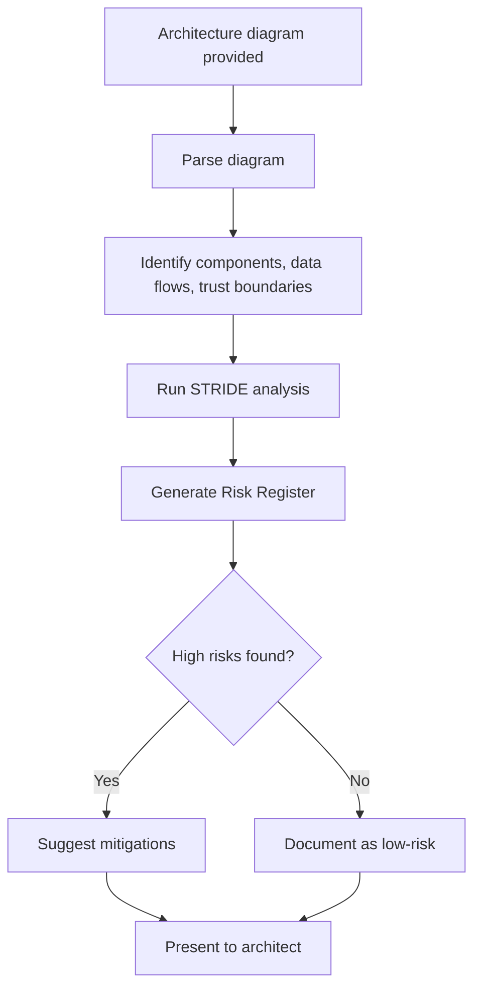
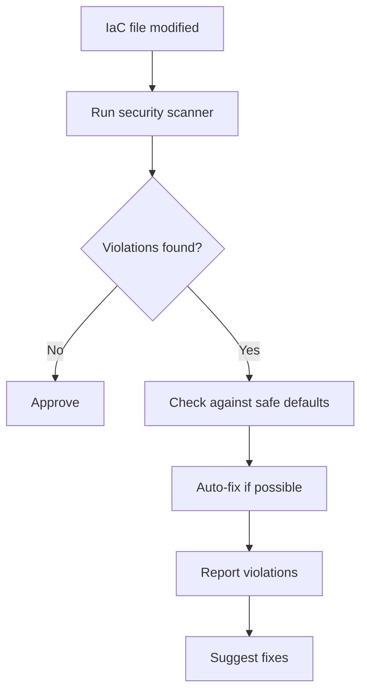

# Security Automation with Agent Skills (Hypothesis - AI Generated)

**Difficulty**: Advanced
**Time Investment**: 3-4 hours
**Prerequisites**: Understanding of security principles, IaC, agent skills framework

---

## Learning Resources (Start Here)

### Primary Concepts
- **[Agent Skills Framework](../03-development-workflows/agent-skills-framework.md)** - Foundation for building security skills
- **[AI Safety & Control](../01-foundations/ai-safety-control.md)** - Security principles for AI systems

### Supplementary
- **[OWASP Top 10](https://owasp.org/www-project-top-ten/)** - Common security vulnerabilities
- **[STRIDE Threat Modeling](https://learn.microsoft.com/en-us/azure/security/develop/threat-modeling-tool-threats)** - Microsoft's threat modeling framework
- **[tfsec](https://github.com/aquasecurity/tfsec)** - Security scanner for Terraform
- **[Checkov](https://www.checkov.io/)** - IaC security scanner (supports Terraform, CloudFormation, Kubernetes)

---

## Why This Matters

**The Problem**: Security is often treated as:
- An **afterthought** (bolted on after implementation)
- A **checkbox** (compliance-driven, not threat-driven)
- **Manual gatekeeping** (security architects become bottlenecks)
- **Inconsistent** (depends on who reviews the code)

**The Cost**:
- Security vulnerabilities discovered late (expensive to fix)
- Misconfigurations slip into production (open S3 buckets, unencrypted data)
- Security architects overwhelmed (can't review every Terraform file)
- "Security theater" (policies exist but aren't enforced)

**The Solution**: Agent skills can automate security analysis:
- **threat-modeler**: STRIDE analysis during design phase
- **iac-security-auditor**: Real-time scanning of Infrastructure-as-Code

**The shift**: From "security review before production" → "security built-in from the start"

---

## Key Concepts

### Secure-by-Design vs. Bolt-On Security

**Bolt-On Security** (traditional):
```
Design → Implement → Security review → Fix issues → Deploy
```
**Problem**: Security issues found late (high cost to fix)

**Secure-by-Design** (with agent skills):
```
Design → Threat model (automated) → Implement with guardrails → Deploy
```
**Benefit**: Security issues prevented early (low cost)

---

## Skill 1: `threat-modeler`

### What It Does

**Purpose**: Automates STRIDE analysis during the design phase

**Triggers when**:
- User provides an architecture diagram (C4, Mermaid, PlantUML)
- User describes a new system or integration
- ADR proposes architectural changes

**Workflow**:


---

### Understanding STRIDE

**STRIDE Framework** (Microsoft):

| Threat | What It Targets | Example |
|--------|-----------------|---------|
| **S**poofing | Authentication | Attacker impersonates legitimate user |
| **T**ampering | Integrity | Attacker modifies data in transit or at rest |
| **R**epudiation | Non-repudiation | User denies performing an action (no audit logs) |
| **I**nformation Disclosure | Confidentiality | Sensitive data exposed (PII, API keys) |
| **D**enial of Service | Availability | Attacker overwhelms system, making it unavailable |
| **E**levation of Privilege | Authorization | Attacker gains admin access |

---

### Skill Structure

```
/threat-modeler/
├── SKILL.md                     # Instructions
├── references/
│   ├── stride-patterns/
│   │   ├── web-api.md          # Common threats for REST APIs
│   │   ├── kubernetes.md       # Common threats for K8s deployments
│   │   ├── serverless.md       # Common threats for Lambda, etc.
│   │   └── oidc-flows.md       # Common threats for OAuth/OIDC
│   └── mitigations.md          # Standard mitigation patterns
└── scripts/
    ├── parse_diagram.py        # Extract components from Mermaid/PlantUML
    └── stride_analysis.py      # Run STRIDE checks
```

---

### Example: Automated Threat Model

**Input** (architecture description):
```
We're building a web API that:
- Accepts user uploads (images, up to 10MB)
- Stores uploads in S3
- Processes images using a Lambda function
- Updates metadata in PostgreSQL
- Returns signed URLs for download
```

**Agent with `threat-modeler` skill**:
```
I'll perform a STRIDE analysis on this architecture.

Components identified:
1. Web API (entry point)
2. S3 bucket (storage)
3. Lambda function (processing)
4. PostgreSQL (metadata)
5. Signed URL generator

Threat analysis:

SPOOFING:
- Risk: Unauthenticated users upload malicious files
- Severity: HIGH
- Mitigation: Require authentication (JWT, API key)

TAMPERING:
- Risk: Files modified in S3 after upload
- Severity: MEDIUM
- Mitigation: Enable S3 versioning, use object lock

INFORMATION DISCLOSURE:
- Risk: S3 bucket publicly accessible
- Severity: HIGH
- Mitigation: Ensure bucket policy blocks public access

- Risk: Signed URLs don't expire
- Severity: MEDIUM
- Mitigation: Set expiration (e.g., 1 hour)

DENIAL OF SERVICE:
- Risk: Attacker uploads large files (>10MB) to exhaust storage
- Severity: MEDIUM
- Mitigation: Enforce size limits at API layer, rate limit uploads

ELEVATION OF PRIVILEGE:
- Risk: Lambda has overly broad IAM permissions
- Severity: HIGH
- Mitigation: Use least-privilege IAM role (only S3 + RDS access)

RISK REGISTER:
High: 3 risks
Medium: 3 risks
Low: 0 risks

Recommended actions:
1. Add authentication to API endpoint
2. Review S3 bucket policy (ensure private)
3. Audit Lambda IAM role (remove unnecessary permissions)
4. Set expiration on signed URLs
```

**Impact**: Security analysis that would take a human 30-60 minutes is done in seconds.

---

## Skill 2: `iac-security-auditor`

### What It Does

**Purpose**: Real-time security scanning of Infrastructure-as-Code (Terraform, CloudFormation, Kubernetes manifests)

**Triggers when**:
- User writes or modifies IaC files
- Before committing to git
- In CI/CD pipeline (automated)

**Workflow**:


---

### Skill Structure

```
/iac-security-auditor/
├── SKILL.md
├── references/
│   ├── safe-defaults.json       # Company-specific secure configs
│   └── violations-library.md    # Common violations and fixes
└── scripts/
    ├── scan_terraform.sh        # Wrapper for tfsec
    ├── scan_cloudformation.sh   # Wrapper for checkov
    └── auto_fix.py              # Attempts to fix common violations
```

---

### Example: Automated IaC Audit

**Input** (Terraform file):
```hcl
resource "aws_s3_bucket" "data" {
  bucket = "my-data-bucket"
}

resource "aws_instance" "web" {
  ami           = "ami-12345678"
  instance_type = "t2.micro"

  security_group_ids = [aws_security_group.web.id]
}

resource "aws_security_group" "web" {
  ingress {
    from_port   = 0
    to_port     = 65535
    protocol    = "tcp"
    cidr_blocks = ["0.0.0.0/0"]
  }
}
```

**Agent with `iac-security-auditor` skill**:
```
I've scanned your Terraform configuration. Found 4 security violations:

CRITICAL:
1. S3 bucket has no encryption
   - Resource: aws_s3_bucket.data
   - Issue: server_side_encryption_configuration is missing
   - Fix: Enable AES256 or KMS encryption

2. Security group allows all traffic from internet
   - Resource: aws_security_group.web
   - Issue: 0.0.0.0/0 on all ports (0-65535)
   - Fix: Restrict to specific ports (e.g., 80, 443)

HIGH:
3. S3 bucket versioning not enabled
   - Resource: aws_s3_bucket.data
   - Issue: versioning block missing
   - Fix: Enable versioning for data recovery

4. EC2 instance has no monitoring
   - Resource: aws_instance.web
   - Issue: monitoring = false (default)
   - Fix: Enable CloudWatch monitoring

Checking against your company's safe defaults...
- S3 encryption: Required KMS key = arn:aws:kms:us-east-1:123456789:key/abc
- Security groups: Default deny all, explicit allow only

I can auto-fix issues 1, 3, and 4. Issue 2 requires your input
(which ports do you need open?).

Shall I apply the fixes?
```

**Auto-fixed code**:
```hcl
resource "aws_s3_bucket" "data" {
  bucket = "my-data-bucket"

  versioning {
    enabled = true
  }

  server_side_encryption_configuration {
    rule {
      apply_server_side_encryption_by_default {
        sse_algorithm     = "aws:kms"
        kms_master_key_id = "arn:aws:kms:us-east-1:123456789:key/abc"
      }
    }
  }
}

resource "aws_instance" "web" {
  ami           = "ami-12345678"
  instance_type = "t2.micro"
  monitoring    = true

  security_group_ids = [aws_security_group.web.id]
}

resource "aws_security_group" "web" {
  # NEEDS YOUR INPUT: Which ports should be open?
  # Current config allows ALL ports from internet (INSECURE)
  ingress {
    from_port   = 80
    to_port     = 80
    protocol    = "tcp"
    cidr_blocks = ["0.0.0.0/0"]
    description = "HTTP - PLEASE VERIFY THIS IS NEEDED"
  }
}
```

---

## Common Security Violations (IaC)

### AWS

| Violation | Risk | Fix |
|-----------|------|-----|
| S3 bucket public access | Information disclosure | Set `block_public_acls = true` |
| Unencrypted EBS volumes | Data breach | Enable `encrypted = true` |
| RDS no backup | Data loss | Set `backup_retention_period > 0` |
| Security group 0.0.0.0/0 | Unauthorised access | Restrict to specific IPs/CIDRs |
| IAM wildcard permissions | Privilege escalation | Use least-privilege policies |

### Kubernetes

| Violation | Risk | Fix |
|-----------|------|-----|
| Containers run as root | Privilege escalation | Set `runAsNonRoot: true` |
| No resource limits | DoS | Set `resources.limits` |
| Secrets in env vars | Information disclosure | Use secret volumes instead |
| Host network enabled | Network exposure | Set `hostNetwork: false` |

---

## Try It Yourself

### Experiment 1: Manual Threat Modeling

**Setup**: No skill, just your brain

**Task**: Threat model a simple login flow
```
User → Web App → Auth Service → Database
```

**Time it**: How long does it take to identify threats across all STRIDE categories?

**Baseline**: Expect 20-30 minutes for a thorough analysis

---

### Experiment 2: Automated Threat Modeling

**Setup**: Build the threat-modeler skill (or use Claude with manual prompts)

**Task**: Same login flow

**Prompt**:
```
Perform a STRIDE threat model on this architecture:

User submits credentials → Web App validates → Auth Service checks against Database → Returns JWT

Identify threats in all STRIDE categories.
```

**Observe**:
- How long does it take? (Expect 30-60 seconds)
- Does it catch threats you missed?
- Are mitigations practical?

---

### Experiment 3: IaC Security Scanning

**Setup**: Install `tfsec` or `checkov`

**Task**: Scan a Terraform file with intentional vulnerabilities

**Run**:
```bash
tfsec .
```

**Observe**: How many violations? Can you fix them manually vs. with AI assistance?

**With agent skill**: Ask agent to "scan this Terraform file and fix security issues"

**Compare**: Manual fixing vs. AI-assisted fixing (speed, accuracy)

---

## Common Pitfalls

### Pitfall 1: False Positives (Noise)
**Problem**: Scanner flags everything, including non-issues
**Solution**: Tune rules to your environment; suppress known-safe patterns

### Pitfall 2: No Baseline (Everything Fails)
**Problem**: Scanning legacy infrastructure → 1000+ violations
**Solution**: Start with new projects; grandfather old violations, fix incrementally

### Pitfall 3: Auto-Fix Breaks Things
**Problem**: Agent "fixes" security issue but breaks functionality
**Solution**: Always review auto-fixes; require human approval for critical changes

### Pitfall 4: Skill Becomes Outdated
**Problem**: New attack vectors emerge, skill doesn't catch them
**Solution**: Update references/ regularly (quarterly security reviews)

---

## Advanced Considerations

### Integration with CI/CD

**Block PRs with critical violations**:
```yaml
# .github/workflows/security-scan.yml
name: IaC Security Scan

on: [pull_request]

jobs:
  scan:
    runs-on: ubuntu-latest
    steps:
      - uses: actions/checkout@v2
      - name: Run tfsec
        uses: aquasecurity/tfsec-action@v1.0.0
        with:
          soft_fail: false  # Block PR if critical issues found
```

---

### Risk-Based Prioritization

Not all violations are equal. Prioritise by:

```
Risk Score = Severity × Exploitability × Data Sensitivity

Examples:
- Public S3 bucket with PII: CRITICAL (10/10)
- Missing CloudWatch monitoring: LOW (2/10)
- Unencrypted dev database: MEDIUM (5/10)
```

Agent skill can auto-calculate risk scores and prioritise fixes.

---

### Compliance Automation

Map security controls to compliance frameworks:

```json
{
  "violation": "S3 bucket not encrypted",
  "compliance_failures": [
    "GDPR Article 32 (Data Security)",
    "PCI-DSS 3.4 (Encryption at Rest)",
    "SOC 2 CC6.7 (Encryption)"
  ]
}
```

**Benefit**: Automated compliance reporting (auditors love this).

---

## Scaling Beyond 50 Developers (AI Generated)

Security automation becomes critical at scale, but the approach evolves as teams grow. Here's how to scale from departmental tooling to enterprise infrastructure.

### Small Teams (10-50 Developers): Local Enforcement

**Approach**: Scripts + CI/CD checks

**What works**:
- **threat-modeler** skill runs on-demand during design phase
- **iac-security-auditor** runs in CI/CD pipeline (blocks PRs on critical violations)
- Ad-hoc security reviews by embedded security engineer
- Violations reported to Slack/email

**Limitations**:
- No centralised visibility (security engineer reviews violations team-by-team)
- Inconsistent enforcement (some teams disable checks to "move fast")
- Manual triage (false positives require human review for each team)

**When to evolve**: When security engineer spends >50% of time triaging violations, or compliance audit requires centralised reporting

---

### Medium Teams (50-200 Developers): Centralised Platform

**Approach**: Central security policy repository + observability dashboard

**What changes**:
- **Policy-as-code**: OPA policies stored in central repo (version controlled, peer reviewed)
- **Tiered enforcement**:
  - **Critical violations**: Block PR merge (exposed secrets, public S3 buckets)
  - **High violations**: Require security team approval (missing encryption, overly permissive IAM)
  - **Medium/Low violations**: Warn only, track over time
- **Centralised dashboard**: Real-time visibility into violations across all teams
- **False positive feedback loop**: Engineers can propose rule updates (security team reviews monthly)

**Infrastructure requirements**:
- **Central OPA service**: Teams query centralised policy engine (not local scripts)
- **Metrics pipeline**: Violations logged to datastore (Elasticsearch, Prometheus)
- **Alerting**: Slack/PagerDuty for critical violations
- **Self-service**: Teams can view their own violation trends

**Governance patterns**:
- **Policy versioning**: Teams can pin to specific policy version (gradual migration)
- **Exception management**: Documented process for accepting risk (requires approval)
- **Quarterly policy review**: Security team updates rules based on incident learnings

**Common challenges**:
- **Alert fatigue**: Too many warnings → teams ignore them
  - **Solution**: Tune rules aggressively, focus on high-signal violations
- **Deployment velocity**: Blocking PRs slows teams down
  - **Solution**: Auto-fix where possible (e.g., add encryption flag), educate teams on common patterns
- **Policy drift**: Each team interprets rules differently
  - **Solution**: Include code examples in policy docs, run "policy office hours"

**When to evolve**: When managing 200+ developers, or multi-cloud/hybrid infrastructure

---

### Large Teams (200+ Developers): Enterprise Governance

**Approach**: Security platform with advanced automation, federated enforcement

**What this looks like**:
- **Multi-tenant policy engine**: Business units can extend base policies with unit-specific rules
- **Automated remediation**: Low-risk violations auto-fixed (e.g., add `encryption = true` to S3 bucket)
- **Risk scoring**: Violations weighted by business impact (production >> dev environment)
- **Compliance attestation**: Automated reports for SOC 2, ISO 27001, HIPAA
- **Security champions network**: Embedded security engineers in each business unit

**Advanced capabilities**:
- **Contextual enforcement**: Same violation may be critical in production, warning in dev
- **Blast radius analysis**: "This IAM role grants access to 47 services"
- **Supply chain security**: Scan dependencies, container images, IaC modules
- **Threat intelligence integration**: Update policies based on CVE disclosures

**Enterprise considerations**:
- **Audit trails**: Who triggered the violation? When? What code?
- **Change management**: How to roll out new security policies without breaking 200+ developers
- **SLA commitments**: Security checks must not add >30s to CI/CD pipeline
- **Cost control**: OPA queries at scale can be expensive (caching, rate limiting)

**Platform maturity requirements**:
- **99.9% uptime**: Security checks are now critical path
- **Regional deployment**: Low-latency policy enforcement in multiple geographies
- **Disaster recovery**: Fallback if central policy service fails (local policy cache?)

**This is rare**: Most organisations don't reach this scale. If you're here, security is a platform product with dedicated team.

---

### Scaling Anti-Patterns

**Anti-pattern 1: Block Everything**
- Over-aggressive enforcement → teams disable checks or route around them
- **Solution**: Start with warnings, escalate to blocks only for critical violations

**Anti-pattern 2: No Exception Process**
- Zero tolerance → teams find workarounds (shadow IT)
- **Solution**: Document exceptions, require business justification + security approval

**Anti-pattern 3: Stale Policies**
- Rules written 2 years ago don't reflect current threats
- **Solution**: Quarterly policy review, integrate threat intelligence

**Anti-pattern 4: No Metrics**
- Can't answer "Are we more secure than last quarter?"
- **Solution**: Track: violations by severity over time, mean-time-to-remediation, policy coverage %

---

### ROI at Scale

**Cost of manual security review** (50-200 developers):
- 1 security engineer × 40 hours/week = 160 hours/month
- Can review ~20 PRs/week (8 hours/PR including threat modeling, code review, documentation)
- **Bottleneck**: Security engineer is on critical path for every high-risk change

**Cost of automated security** (50-200 developers):
- Setup: 2-4 weeks engineering time (OPA policies, CI/CD integration)
- Ongoing: 4-8 hours/month tuning rules, reviewing false positives
- **Benefit**: Can "review" 100% of PRs, not just high-risk ones

**Break-even**: After 3-6 months, automation pays for itself by freeing security engineer for higher-value work (architecture reviews, incident response)

---

## Related Topics

- [AI Safety & Control](../01-foundations/ai-safety-control.md) - Security principles for AI systems
- [Agent Skills Framework](../03-development-workflows/agent-skills-framework.md) - How to build security skills
- [ADR Automation](./adr-automation.md) - Documenting security decisions

---

## Key Takeaway

**Security automation shifts security left** (design phase) and scales security expertise.

**Without automation**:
- Security reviews are manual (bottleneck)
- Issues found late (expensive to fix)
- Inconsistent coverage (depends on who reviews)

**With automation (threat-modeler + iac-security-auditor)**:
- Threats identified during design (cheap to fix)
- IaC scanned automatically (no human bottleneck)
- Consistent enforcement (every file scanned)

**ROI Calculation**:
- Time to build skills: 8-16 hours
- Time saved per project: 5-10 hours (no manual security review)
- Risk reduction: Catch 80%+ of common vulnerabilities before production

**Start**:
1. Install tfsec/checkov (IaC scanning)
2. Build iac-security-auditor skill (automate the scanning)
3. Test on 1-2 Terraform files
4. Integrate into CI/CD
5. Expand to threat modeling (design phase)

**The goal**: Make security **default**, not an afterthought. Agents enforce security standards so architects can focus on novel threats.
