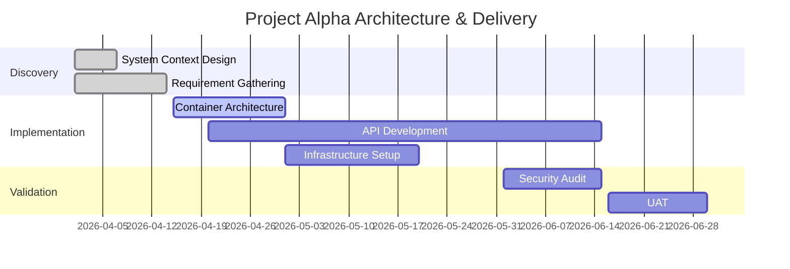

[< Back](./introducing_the_principles.md)

# Day to day Behaviours

## Continually visualise the technical architecture

Perhaps the most visible aspect of the architect's role is ensuring that the technical architecture documentation is up to date and reflects the current state of the system. This involves maintaining a living set of diagrams that evolve alongside the software.

### C4 Diagram Types and Evolution

We recommend using the **C4 Model** to visualise architecture at different levels of abstraction. These diagrams are not static; they change as the system's design matures and as you move from a high-level vision to detailed implementation.

| Level | Diagram Type | Focus | How it evolves |
| :--- | :--- | :--- | :--- |
| **1** | **System Context** | The system itself and its users/external systems. | Rarely changes after initial discovery; captures the "Big Picture." |
| **2** | **Container** | High-level technology choices (e.g., Web App, Database, API). | Evolves as major infrastructure decisions are made or changed. |
| **3** | **Component** | Internal structural building blocks within a container. | Changes frequently during active development as the internal design is refined. |
| **4** | **Code** | Low-level implementation details (e.g., Class diagrams). | Often generated from code or only used for complex logic; highly transient. |

**Example of Evolution:**
A **Container Diagram** might start with a single "Backend API" and a "Database." As the project progresses, you might split that API into microservices or add a caching layer, requiring the diagram to be updated to reflect the current state.

### Project Progress Documentation

Visualising the architecture is only half the battle; you also need to visualise the **delivery**. This ensures stakeholders understand the timeline, dependencies, and current status.

#### Gantt Charts for Progress
Gantt charts are a powerful tool for showing the project's timeline and the relationships between different tasks or workstreams.

*   **Showing Progress:** In the example above, "Discovery" tasks are marked as `done`, while "Container Architecture" is `active`. This gives an immediate visual cue of where the team is currently focused.
*   **Managing Dependencies:** Gantt charts help identify when a task (like API Development) is blocked by another (like Container Architecture Design).

[Read more here](../../principles/continually_visualise_the_technical_architecture.md)

## Keeping documentation close to code

[Read more here](../../principles/keep_documentation_close_to_code.md)

## Identifying 'non functional' requirements

Quality Attributes or Non Functional Requirements need to be considered and balanced as they are normally a trade off, examples could be:

 - Performance
 - Interoperability
 - Deployability
 - Reliability
 - Availability
 - Security
 - Maintainability
 - Observability
 - Testability
 - Scaleability
 - Modifiability
 - Reusability
 - Audibility

##  Managing risk

[Risk Storming](https://riskstorming.com/)

-   A visual and collaborative risk identification technique
-   Can be applied to architectures, business processes, workflows, etc
-   Can be applied multiple times during the lifetime of the thing being risk stormed
-   More information [here](https://sites.google.com/madetech.com/signpost/home/software-engineering/technical-architecture/processes/risk-storming)

## Communicating into the future

[Read more here](../../principles/communicate_into_the_future.md)

[< Back](./introducing_the_principles.md)
