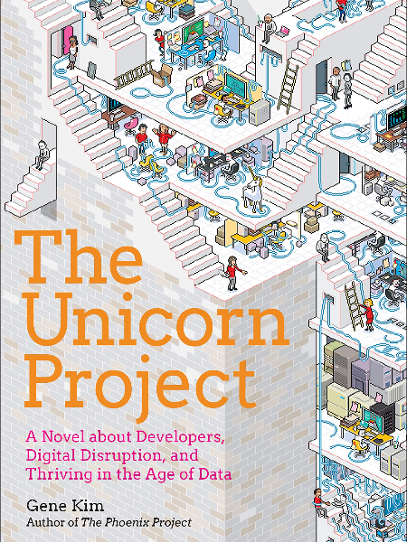

# Getting Started

### Video Links

We recommend watching this video on the modern architecture approach which tackles, the role of IT, change and thinking like an architect.

[The Software Architect Elevator](https://www.youtube.com/watch?v=Zq2VcRZmz78) - 52 minutes
### Unicorn Project

We also recommend reading this novel about a large IT project in an organisation in need of digital transformation.

The book follows the story of a technical lead (acting like a modern architect) being thrown into a failing project and trying to unpick and correct the technical and business failures.

It's an easy and fun read but gives a practical insight into the role.

[Find it on Amazon](https://www.amazon.co.uk/dp/1942788762)

**Next** - [Introducing the Principles](./introducing_the_principles.md)
