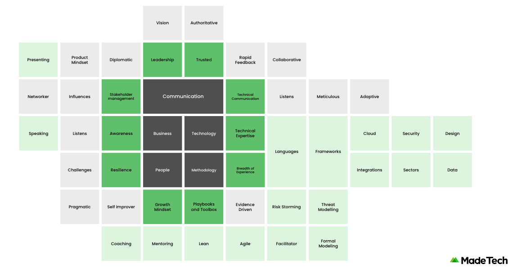
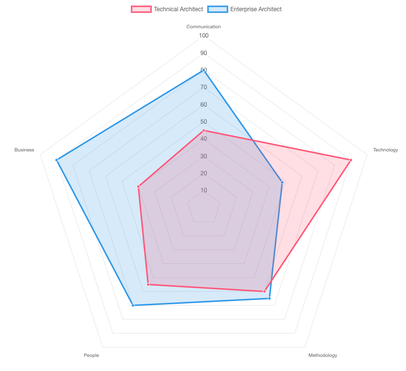
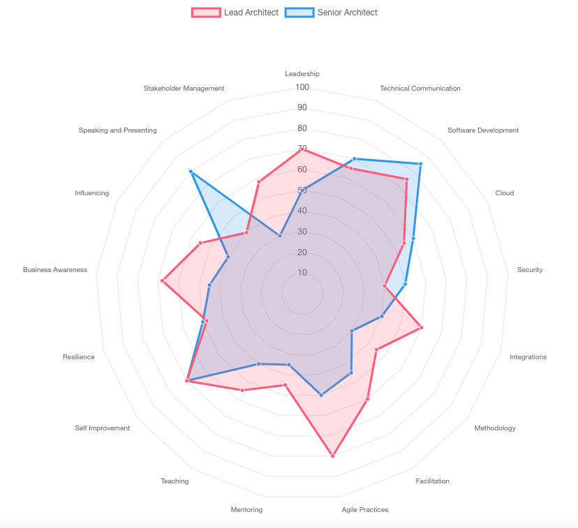

# Skills and Behaviours

**Architecture is a skill and set of behaviours: not just a role**

As an Architect you need both sides to be effective. you might have fantastic technical knowledge and experience but if you can't communicate and influence others that knowledge will be wasted. Likewise without a solid technical understanding you might not communicate or influence the right ideas or fall short on credibility. Worse still you could lead an organisation in the wrong technical direction !

Looking now at the top of the graphic we see leadership skills, both technical and non technical. People will look at you for direction and you should be able to communicate direction with authority. Without some kind of leadership people will not trust the vision you put forward.

Now looking near the bottom we see a growth mindset. Architects are always seeking to learn more and be better but also look to help others do the same through mentoring or teaching.

We also see facilitation in the bottom right, this is another key skill and brings together all the above elements as an agent of change. Architects use evidence based approaches with a lean and agile mindset often running workshops and collaborative activities (again working closely with delivery managers and product owners) to influence positive, focused behaviours.

This again makes us think of a 'Digital Guru' and can seem impossible to achieve ? How can an architect be an expert in all these areas ?

The truth is no architect is an expert in every area but effective architects have a good understanding of all areas with no glaring weakness. Many will have specialities or stronger attributes but all recognise their strengths and utilise others to complement them while improving and learning through their growth mindset.

Examples of different balances of an architect might be:

- Strong technical background but less experience presenting and communicating ideas to non technical groups
- Excellent communicator and influencer, great at listening and understanding but has a shallower understanding of technology or might be missing a few areas such as cloud or security.

Another example is a Senior vs a Lead architect where the senior performs more strongly in some areas but is missing a key skill or is overall weaker across other areas compared to the lead.

You might want to **[map your strengths and skills](https://madetech.github.io/skills-radar/)** over the graphic above ? if you were to rate yourself in each area what would your radar look like ?

Once you understand this you know your strengths and weaknesses and you can communicate that to your team, if someone on your team excels in an area you are weak then work together and learn from them!

**Next** - [Getting Started](./getting_started.md)
