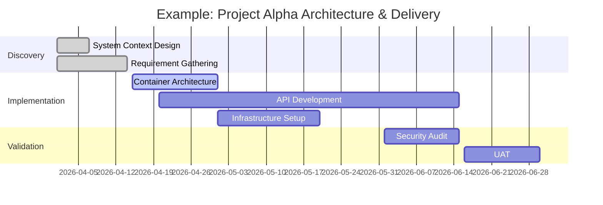

# Visualising Project Progress

Visualising the architecture is essential for technical alignment, but you also need to visualise the **delivery** of that architecture. This ensures stakeholders understand the timeline, dependencies, and current status.

## Why Visualise Progress?

- **Align Stakeholders:** Provides a clear picture of what has been delivered and what is coming next.
- **Manage Dependencies:** Identifies blockers between architectural design and implementation.
- **Communicate Velocity:** Shows the pace of the project in a way that is easy to digest.

---

## Gantt Charts for Progress

Gantt charts are a powerful tool for showing the project's timeline and the relationships between different tasks or workstreams.

### Key Progress Indicators

- **Showing Progress:** In the example above, "Discovery" tasks are marked as `done`, while "Container Architecture" is `active`. This gives an immediate visual cue of where the team is currently focused.
- **Managing Dependencies:** Gantt charts help identify when a task (like API Development) is blocked by another (like Container Architecture Design).

[< Back to Visualising Architecture](./README.md)
