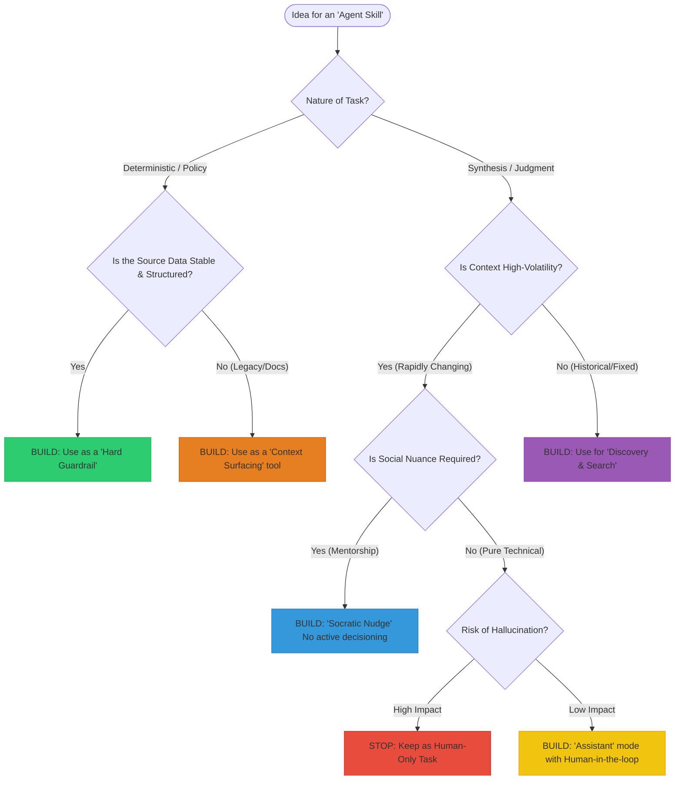

# Strategic Guide: Leveraging Agent Skills in Software Architecture

## Executive Summary

Software Architecture in large estates is a high-context, high-nuance discipline. While LLMs offer significant potential, their probabilistic nature makes them unsuitable for "black box" decision-making. This framework ensures that Agent Skills (automated capabilities) are applied only where they provide high leverage without compromising architectural integrity.

---

## 1. The Four Archetypes of Architectural AI

We categorize every "Agent Skill" into one of four archetypes based on the Decision Flow. Understanding these prevents the "Safety/Utility Gap."

### The Enforcer (Hard Guardrail)

**When to use:** When the rules are binary and the data is structured (e.g., JSON Tech Radars, Schema registries).

**The Logic:** The Agent doesn't "guess"; it triggers a deterministic script.

**Value:** Removes the "governance tax" from architects by automating routine compliance checks.

### The Librarian (Discovery & Search)

**When to use:** When you need to find "needles in haystacks" across thousands of historical documents.

**The Logic:** Uses semantic search (RAG) to find context.

**Value:** Solves the "Large Estate" problem by instantly surfacing relevant historical context that a human would spend hours finding.

### The Mentor (Socratic Nudge)

**When to use:** When the goal is to change team behavior or build "architectural muscle" in delivery teams.

**The Logic:** Instead of giving answers, the Agent asks clarifying questions based on enterprise principles.

**Value:** Scales the Architect's influence without creating a bottleneck.

### The Human-Only Zone (Strategic Synthesis)

**When to use:** High-volatility situations, social/political navigation, or high-impact "one-way door" decisions.

**The Logic:** These require empathy, accountability, and tribal knowledge that LLMs lack.

**Value:** Protects the organization from confident but context-blind AI hallucinations.

---

## 2. Key Evaluation Questions (The Deep Dive)

### The Data Stability Test

**The Nuance:** An Agent is only as good as its "Source of Truth." If your architecture is documented in decaying Word docs, an "Enforcer" will fail.

**Strategy:** If your data is "Orange" (unstructured), build a Librarian, not an Enforcer.

### The Volatility Test

**The Nuance:** Architecture is "frozen history" vs. "fluid strategy." LLMs struggle with "Fluid" context.

**Strategy:** For rapidly changing projects, use Agents to track changes (summarize deltas) rather than judging them.

### The Mentorship Test

**The Nuance:** True leadership is about enabling teams, not controlling them.

**Strategy:** A "Blue" skill should point to a human or a principle.

**Examples:**
- **Bad AI:** "Don't use DynamoDB."
- **Good AI:** "ADR-09 suggested we avoid NoSQL for ledger data. How does your use case differ?"

---

## 3. Implementation Matrix

Use this table to quickly categorize a new skill idea:

| Skill Name | Data Source | Logic Type | Resulting Archetype |
|------------|-------------|------------|---------------------|
| Tech Radar Check | YAML File | Deterministic | Enforcer |
| ADR Researcher | Markdown Docs | Semantic Search | Librarian |
| Principle Nudge | Text Handbook | Socratic | Mentor |
| Cloud Migration Strategy | Tribal Knowledge | Human Reasoning | Human-Only |

---

## 4. Operational Guardrails

To ensure success, every Agent Skill must follow these three rules:

1. **Citations are Mandatory:** No "Information" skill can provide an answer without a link to the source document.

2. **Explicit Uncertainty:** If the data score for a search is low, the Agent must state: "I couldn't find a definitive rule, please consult [Architect Name]."

3. **Human-in-the-loop (HITL):** For any "Yellow" or "Orange" path, the AI's output is a draft for a human to approve.

---

## Decision Flow Diagram

The following diagram provides a visual representation of the decision-making process for categorizing and implementing Agent Skills:

---

## Conclusion

This framework ensures that Agent Skills are applied strategically, enhancing architectural decision-making without compromising the nuanced judgment that human architects provide. By categorizing skills into clear archetypes and following operational guardrails, organizations can leverage AI capabilities while engineering trust in the process.
