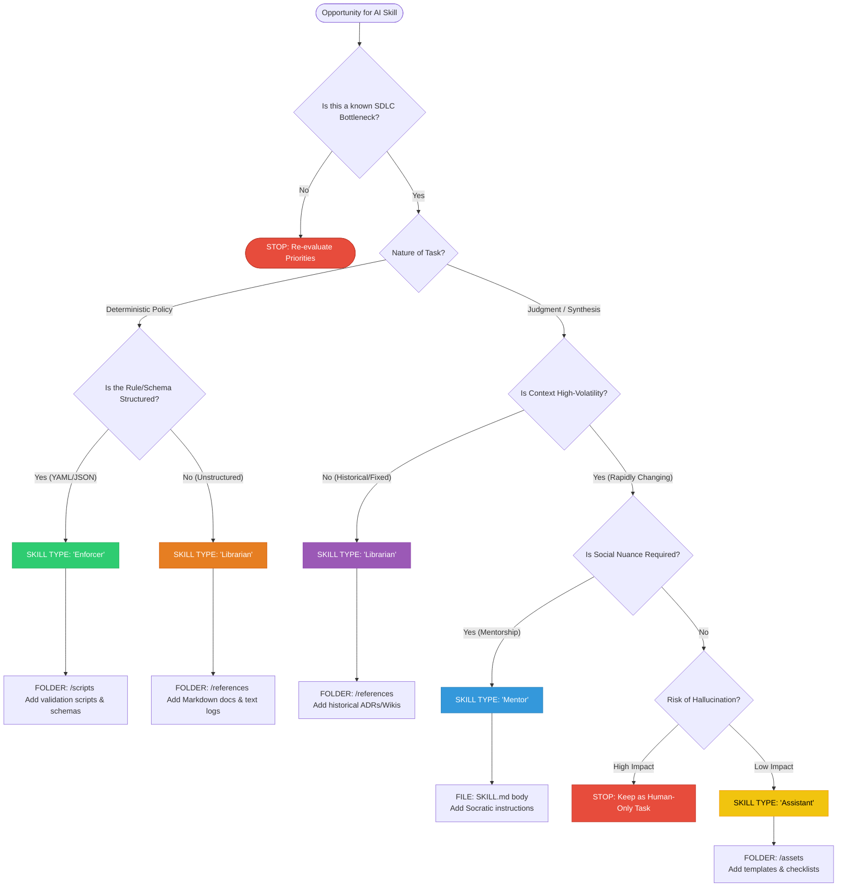

# Strategic Guide: Leveraging Agent Skills in Software Architecture

## Executive Summary

Software Architecture in large estates is a high-context, high-nuance discipline. This framework ensures that Agent Skills (automated capabilities) are developed only to solve proven SDLC constraints and are structured to align with the technical requirements of the agentic environment.

---

## 1. The ROI Filter: The Bottleneck Test

Before any "Agent Skill" is developed, it must pass the **Bottleneck Test**.

* **The Rule:** No skill is developed unless it alleviates a measured delay in the SDLC (e.g., PR Review Latency, Documentation Upkeep, or Incident Triage).
* **The Logic:** "An hour saved on something that isn't the bottleneck is worthless." We prioritize automation where the human flow is currently stalled.

---

## 2. Implementation Strategy: Skill Components

An Agent Skill is a directory-based package. Based on the task archetype, we provide different assets within the `.claude/skills/` folder structure.

### Level 1: The Discovery Layer (Metadata)

* **File:** `SKILL.md` (Frontmatter)
* **Content:** Unique `name` and specific `description`.
* **Behavior:** Always loaded; used by the agent to decide if the skill is relevant to the user's request.

### Level 2: The Guidance Layer (Instructions)

* **File:** `SKILL.md` (Body)
* **Content:** Natural language instructions, Socratic nudges, or pattern-matching rules.
* **Behavior:** Loaded only when the skill is triggered.

### Level 3: The Resource Layer (Supporting Files)

* **Folders:** `/references`, `/scripts`, `/assets`
* **Content:** Python/Bash scripts for validation, Markdown ADRs, YAML schemas, or checklists.
* **Behavior:** Accessed by the agent only when explicitly needed.

---

## 3. The Four Archetypes of Architectural AI

Understanding these archetypes dictates which "Level" of assets you need to prioritize during development.

| Archetype | Logic Goal | Primary Assets | Primary Bottleneck |
| --- | --- | --- | --- |
| **The Enforcer** | **Precision** | `/scripts` & YAML Schemas | Governance/Compliance Lag |
| **The Librarian** | **Discovery** | `/references` (Markdown/Logs) | Discovery & Research Time |
| **The Mentor** | **Behavior** | `SKILL.md` Instructions | Review Latency / Skill Gaps |
| **The Assistant** | **Execution** | `/assets` & Templates | Administrative / Toil tasks |

---

## 4. Operational Guardrails

1. **Citations are Mandatory:** No response from a `/references` asset is valid without a link to the source document.
2. **Explicit Uncertainty:** If confidence in a search is low, the agent must defer to a human architect.
3. **Human-in-the-loop (HITL):** AI output for synthesis tasks remains a "Draft" until signed off by a human.
4. **Experience Sampling:** Consider capturing a "Helpful/Not Helpful" score for every invocation to track the **Developer Experience Index (DXI)**.

---

## 5. Decision Flow: From Bottleneck to Folder Structure

## Conclusion

This framework ensures that Agent Skills are applied strategically, enhancing architectural decision-making without compromising the nuanced judgment that human architects provide. By categorizing skills into clear archetypes and following operational guardrails, organizations can leverage AI capabilities while engineering trust in the process.
