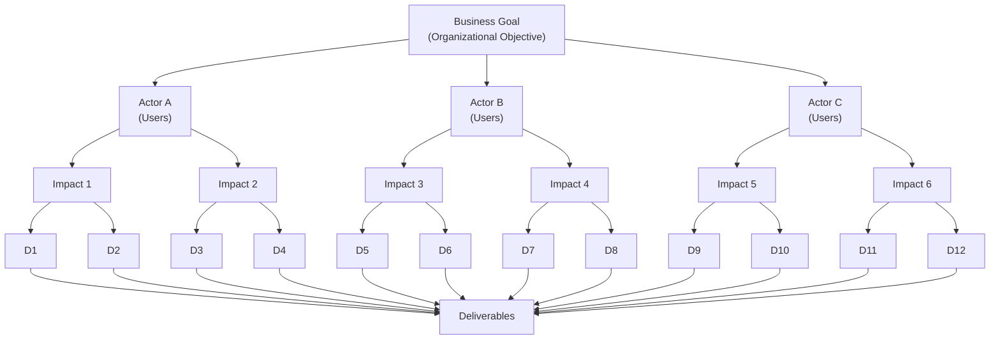

## Impact Mapping

### What Is Impact Mapping?

Impact mapping is a lightweight, collaborative planning technique designed for teams that want to deliver software products with measurable outcomes. It combines three key approaches:
- **User interaction design** — Understanding how users interact with your product
- **Outcome-driven planning** — Focusing on desired behavioural changes and business impact
- **Mind mapping** — Visualising relationships and hierarchies in a single, comprehensive diagram

Impact maps help delivery teams and stakeholders:
- Visualise product roadmaps and strategic goals
- Explain how deliverables connect to user needs
- Communicate how user outcomes relate to organisational objectives
- Make informed prioritization decisions

### Why Impact Mapping Is Useful

Impact mapping provides several critical benefits for product teams.

#### 1. **Fast and Visual**
- Collaborative workshops can be conducted in hours, not weeks
- Visual format makes relationships between goals, users, and deliverables immediately clear
- Easy to update and iterate as new information emerges

#### 2. **Collaborative and Inclusive**
- Engages people from various roles and backgrounds (product managers, engineers, stakeholders)
- Exposes hidden assumptions before they become costly
- Builds shared understanding across teams
- Documents important decisions and reasoning

#### 3. **Focused Prioritisation**
- Connects low-level features directly to high-level business goals
- Helps teams distinguish between "nice to have" and "must have" features
- Enables data-driven prioritisation based on impact potential
- Prevents scope creep by keeping focus on outcomes

#### 4. **Lightweight Structure**
- Provides just enough structure to facilitate effective planning
- Avoids complicated syntax or bureaucracy
- Adapts to different project types and team sizes
- Can be drawn on a whiteboard or created digitally

#### 5. **Communication Tool**
- Serves as a shared reference for stakeholders and team members
- Aligns business sponsors with delivery teams
- Helps communicate vision for new initiatives
- Documents the "why" behind technical decisions

### When to Use Impact Mapping

Impact mapping is especially valuable for:

- **Product managers and business sponsors** working with iterative software delivery
  - Identify the alignment between the goal and the actions
  - Identifys blockers early, and identify strategies to avoid
  - Validate goals
- Teams wanting to **restructure existing initiatives** 
  - clarify priorities
- Cross-functional teams that need **aligned understanding** of goals
- Projects where you need to **focus effort** and make trade-off decisions

It's less suitable for:
- Simple, one-person projects with clear, predetermined requirements
- Maintenance-only work with fixed scope
- Highly regulated environments requiring extensive formal documentation

### How to Create an Impact Map

The basic process involves five steps:

#### 1. **Define the Goal**
Start at the centre with the organisational goal or business objective you're trying to achieve.

Example: "Increase user engagement by 50%"

#### 2. **Identify Actors**
Determine who are the people (users, actors, or personas) whose behavior change would impact your goal.

Example: "Regular users", "New users", "Power users"

#### 3. **Map Impacts (Behavior Changes)**
For each actor, identify what behavior changes would help achieve the goal.

Example: 
- New users: "Complete onboarding in less than 5 minutes"
- Regular users: "Return to the app at least weekly"
- Power users: "Create customised dashboards"

#### 4. **Add Deliverables**
Identify features, services, or products that could support the desired behaviour changes.

Example:
- Interactive onboarding tutorial
- Push notifications
- Customization engine

#### 5. **Connect and Prioritise**
- Use visual connections to show relationships between elements
- Prioritise from the organisational goal downward
- Highlight dependencies and key decisions

### Structure of an Impact Map

You can use:
- Colors to indicate priority or impact level
- Icons or symbols to denote complexity or risk
- Size and position to show importance and relationships
- Grouping to organize related elements

### Further Reading

- **[Impact Mapping Official Site](https://www.impactmapping.org/)** — Complete guides and resources
- **[Impact Mapping Book](https://www.impactmapping.org/book.html)** — "Impact Mapping: Making a Big Impact with Software Products" by Gojko Adzic
- **[Introductory Articles and Videos](https://www.impactmapping.org/intro-resources.html)** — Getting started resources
- **[Tips and Tricks](https://www.impactmapping.org/tips-and-tricks.html)** — Advanced techniques for practitioners
- **[Impact Mapping Community](https://groups.google.com/d/forum/impact-mapping/)** — Discussion list and mentoring